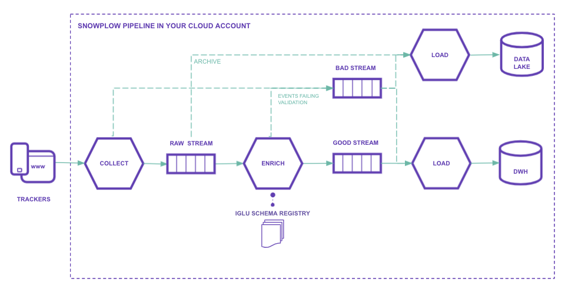

## What is Quick Start?

We have built a set of [terraform](https://www.terraform.io/docs/language/modules/develop/index.html) modules, which automates the setting up & deployment of the required infrastructure & applications for an operational Snowplow open source pipeline, with just a handful of input variables required on your side.

The accompanying Quick Start guides for AWS or GCP will get you up and running with a Snowplow open source pipeline — and deliver rich behavioural data to stream, lake and warehouse — in less than an hour.

The data pipeline that you will have set up by the end of either guide will look similar to the following (this will vary by cloud and can be designed to suit your needs due to our modular approach):



After following a Quick Start guide, you will be able to:

- Collect granular, well-structured data with our suite of web, mobile and server side [SDKs](/docs/collecting-data/collecting-from-own-applications/index.md)
- Create your own [custom events and entities](/docs/understanding-tracking-design/out-of-the-box-vs-custom-events-and-entities/index.md) 
- Easily enable and disable our suite of [out-of-the-box enrichments](/docs/enriching-your-data/available-enrichments/index.md) 
- Consume your rich data in real time from a choice of over 7 supported destinations (Kinesis, Pubsub, S3, Postgres, ElasticSearch, Snowflake or Databricks)

Out-of-the-box, the pipeline set up using Quick Start will:

- Handle up to ~100 events per second (~9 million events per day)
- Cost ~$200 (depending on data transfer costs) per month for ~100 events per second in AWS infrastructure costs, and ~$240 on GCP

It will get you up and running as quickly as possible with Snowplow's open source product so that you can start exploring how to run & manage a Snowplow pipeline that will help you to deliver value with rich, high quality behavioural data to power multiple use cases.

```mdx-code-block
import PocketEdition from "@site/docs/reusable/pocket-edition-pitch/_index.md"

<PocketEdition/>
```

## When to choose Manual Setup

Having completed a Quick Start guide, you can tweak our terraform modules or the pipeline topology to your liking. Still, some setups are not yet supported. Because of this, you might want to opt for a Manual Setup instead. Manual Setup is more involved, but gives you more flexibility and control.

| Feature                                                                                                                                                                 |                         Quick Start                         |                            Manual Setup                             |
|:------------------------------------------------------------------------------------------------------------------------------------------------------------------------|:-----------------------------------------------------------:|:-------------------------------------------------------------------:|
| Hosted in your own cloud                                                                                                                                                |                          AWS, GCP                           |                              AWS, GCP                               |
| First party server cookies                                                                                                                                              |                     :white_check_mark:                      |                         :white_check_mark:                          |
| Installation                                                                                                                                                            |                   Automated via Terraform                   |             Docker images available for each component              |
| Data warehouse destinations                                                                                                                                             | Postgres, (AWS→)Snowflake, (AWS→)Databricks, (GCP→)BigQuery | Postgres, Snowflake, Databricks, (GCP→)BigQuery, (AWS→)**Redshift** |
| Data lake destinations                                                                                                                                                  |                             S3                              |                             S3, **GCS**                             |
| Streaming destinations                                                                                                                                                  |                       Kinesis, Pubsub                       |          Kinesis, Pubsub, <nobr>**Kafka _(alpha)_**</nobr>          |
| [Surge protection](/docs/getting-started-on-snowplow-open-source/setup-snowplow-on-aws/setup-the-snowplow-collector/set-up-an-sqs-buffer/index.md)<br/>_(AWS-specific)_ |                             :x:                             |                         :white_check_mark:                          |
