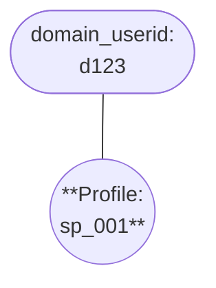
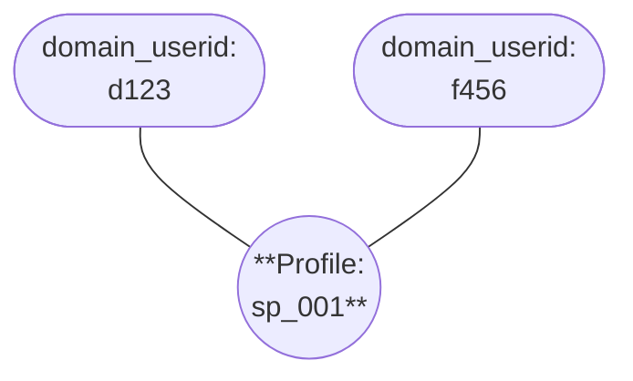
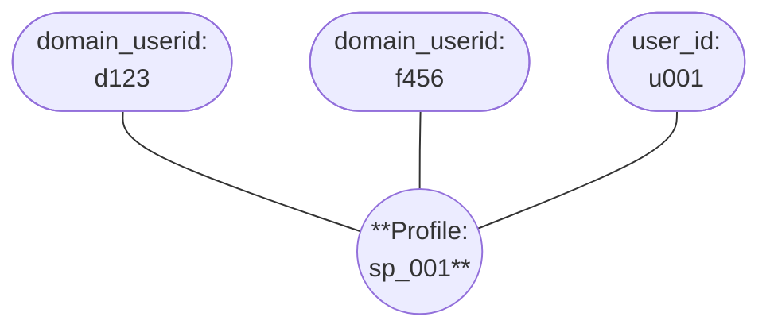

When users navigate between sites with different cookie domains, or from a mobile app to a webview, each destination assigns its own `domain_userid`. Without cross-domain tracking, these appear as separate users. [Cross-domain](/docs/events/cross-navigation/index.md), or cross-navigation, tracking solves this by passing the `domain_userid` from the source site or app in the URL. Events captured on the destination contain a `refr_domain_userid` field with the source's `domain_userid`.

This works for web-to-web navigation, mobile app-to-webview transitions, and any other scenario where the [web](/docs/sources/web-trackers/cross-domain-tracking/index.md) or [native mobile](/docs/sources/mobile-trackers/tracking-events/session-tracking/index.md#decorating-outgoing-links-using-cross-navigation-tracking) trackers decorate outgoing links.

You can [enable cross-domain tracking support](/docs/identities/configuration/index.md#enable-cross-domain-tracking-aliases) in the Identities configuration so that Identities automatically extracts `refr_domain_userid` and maps it to `domain_userid` and `client_session_user_id`, linking the user's profiles across sites.

## Example cross-domain resolution

In this example, ExampleCompany runs two sites on separate cookie domains: `brandA.com` and `brandB.com`. Cross-domain tracking is configured on the web tracker, and the ExampleCompany team has enabled cross-domain tracking in the Identities configuration.

A user browses `brandA.com` anonymously. The event contains a `domain_userid`. Identities creates a new profile.

| Event property  | Value        |
| --------------- | ------------ |
| `url`           | `brandA.com` |
| `domain_userid` | `d123`       |
| `user_id`       | -            |

The user clicks a link to `brandB.com`. The destination site assigns a new `domain_userid`, but the event also contains a `refr_domain_userid` field with the `domain_userid` from `brandA.com`. Identities treats `refr_domain_userid` as equivalent to `domain_userid`, finds the existing profile, and links the new `domain_userid` to it.

| Event property       | Value        |
| -------------------- | ------------ |
| `url`                | `brandB.com` |
| `domain_userid`      | `f456`       |
| `refr_domain_userid` | `d123`       |
| `user_id`            | -            |

The user then logs into `brandB.com`. The event contains the same `domain_userid` from that site plus a `user_id`. Identities adds the `user_id` to the existing profile.

| Event property  | Value                     |
| --------------- | ------------------------- |
| `url`           | `brandB.com/user-profile` |
| `domain_userid` | `f456`                    |
| `user_id`       | `u001`                    |

All of the user's activity across both sites, both anonymous and authenticated, is resolved to the same Snowplow ID.
