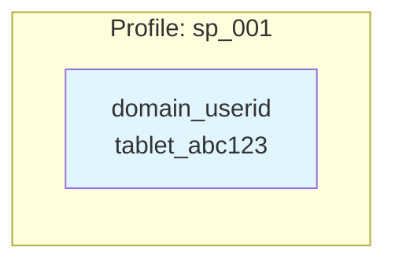
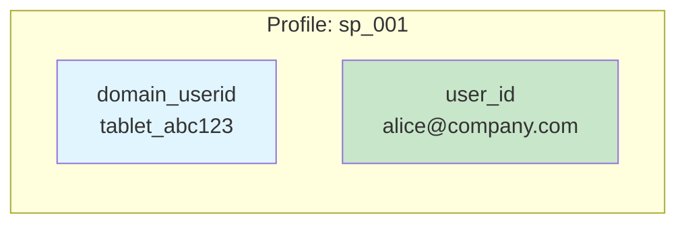
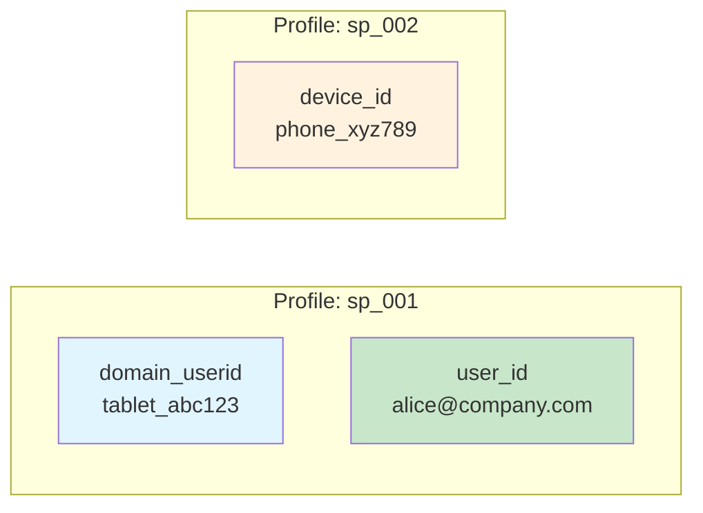
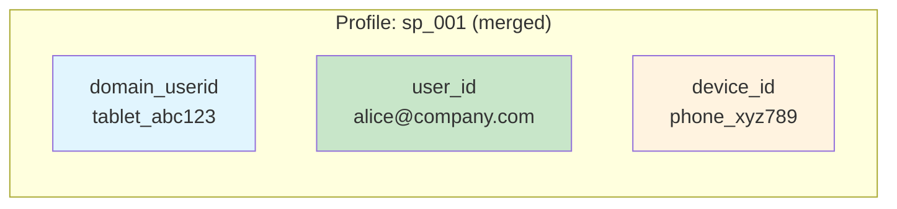
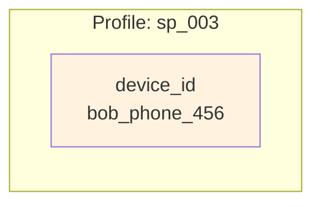
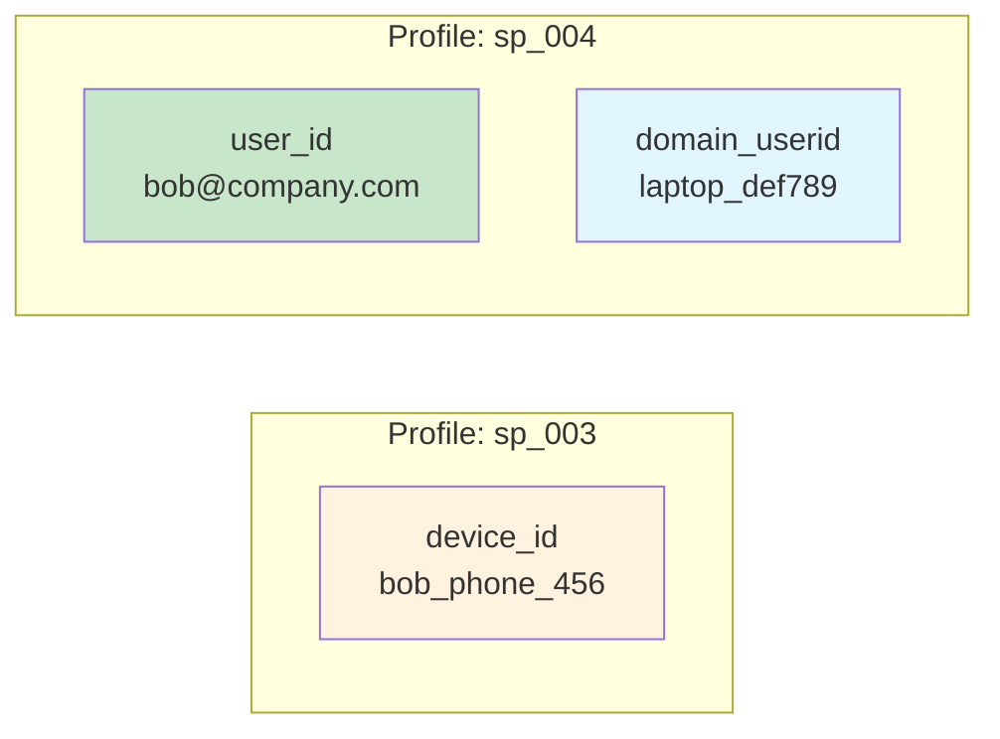
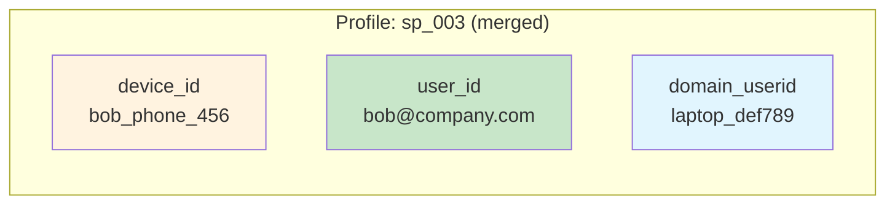
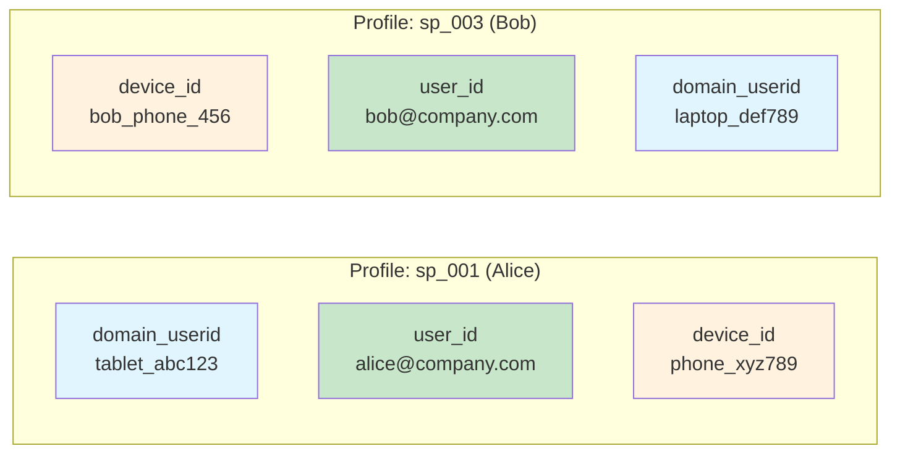
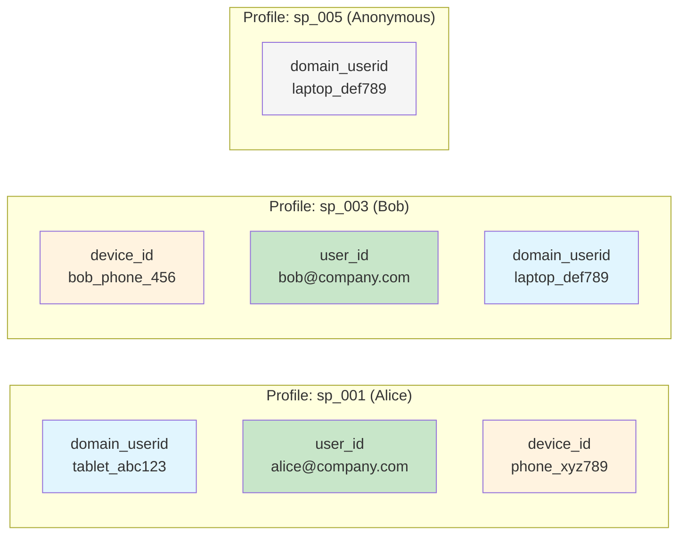

Identities is based on several core concepts.
* **Identifiers** are the key/value pairs extracted from events and used to resolve identity
* **Profiles** are collections of linked identifiers that represent a single user
* **Merges** occur when identifiers link two previously separate profiles together

## Identifiers

Identifiers are the key/value pairs that Identities extracts from events and uses to resolve identity. Each identifier has a name, such as `domain_userid`, and a value that's the actual ID in the event payload, such as `a43eb2f1-...`.

You can configure identifiers from atomic event fields, custom event fields, or from your own entities. For example, you might add a hashed email address from a user profile entity, or a legacy user ID from a custom entity.

### Identifier priority

Each identifier has a priority that determines how the `snowplow_id` is generated when Identities can't reach the graph database, e.g. during a traffic spike. Higher-priority identifiers are preferred when generating fallback IDs.

In normal operation, priority doesn't affect how profiles are linked. All identifiers contribute equally to identity resolution.

### Unique identifiers

Unique identifiers are identifiers that should never cause two profiles to merge together if they have different values. For example, if you mark `user_id` as unique, two events with different `user_id` values will never cause their profiles to merge, even if they share other identifiers like `domain_userid`. This prevents incorrect merges when multiple users share a device or browser.

When Identities processes an event that would cause a merge, it checks whether any unique identifiers would conflict. If they do, Identities creates a new anonymous profile for any identifiers that cannot be definitively attributed to either existing profile.

### Identifier aliases

Identifier aliases allow you to map multiple event fields to the same identifier type. This is useful for cross-domain tracking, where the `refr_domain_userid` field contains the `domain_userid` from the referring site.

When you create an alias, events with values in the aliased field are treated as if they contained that identifier type. For example, if you alias `refr_domain_userid` to `domain_userid`, a user clicking from one site to another will have their profiles linked even though the identifier appears in different fields.

## Profiles

A profile is a collection of linked identifiers that represent a single user. Each profile has a persistent, immutable `snowplow_id` that identifies it.

When Identities receives a new identifier, it creates a new profile and links the identifier to it. The pipeline adds the new `snowplow_id` to the event. In subsequent events, if the original identifier appears alongside new identifiers or identifier values, those are also linked to the same profile. Events containing one or more of the profile identifiers will receive the same `snowplow_id`.

### Identity entity

The added entity uses schema X. The `snowplow_id` has format Y.

Here's an example:

```json
{ "some":"json"}
```

## Merges

Merges happen when an event contains identifiers that are currently linked to different profiles. This typically occurs when a user's anonymous activity is later connected to their known identity.

When profiles merge, the older profile's `snowplow_id` becomes the ID for the combined profile. All identifiers from both profiles are linked to the combined profile.

Merged profiles can also be merged again in the future if new connecting identifiers are observed. The `snowplow_id` always reflects the oldest profile in the merge chain.

### Merge events

When merges occur, a merge event is emitted into the Snowplow pipeline. This event indicates to downstream systems, such as warehouse data models, Signals, or third party event forwarding destinations, that two users were determined to be the same user.

The merge event uses this schema ADD LINK:

```json
{ "some":"json"}
```

## Identity resolution graph

Identities stores the relationships between identifiers and profiles in a Postgres database using a graph-based model. This graph is the source of truth for identity resolution. It dynamically links and merges profiles as new identifiers appear.

Identities resolves identity in real time. Each event is resolved against the current state of the graph, ensuring that the `snowplow_id` reflects the most up-to-date identity information.

If the graph database is temporarily unavailable or slow to respond, Identities generates a deterministic fallback `snowplow_id` based on the event's identifiers. A background reconciliation process later replays these events to update the graph and generate any necessary merge events.

:::info Data privacy
Identities works inside your cloud environment. All requests are encrypted in transit and at rest.
:::

## Examples

These examples based on a fictional company show how Identities builds and merges profiles over time. They follow ExampleCompany employees Alice, Bob, and Carol.

ExampleCompany uses several identifiers for identity resolution:
- `user_id` (marked as unique) — the authenticated user's email address
- `domain_userid` — browser cookie ID from the web tracker
- `network_userid` — server-side cookie ID from the Collector
- `device_id` — device identifier from mobile apps
- TODO

### Creating a new profile

Alice browses the ExampleCompany website on her tablet without logging in. This is the first time Identities has seen her tablet's `domain_userid`.

Since no existing profile contains this identifier, Identities creates a new profile and links the `domain_userid` to it.



All events from Alice's tablet browsing session receive `snowplow_id` = `sp_001`.

### Adding identifiers to a profile

Later, Alice logs in on the same tablet. The event now contains both her `domain_userid` (from the browser cookie) and her `user_id` (from authentication).

Identities finds the existing profile via the `domain_userid` and adds the `user_id` to it.



The profile now has two linked identifiers. Any future events with either identifier will resolve to `sp_001`.

### Merging profiles

Alice installs the ExampleCompany mobile app on her phone and browses anonymously. A new profile is created for her phone's `device_id`.



When Alice logs into the mobile app, the event contains both her `device_id` and her `user_id`. Identities detects that these identifiers belong to different profiles and merges them.

The older profile (`sp_001`) becomes the active `snowplow_id`. All identifiers from both profiles are now linked to `sp_001`.



Identities emits a merge event indicating that `sp_002` was merged into `sp_001`. Downstream systems can use this event to update their records.

### Unique identifiers preventing incorrect merges

Bob is a new ExampleCompany user. He receives an invitation from Alice and opens it on his mobile phone, browsing anonymously. A new profile is created.



The next day, Bob signs up on his laptop. A new profile is created with his `user_id` and laptop's `domain_userid`.



When Bob logs into the mobile app, the two profiles merge. Since both profiles have only one unique identifier value (`bob@company.com`), there's no conflict.



Now consider a shared device scenario. Bob asks Alice to show him how to complete a task using his work laptop. Alice logs out of Bob's account and logs into her own.

The event contains Alice's `user_id` and Bob's laptop `domain_userid`. Without unique identifier protection, this would merge Alice's and Bob's profiles together.

However, because `user_id` is marked as unique, Identities detects a conflict: Alice's profile has `user_id` = `alice@company.com` and Bob's profile has `user_id` = `bob@company.com`. These are different values for the same unique identifier.

Identities does **not** merge the profiles. Alice's event is attributed to her existing profile (`sp_001`), and the `domain_userid` is recognized as shared rather than identifying.



The profiles remain separate, preserving accurate identity resolution.

### Anonymous activity on a shared device

After Alice finishes helping Bob, she logs out. Their colleague Carol walks past and browses the ExampleCompany landing page anonymously on Bob's laptop.

The event contains only the laptop's `domain_userid`. This identifier has now been seen with two different unique identifiers (`alice@company.com` and `bob@company.com`).

Identities cannot deterministically attribute this anonymous activity to either Alice or Bob. Instead of making an incorrect attribution, Identities creates a new anonymous profile.



This anonymous profile ensures that Carol's activity (or any other anonymous user of the shared laptop) isn't incorrectly attributed to Alice or Bob.

### Late-arriving events

Alice frequently works offline during her commute. Her laptop buffers events while disconnected and sends them when she reconnects.

While Alice's laptop is offline, she logs into the mobile app on her phone. This creates a connection between her phone's read-only account and her editor account, triggering a merge.

When her laptop reconnects and sends the buffered events, those events are resolved against the **current** state of the identity graph—which now includes the merge. The late-arriving events receive Alice's up-to-date merged `snowplow_id`.

This means the events are attributed to her complete, merged profile rather than a partial profile that existed when the events were originally captured.
