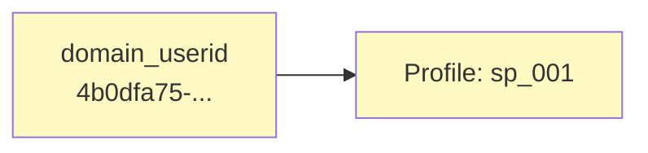
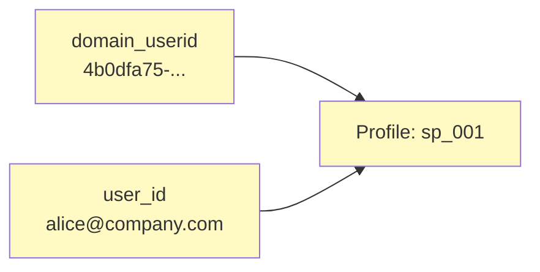
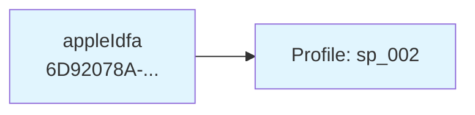
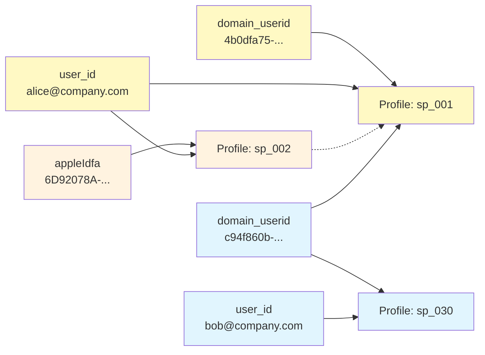

Identities is based on several core concepts.
* **Identifiers** are the identifying properties in the event payload
* **Profiles** are collections of linked identifiers that represent a single user
* **Merges** occur when identifiers link two previously separate profiles together

## Identifiers

Identifiers are the key/value pairs that Identities extracts from events and uses to resolve identity. Each identifier has a name or type, such as `domain_userid`, and a value that's the actual ID in the event payload, such as `a43eb2f1-...`.

You can configure identifiers from atomic event fields, custom event fields, or from your own entities. For example, you might add a hashed email address from a user profile entity, or a legacy user ID from a custom entity.

### Identifier aliases

Identifier aliases allow you to map multiple event fields to the same identifier type. This is useful for cross-domain tracking, where the `refr_domain_userid` field contains the `domain_userid` from the referring site.

When you create an alias, events with values in the aliased field are treated as if they contained that identifier type. For example, if you alias `refr_domain_userid` to `domain_userid`, a user clicking from one site to another will have their profiles linked even though the identifier appears in different fields.

## Profiles

A profile is a collection of linked identifiers that represent a single user. Each profile has a persistent, immutable `snowplow_id` that identifies it.

When Identities receives a new identifier, it creates a new profile and links the identifier to it. The pipeline adds the new `snowplow_id` to the event in an [identity entity](/docs/identities/data-models/index.md#identity-entity). In subsequent events, if the original identifier appears alongside new identifiers or identifier values, those are also linked to the same profile. Events containing one or more of the profile identifiers will receive the same `snowplow_id`.

### Example profile creation

In this example, a user browses a Snowplow-enabled ExampleCompany website anonymously, then logs in. Identities is able to identify the events as belonging to the same user.

The configured identifiers for this example are:
- `domain_userid`: browser cookie ID from the web tracker
- `user_id`: the authenticated user's email address

During the anonymous browsing session, the only configured identifier in the events is the `domain_userid`. Since this is a new identifier, Identities creates a new profile and links the identifier to it.

After the user logs in, the next event contains both the `domain_userid` and their `user_id`. Identities finds the existing profile via the `domain_userid` and adds the `user_id` to it.

For now, Identities will give any subsequent events containing either identifier Snowplow ID `sp_001`.

## Identity resolution

Identities stores the relationships between identifiers and profiles in a Postgres database using a graph-based model. This graph is the source of truth for identity resolution. It dynamically links and merges profiles as new identifiers appear.

The identity resolution process for each event is as follows:
1. The Snowplow pipeline extracts the configured identifiers from the event payload
2. The pipeline sends the identifiers to the Identities API
3. Identities checks the graph database for existing profiles linked to the identifiers
4. Are any of the identifiers linked to existing profiles?
   * No: Identities creates a new profile, links all identifiers to it, and returns the new profile Snowplow ID
   * Yes: processing continues
5. Identities creates links to that profile for any identifiers that aren't already linked
6. Does any of the identifiers have another linked profile?
   * No: Identities returns the existing profile Snowplow ID
   * Yes: processing continues
7. Identities creates a profile-profile merge relationship from the newer profile to the older profile
8. Identities follows the downstream profiles and relinks their identifiers directly to the new root profile <!-- really? that's not shown in the example diagrams -->
9. Identities returns the parent profile Snowplow ID

:::info Data privacy
Identities works inside your cloud environment. All requests are encrypted in transit and at rest.
:::

Identities resolves identity in real time. Each event is resolved against the current state of the graph, ensuring that the `snowplow_id` reflects the most up-to-date identity information.

If the graph database is temporarily unavailable or slow to respond, Identities generates a deterministic fallback `snowplow_id` linked to the event's identifiers, without looking up existing profiles. Full identity resolution is deferred to avoid additional pipeline latency. An automatic background reconciliation process later replays the affected events to update the graph and generate any necessary merge events.

Tracked events are sometimes delayed in arriving into your pipeline, for example due to network issues or offline tracking. When they're eventually processed, they're resolved against the current state of the identity graph.

### Fallback IDs and identifier priority

Each identifier has a priority that determines how the `snowplow_id` is generated when Identities can't reach the graph database, e.g. during a traffic spike. Higher-priority identifiers are preferred when generating fallback IDs.

In normal operation, priority doesn't affect how profiles are linked. All identifiers contribute equally to identity resolution.

## Merges

Merges happen when an event contains identifiers that are currently linked to different profiles. This typically occurs when a user's anonymous activity is later connected to their known identity.

When profiles merge, the older profile's `snowplow_id` becomes the ID for the combined profile. All identifiers from both profiles are linked to the combined profile. Merged profiles can also be merged again in the future if new connecting identifiers are observed.

When a merge occurs, Identities emits a [merge event](/docs/identities/data-models/index.md#merge-events) into your enriched event stream.

### Example merge process

In this example, a user installs a Snowplow-enabled ExampleCompany mobile app on their Apple phone, and uses the app anonymously. It's the same user as in the previous example, but that's not immediately apparent.

The ExampleCompany team have configured Identities to use the `appleIdfa` identifier from the mobile platform entity. Identities finds a new `appleIdfa` value in the user's first event, so it creates a new profile.

The user then logs into the mobile app. The next event contains the known `appleIdfa` and the previously seen `user_id`. Identities detects that profiles `sp_001` and `sp_002` refer to the same user because of the matching `user_id`. It merges them and emits a merge event.

The older profile becomes the active `snowplow_id`. All identifiers from both profiles are now linked to `sp_001`; all future events containing any of these identifiers will have an identity entity containing `sp_001`.

## Unique identifiers prevent inaccurate merging

Unique identifiers are identifiers that should never cause two profiles to merge together if they have different values. For example, if you mark `user_id` as unique, two events with different `user_id` values will never cause their profiles to merge, even if they share other identifiers like `domain_userid`. This prevents incorrect merges when multiple users share a device or browser.

When Identities processes an event that would cause a merge, it checks whether any unique identifiers would conflict. If they do, Identities creates a new anonymous profile for any identifiers that cannot be definitively attributed to either existing profile.

### Example merge conflict

In this example, the user from the previous example shares their device with a colleague. The original user logs out of their account, and the colleague logs in. Both users have now generated events with the same `domain_userid`, but different `user_id` values. Because `user_id` is marked as unique, Identities doesn't merge the identity profiles.

The second user then logs out, and a third user browses the site anonymously on the shared device. The next event again contains the same `domain_userid`. Identities has now seen this identifier with two different unique `user_id` identifiers, `alice@company.com` and `bob@company.com`.

Identities can't deterministically attribute this anonymous activity to either Alice or Bob. Instead of making an incorrect attribution, Identities creates a new anonymous profile, and tags events in this session with the new Snowplow ID `sp_045`.

## Identifier aliases and cross-domain tracking

Identifier aliases allow you to map multiple event fields to the same identifier type. This is particularly useful for [cross-domain tracking](/docs/events/cross-navigation/index.md), where the `refr_domain_userid` field contains the `domain_userid` from the referring site.

If you alias `refr_domain_userid` to `domain_userid`, a user clicking from one site to another will have their profiles linked even though the identifier appears in different fields.
