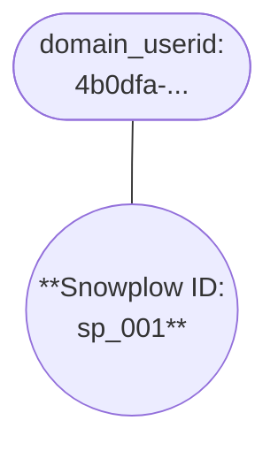
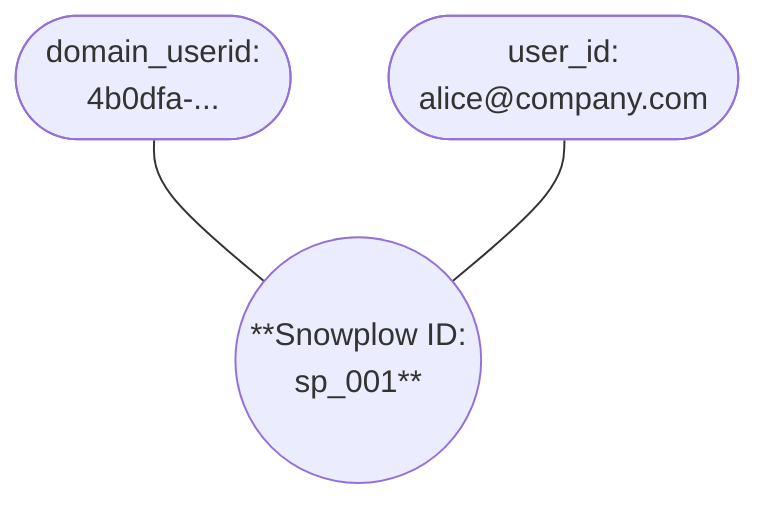

import SchemaProperties from "@site/docs/reusable/schema-properties/_index.md"

Identities is based on several core concepts.
* **Identifiers** are the properties in the event payload that correspond to a user
* **A Snowplow ID** is a persistent, immutable identifier for a collection of linked identifiers that represent a single user
* **[Merges](/docs/identities/concepts/merges/index.md)** occur when identifiers link two previously separate Snowplow IDs together
* **[Unique identifiers](/docs/identities/concepts/unique-identifiers/index.md)** prevent incorrect merges when users share devices
* **[Cross-domain tracking](/docs/identities/concepts/cross-domain-tracking/index.md)** resolves identity across sites with different cookie domains

## Identifiers

Identifiers are the properties in the event payload that Identities uses to resolve identity. They're key-value pairs. Each identifier has a type key, such as `domain_userid`, and a value that's the actual ID in the event payload, such as `a43eb2f1-...`.

You can configure identifiers from atomic event fields, or from a property inside an event or entity data structure. For example, you might add a hashed email address from a form submission event, or a global user ID from a custom user profile entity.

## Snowplow IDs

A Snowplow ID is a persistent, immutable identifier for a collection of linked identifiers that represent a single user.

When Identities receives a new identifier not found in another Snowplow ID, it creates a new Snowplow ID and links the identifier to it. The pipeline adds the Snowplow ID to the event in an [identity entity](#identity-entity).

In subsequent events, if the original identifier appears alongside new identifiers or identifier values, those are also linked to the same Snowplow ID. Events containing one or more of the linked identifiers will receive the same Snowplow ID.

### Example Snowplow ID creation

In this example, a user browses an ExampleCompany website anonymously, then logs in. Identities, running in the ExampleCompany Snowplow pipeline, is able to identify the events as belonging to the same user.

The configured identifiers for this example are:
- `domain_userid`: browser cookie ID from the web tracker
- `user_id`: the authenticated user's email address

During the anonymous browsing session, the only configured identifier in the events is the `domain_userid`. Since this is a new identifier, Identities creates a new Snowplow ID and links the identifier to it.

| Event property  | Value        |
| --------------- | ------------ |
| `domain_userid` | `4b0dfa-...` |
| `user_id`       | -            |

```mermaid
graph TD
    A(["domain_userid:<br/>4b0dfa-..."])
    B(("**Snowplow ID:<br/>sp_001**"))

    A --- B
```

After the user logs in, the next event contains both the `domain_userid` and their `user_id`. Identities finds the existing Snowplow ID via the `domain_userid` and adds the `user_id` to it.

| Event property  | Value               |
| --------------- | ------------------- |
| `domain_userid` | `4b0dfa-...`        |
| `user_id`       | `alice@company.com` |

```mermaid
graph TD
    A(["domain_userid:<br/>4b0dfa-..."])
    B(["user_id:<br/>alice@company.com"])
    C(("**Snowplow ID:<br/>sp_001**"))

    A --- C
    B --- C
```

All events associated with this user both pre- and post-login will have the same Snowplow ID `sp_001` attached in an identity entity.

## Identity resolution process

Identities stores the relationships between identifiers and Snowplow IDs using a graph-based model. This graph is the source of truth for identity resolution. It dynamically links and merges Snowplow IDs as new identifiers appear.

The identity resolution process for each event is as follows:
1. The Snowplow pipeline extracts the configured identifiers from the event payload
2. The pipeline sends the identifiers to the Identities service
3. The Identities service checks the graph for existing Snowplow IDs linked to the identifiers
4. Are any of the identifiers linked to existing Snowplow IDs?
   * No: Identities creates a new Snowplow ID, links all identifiers to it, and returns it
   * Yes: processing continues
5. Identities creates links to that Snowplow ID for any identifiers that aren't already linked
6. Do any of the identifiers have another linked Snowplow ID?
   * No: Identities returns the existing Snowplow ID
   * Yes: processing continues
7. Identities creates a merge relationship from the newer Snowplow ID to the older one
8. Identities returns the parent Snowplow ID and emits a merge event into the Snowplow pipeline to signal to downstream systems that a merge has occurred.

Identities resolves identity in real time. Each event is resolved against the current state of the graph, ensuring that the Snowplow ID reflects the most up-to-date identity information.

If the graph database is temporarily unavailable or slow to respond, Identities generates a deterministic fallback Snowplow ID linked to the event's identifiers, without looking up existing Snowplow IDs. Full identity resolution is deferred to avoid additional pipeline latency. An automatic background reconciliation process later replays the affected events to update the graph and generate any necessary merge events.

Tracked events are sometimes delayed in arriving into your pipeline, for example due to network issues or offline tracking. When they're eventually processed, they're resolved against the current state of the identity graph.

### Fallback IDs and identifier priority

Each identifier has a priority that determines how the Snowplow ID is generated when Identities can't reach the graph database, e.g. during a traffic spike. Higher-priority identifiers are preferred when generating fallback IDs.

In normal operation, priority doesn't affect how Snowplow IDs are linked. All identifiers contribute equally to identity resolution.

## Identities and Signals

Identities is designed to work alongside [Snowplow Signals](/docs/signals/get-started/index.md). To use the Snowplow ID as a unified identifier in Signals, set an attribute group's key to `snowplow_id` and map it to the `snowplow_id` property in the identity entity.

## Data types

Identities adds two data types to your enriched event stream: an identity entity attached to every resolved event, and a merge event emitted when Snowplow IDs are combined.

### Identity entity

When Identities resolves identity for an event, it attaches an identity [entity](/docs/fundamentals/entities/index.md) to the event payload. This entity contains the Snowplow ID that the event was resolved to. For [most warehouses](/docs/api-reference/loaders-storage-targets/schemas-in-warehouse/index.md), you'll find it as `contexts_com_snowplowanalytics_snowplow_identity_2`.

<SchemaProperties
  overview={{entity: true}}
  example={{
    snowplow_id: "sp_abcdefabcdefabcdefabcdefab",
    created_at: "2024-01-15T10:30:00.000Z"
  }}
  schema={{ "$schema": "http://iglucentral.com/schemas/com.snowplowanalytics.self-desc/schema/jsonschema/1-0-0#", "type": "object", "self": { "vendor": "com.snowplowanalytics.snowplow", "name": "identity", "format": "jsonschema", "version": "2-0-0" }, "description": "Identity entity that is enriched onto events by Snowplow Identities", "properties": { "created_at": { "type": "string", "format": "date-time" }, "snowplow_id": { "type": "string", "maxLength": 29, "pattern": "^sp_[A-Za-z2-7]{26}$" } }, "required": ["snowplow_id", "created_at"], "additionalProperties": false }} />

### Merge events

When a merge occurs, Identities emits a [self-describing event](/docs/fundamentals/events/index.md#self-describing-events) into the enriched event stream. Downstream consumers such as the [Identities dbt package](/docs/identities/data-models/index.md) use these events to keep identity mappings up to date.

The `merges` array contains **all** Snowplow IDs that have ever been merged into the current `snowplow_id`, not just the IDs involved in the most recent merge. This gives downstream consumers the complete merge history for a given Snowplow ID in a single event.

<SchemaProperties
  overview={{event: true}}
  example={{
    snowplow_id: "sp_abcdefabcdefabcdefabcdefab",
    created_at: "2024-01-15T10:30:00.000Z",
    merges: ["sp_zyxwvuzyxwvuzyxwvuzyxwvuzy"],
    merged: [{
      snowplow_id: "sp_zyxwvuzyxwvuzyxwvuzyxwvuzy",
      created_at: "2024-01-10T08:00:00.000Z",
      merged_at: "2024-01-15T10:30:00.000Z",
      triggering_event_id: "a1b2c3d4-e5f6-7890-abcd-ef1234567890"
    }]
  }}
  schema={{ "$schema": "http://iglucentral.com/schemas/com.snowplowanalytics.self-desc/schema/jsonschema/1-0-0#", "type": "object", "self": { "vendor": "com.snowplowanalytics.snowplow", "name": "identity_merge", "format": "jsonschema", "version": "2-0-0" }, "description": "Event emitted when Snowplow Identities merges user identities", "properties": { "merged": { "type": "array", "items": { "type": "object", "required": ["snowplow_id", "created_at", "merged_at", "triggering_event_id"], "properties": { "merged_at": { "type": "string", "format": "date-time" }, "created_at": { "type": "string", "format": "date-time" }, "snowplow_id": { "type": "string", "maxLength": 29, "pattern": "^sp_[A-Za-z2-7]{26}$" }, "triggering_event_id": { "type": "string", "maxLength": 36 } }, "additionalProperties": false }, "description": "Detailed info about merged identities" }, "merges": { "type": "array", "items": { "type": "string" }, "description": "List of merged identity IDs" }, "created_at": { "type": "string", "format": "date-time", "description": "When the parent identity was created" }, "snowplow_id": { "description": "The parent/surviving identity ID", "type": "string", "maxLength": 29, "pattern": "^sp_[A-Za-z2-7]{26}$" } }, "required": ["snowplow_id", "created_at", "merges", "merged"], "additionalProperties": false }} />
