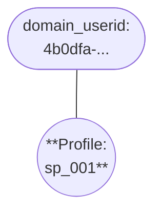
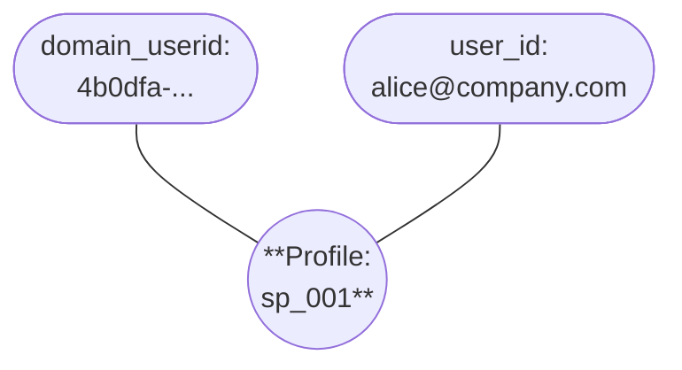
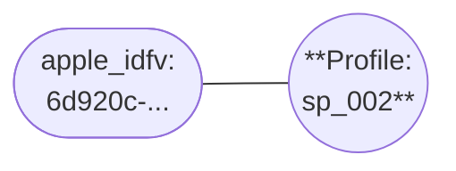
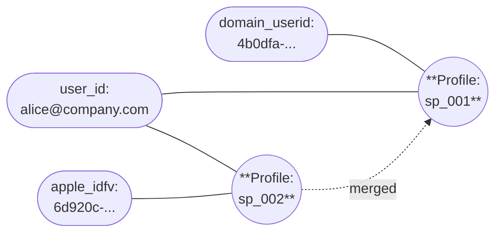
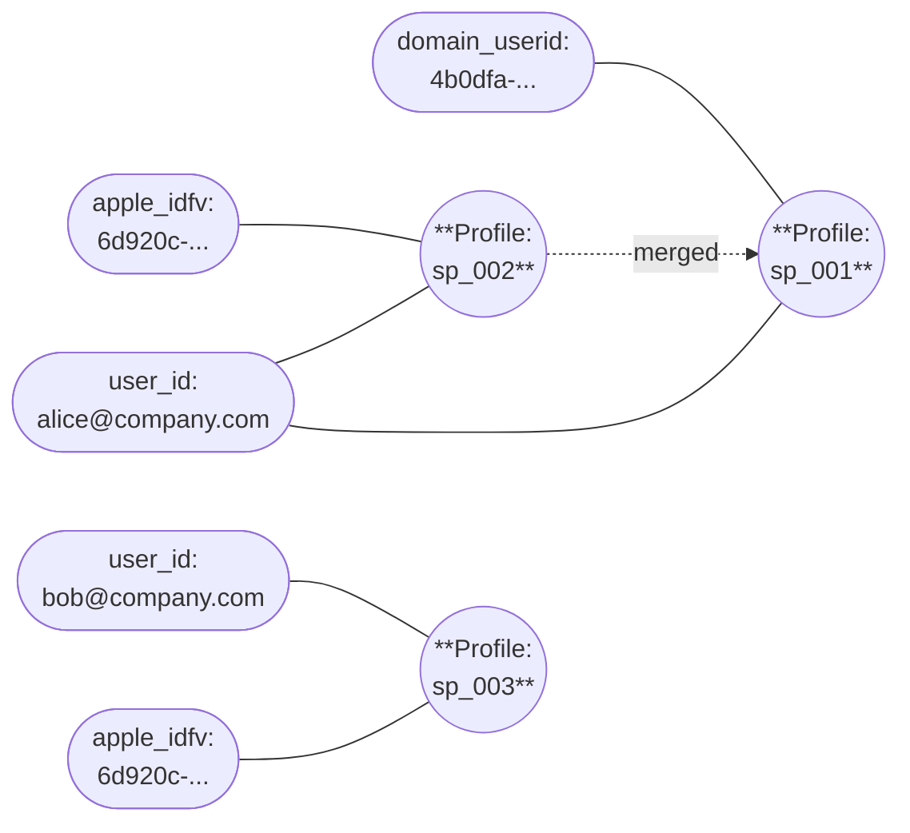
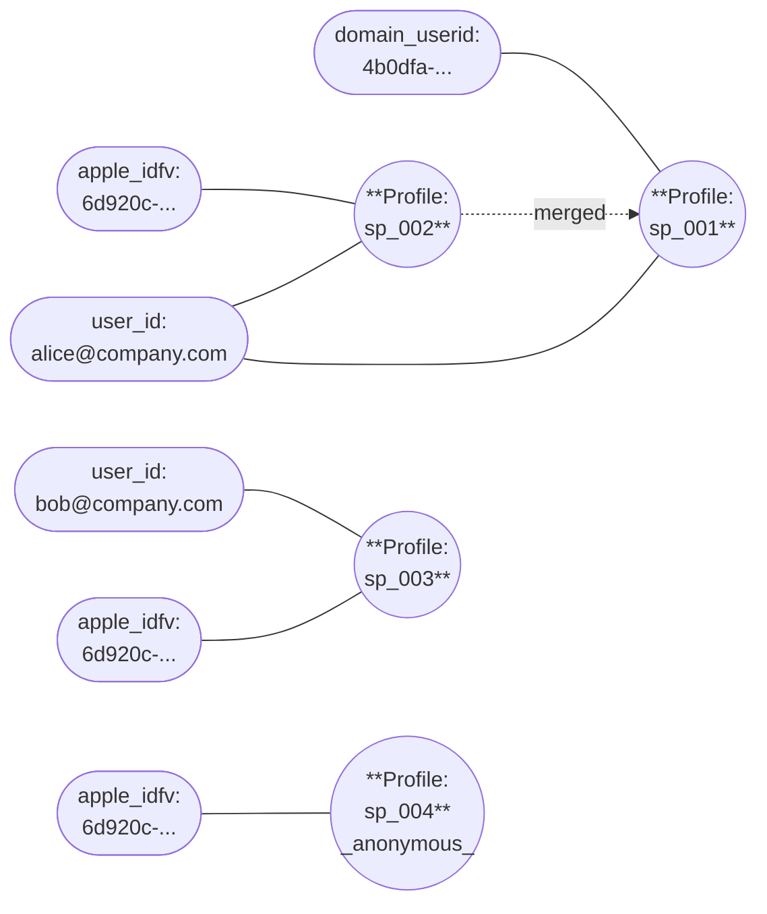
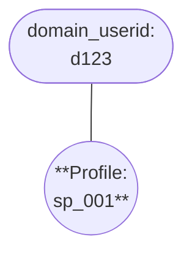
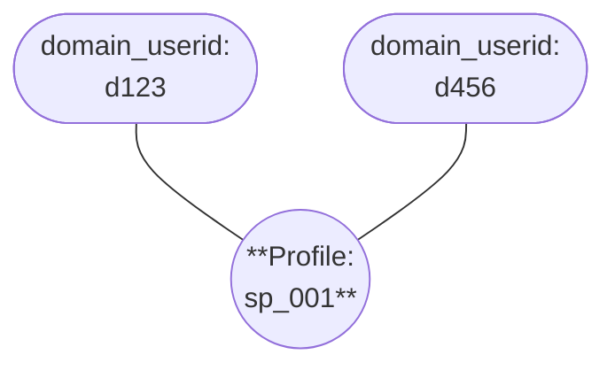
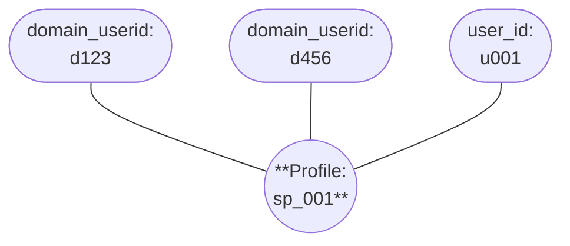

```mdx-code-block
import Tabs from '@theme/Tabs';
import TabItem from '@theme/TabItem';
```

Identities is based on several core concepts.
* **Identifiers** are the properties in the event payload that correspond to a user
* **Profiles** are collections of linked identifiers that represent a single user
* **Merges** occur when identifiers link two previously separate profiles together

## Identifiers

Identifiers are the key/value pairs that Identities extracts from events and uses to resolve identity. Each identifier has a name or type, such as `domain_userid`, and a value that's the actual ID in the event payload, such as `a43eb2f1-...`.

You can configure identifiers from atomic event fields, custom event fields, or from your own entities. For example, you might add a hashed email address from a form submission event, or a global user ID from a custom user profile entity.

Identities also supports [cross-domain tracking](#cross-domain-tracking), where users navigating between sites with different cookie domains can be resolved to the same profile.

## Profiles

A profile is a collection of linked identifiers that represent a single user. Each profile has a persistent, immutable `snowplow_id` that identifies it.

When Identities receives a new identifier, it creates a new profile and links the identifier to it. The pipeline adds the new `snowplow_id` to the event in an [identity entity](#identity-entity). In subsequent events, if the original identifier appears alongside new identifiers or identifier values, those are also linked to the same profile. Events containing one or more of the profile identifiers will receive the same `snowplow_id`.
<!-- TODO: it's called `identity` instead of `profile` in the backend; is that a problem? I've been using the term `profile` with customers -->

### Example profile creation

In this example, a user browses a Snowplow-enabled ExampleCompany website anonymously, then logs in. Identities is able to identify the events as belonging to the same user.

The configured identifiers for this example are:
- `domain_userid`: browser cookie ID from the web tracker
- `user_id`: the authenticated user's email address

During the anonymous browsing session, the only configured identifier in the events is the `domain_userid`. Since this is a new identifier, Identities creates a new profile and links the identifier to it.


```mermaid
graph TD
    A(["domain_userid:<br/>4b0dfa-..."])
    B(("**Profile:<br/>sp_001**"))

    A --- B
```

After the user logs in, the next event contains both the `domain_userid` and their `user_id`. Identities finds the existing profile via the `domain_userid` and adds the `user_id` to it.


```mermaid
graph TD
    A(["domain_userid:<br/>4b0dfa-..."])
    B(["user_id:<br/>alice@company.com"])
    C(("**Profile:<br/>sp_001**"))

    A --- C
    B --- C
```

All events associated with this user both pre- and post-login will have Snowplow ID `sp_001` attached to them.

## Identity resolution process

Identities stores the relationships between identifiers and profiles using a graph-based model. This graph is the source of truth for identity resolution. It dynamically links and merges profiles as new identifiers appear.

The identity resolution process for each event is as follows:
1. The Snowplow pipeline extracts the configured identifiers from the event payload
2. The pipeline sends the identifiers to the Identities service
3. The Identities service checks the graph for existing profiles linked to the identifiers
4. Are any of the identifiers linked to existing profiles?
   * No: Identities creates a new profile, links all identifiers to it, and returns the new profile Snowplow ID
   * Yes: processing continues
5. Identities creates links to that profile for any identifiers that aren't already linked
6. Do any of the identifiers have another linked profile?
   * No: Identities returns the existing profile Snowplow ID
   * Yes: processing continues
7. Identities creates a profile-profile merge relationship from the newer profile to the older profile
8. Identities returns the parent profile Snowplow ID and emits a merge event into the Snowplow pipeline to signal to downstream systems that a merge has occurred.

Identities resolves identity in real time. Each event is resolved against the current state of the graph, ensuring that the `snowplow_id` reflects the most up-to-date identity information.

If the graph database is temporarily unavailable or slow to respond, Identities generates a deterministic fallback `snowplow_id` linked to the event's identifiers, without looking up existing profiles. Full identity resolution is deferred to avoid additional pipeline latency. An automatic background reconciliation process later replays the affected events to update the graph and generate any necessary merge events. <!-- TODO: ask peel to confirm -->

Tracked events are sometimes delayed in arriving into your pipeline, for example due to network issues or offline tracking. When they're eventually processed, they're resolved against the current state of the identity graph.

### Fallback IDs and identifier priority

Each identifier has a priority that determines how the `snowplow_id` is generated when Identities can't reach the graph database, e.g. during a traffic spike. Higher-priority identifiers are preferred when generating fallback IDs.

In normal operation, priority doesn't affect how profiles are linked. All identifiers contribute equally to identity resolution.

## Merges

Merges happen when an event contains identifiers that are linked to different profiles. This typically occurs when a user's anonymous activity is later connected to their known identity.

When profiles merge, the older profile's `snowplow_id` becomes the ID for the combined profile. All identifiers from both profiles are linked to the combined profile. Merged profiles can also be merged again in the future if new connecting identifiers are observed.

When a merge occurs, Identities emits a [merge event](#merge-events) into your enriched event stream.

### Example merge process

In this example, a user installs a Snowplow-enabled ExampleCompany mobile app on their Apple phone, and uses the app anonymously (i.e. is not logged in). It's the same user as in the previous example, but that's not immediately apparent.

The ExampleCompany team has configured Identities to use the `apple_idfv` identifier from the mobile platform entity. Identities finds a new `apple_idfv` value in the user's first event, so it creates a new profile.


```mermaid
graph LR
    C(["apple_idfv:<br/>6d920c-..."])
    P2(("**Profile:<br/> sp_002**"))

    C --- P2
```

The user then logs into the mobile app. The next event contains the known `apple_idfv` and the previously seen `user_id`. Identities detects that profiles `sp_001` and `sp_002` refer to the same user because of the matching `user_id`. It merges them and emits a merge event.

The older profile becomes the active `snowplow_id`. All identifiers from both profiles are now linked to `sp_001`; all future events containing any of these identifiers will have an identity entity containing `sp_001` attached.


```mermaid
graph LR
    A(["domain_userid:<br/>4b0dfa-..."])
    B(["user_id:<br/>alice@company.com"])
    C(["apple_idfv:<br/>6d920c-..."])
    P1(("**Profile:<br/> sp_001**"))
    P2(("**Profile:<br/> sp_002**"))

    A --- P1
    B --- P1
    C --- P2
    B --- P2
    P2 -. merged .-> P1
```

## Unique identifiers and merge conflicts

**Unique identifiers** are identifiers that should never cause two profiles to merge together if they have different values. For example, if you mark `user_id` as unique, two events with different `user_id` values will never cause their profiles to merge, even if they share other identifiers like `domain_userid`. This prevents incorrect merges such as when multiple users share a device or browser.

When Identities processes an event that would cause a merge, it checks whether any unique identifiers would conflict. If they do, Identities creates a new anonymous profile for any identifiers that cannot be definitively attributed to either existing profile.

### Example merge conflict

In this example, Alice from the previous example shares her phone with a colleague, Bob. Bob logs into the ExampleCompany mobile app on Alice's phone. The event contains the device's `apple_idfv` (already linked to Alice's profile via the earlier merge) and Bob's `user_id`.

Identities detects a conflict: the `apple_idfv` is linked to a profile with `user_id` `alice@company.com`, but the event contains `user_id` `bob@company.com`. Because `user_id` is marked as unique, Identities doesn't merge the profiles. Instead, it creates a new profile for Bob and links all of the event's identifiers to it — including the shared `apple_idfv`.


```mermaid
graph LR
    A(["domain_userid:<br/>4b0dfa-..."])
    B(["user_id:<br/>alice@company.com"])
    C1(["apple_idfv:<br/>6d920c-..."])
    P1(("**Profile:<br/> sp_001**"))
    P2(("**Profile:<br/> sp_002**"))

    A --- P1
    B --- P1
    C1 --- P2
    B --- P2
    P2 -. merged .-> P1

    C2(["apple_idfv:<br/>6d920c-..."])
    BobB(["user_id:<br/>bob@company.com"])
    BobC(("**Profile:<br/> sp_003**"))

    C2 --- BobC
    BobB --- BobC
```

Bob logs out, and a third person picks up the device and opens the app without logging in. The event contains only the `apple_idfv`. Identities looks up the identifier and finds it linked to profiles with two different unique `user_id` values: `alice@company.com` and `bob@company.com`.

Identities can't attribute this anonymous activity to either Alice or Bob. Instead of guessing, it creates a new anonymous profile. The anonymous profile receives a deterministic `snowplow_id`, so all future anonymous events from this device receive the same ID until a user logs in.


```mermaid
graph LR
    A(["domain_userid:<br/>4b0dfa-..."])
    B(["user_id:<br/>alice@company.com"])
    C1(["apple_idfv:<br/>6d920c-..."])
    P1(("**Profile:<br/> sp_001**"))
    P2(("**Profile:<br/> sp_002**"))

    A --- P1
    B --- P1
    C1 --- P2
    B --- P2
    P2 -. merged .-> P1

    C2(["apple_idfv:<br/>6d920c-..."])
    BobB(["user_id:<br/>bob@company.com"])
    BobC(("**Profile:<br/>sp_003**"))

    C2 --- BobC
    BobB --- BobC

    C3(["apple_idfv:<br/>6d920c-..."])
    AnonP(("**Profile:<br/>sp_004**<br/>_anonymous_"))

    C3 --- AnonP
```

:::tip Resetting identifiers on logout
For web browsers, consider calling [`newSession`](/docs/sources/web-trackers/tracking-events/session/index.md) or [`clearUserData`](/docs/sources/web-trackers/anonymous-tracking/index.md#clear-user-data) when a user logs out. This resets the `domain_userid` cookie, preventing it from being shared between users on the same browser.
:::

## Cross-domain tracking

When users navigate between sites with different cookie domains, or from a mobile app to a webview, each destination assigns its own `domain_userid`. Without cross-domain tracking, these appear as separate users. [Cross-domain tracking](/docs/events/cross-navigation/index.md) solves this by passing the `domain_userid` from the source site or app in the URL. Events captured on the destination contain a `refr_domain_userid` field with the source's `domain_userid`. This works for web-to-web navigation, mobile app-to-webview transitions, and any other scenario where the [web](/docs/sources/web-trackers/cross-domain-tracking/index.md) or [native mobile](/docs/sources/mobile-trackers/tracking-events/session-tracking/index.md#decorating-outgoing-links-using-cross-navigation-tracking) trackers decorate outgoing links.

You can [enable cross-domain tracking support](/docs/identities/configuration/index.md#enable-cross-domain-tracking-aliases) in the Identities configuration so that Identities automatically extracts `refr_domain_userid` and maps it to `domain_userid` and `client_session_user_id`, linking the user's profiles across sites.

### Example cross-domain resolution

In this example, ExampleCompany runs two sites on separate cookie domains: `brandA.example.com` and `brandB.example.com`. Cross-domain tracking is configured on the web tracker, and the ExampleCompany team has enabled cross-domain tracking in the Identities configuration.

A user browses `brandA.example.com` anonymously. The event contains a `domain_userid`. Identities creates a new profile.


```mermaid
graph TD
    A(["domain_userid:<br/>d123"])
    P1(("**Profile:<br/>sp_001**"))

    A --- P1
```

The user clicks a link to `brandB.example.com`. The destination site assigns a new `domain_userid`, but the event also contains a `refr_domain_userid` field with the `domain_userid` from `brandA.example.com`. Identities treats `refr_domain_userid` as equivalent to `domain_userid`, finds the existing profile, and links the new `domain_userid` to it.


```mermaid
graph TD
    A(["domain_userid:<br/>d123"])
    D(["domain_userid:<br/>d456"])
    P1(("**Profile:<br/>sp_001**"))

    A --- P1
    D --- P1
```

The user then logs into `brandB.example.com`. The event contains the same `domain_userid` from that site plus a `user_id`. Identities adds the `user_id` to the existing profile.


```mermaid
graph TD
    A(["domain_userid:<br/>d123"])
    D(["domain_userid:<br/>d456"])
    U(["user_id:<br/>u001"])
    P1(("**Profile:<br/>sp_001**"))

    A --- P1
    D --- P1
    U --- P1
```

All of the user's activity across both sites, both anonymous and authenticated, is resolved to the same `snowplow_id`.

## Identities data structures

Identities adds two data structures to your enriched event stream: an identity entity attached to every resolved event, and a merge event emitted when profiles are combined.

### Identity entity

When Identities resolves identity for an event, it attaches an identity [entity](/docs/fundamentals/entities/index.md) to the event payload. This entity contains the `snowplow_id` for the profile that the event was resolved to. It appears in your warehouse as `contexts_com_snowplowanalytics_snowplow_identity_1`.

<Tabs groupId="schema-view" queryString>
  <TabItem value="fields" label="Fields" default>

| Field | Type | Description |
| ----- | ---- | ----------- |
| `snowplowId` | `string` | Required. The profile's Snowplow ID at the time the event was processed. Matches the pattern `sp_` followed by 26 base-32 characters. This may later be merged into a different ID. |
| `createdAt` | `string` (date-time) | Required. Timestamp of when the profile was first created. |

  </TabItem>
  <TabItem value="json-schema" label="JSON schema">

See the [full schema](https://github.com/snowplow/iglu-central/blob/master/schemas/com.snowplowanalytics.snowplow/identity/jsonschema/1-0-0) on GitHub.

```json
{
  "description": "Identity context that is enriched onto events by Snowplow Identities",
  "properties": {
    "createdAt": {
      "type": "string",
      "format": "date-time"
    },
    "snowplowId": {
      "type": "string",
      "maxLength": 29,
      "pattern": "^sp_[A-Za-z2-7]{26}$"
    }
  },
  "additionalProperties": false,
  "type": "object",
  "required": ["snowplowId", "createdAt"],
  "self": {
    "vendor": "com.snowplowanalytics.snowplow",
    "name": "identity",
    "format": "jsonschema",
    "version": "1-0-0"
  }
}
```

  </TabItem>
</Tabs>

### Merge events

When a [merge](#merges) occurs, Identities emits a [self-describing event](/docs/fundamentals/events/index.md#self-describing-events) into the enriched event stream. Downstream consumers such as the [Identities dbt package](/docs/identities/data-models/index.md) use these events to keep identity mappings up to date.

<Tabs groupId="schema-view" queryString>
  <TabItem value="fields" label="Fields" default>

| Field | Type | Description |
| ----- | ---- | ----------- |
| `snowplowId` | `string` | Required. The parent/surviving identity ID after the merge. |
| `createdAt` | `string` (date-time) | Required. When the parent identity was created. |
| `merges` | `array` of `string` | Required. List of merged identity IDs. |
| `merged` | `array` of `object` | Required. Detailed info about each merged identity. Each object contains `snowplowId`, `createdAt`, `mergedAt`, and `triggeringEventId`. |

  </TabItem>
  <TabItem value="json-schema" label="JSON schema">

See the [full schema](https://github.com/snowplow/iglu-central/blob/master/schemas/com.snowplowanalytics.snowplow/identity_merge/jsonschema/1-0-0) on GitHub.

```json
{
  "description": "Event emitted when Snowplow Identities merges user identities",
  "properties": {
    "snowplowId": {
      "description": "The parent/surviving identity ID",
      "type": "string",
      "maxLength": 29,
      "pattern": "^sp_[A-Za-z2-7]{26}$"
    },
    "createdAt": {
      "type": "string",
      "format": "date-time",
      "description": "When the parent identity was created"
    },
    "merges": {
      "type": "array",
      "items": { "type": "string" },
      "description": "List of merged identity IDs"
    },
    "merged": {
      "type": "array",
      "items": {
        "type": "object",
        "required": ["snowplowId", "createdAt", "mergedAt", "triggeringEventId"],
        "properties": {
          "snowplowId": {
            "type": "string",
            "maxLength": 29,
            "pattern": "^sp_[A-Za-z2-7]{26}$"
          },
          "createdAt": {
            "type": "string",
            "format": "date-time"
          },
          "mergedAt": {
            "type": "string",
            "format": "date-time"
          },
          "triggeringEventId": {
            "type": "string",
            "maxLength": 36
          }
        },
        "additionalProperties": false
      },
      "description": "Detailed info about merged identities"
    }
  },
  "additionalProperties": false,
  "type": "object",
  "required": ["snowplowId", "createdAt", "merges", "merged"],
  "self": {
    "vendor": "com.snowplowanalytics.snowplow",
    "name": "identity_merge",
    "format": "jsonschema",
    "version": "1-0-0"
  }
}
```

  </TabItem>
</Tabs>
