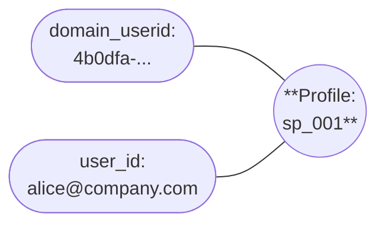
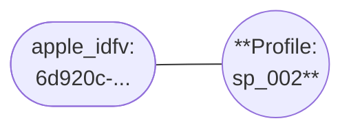
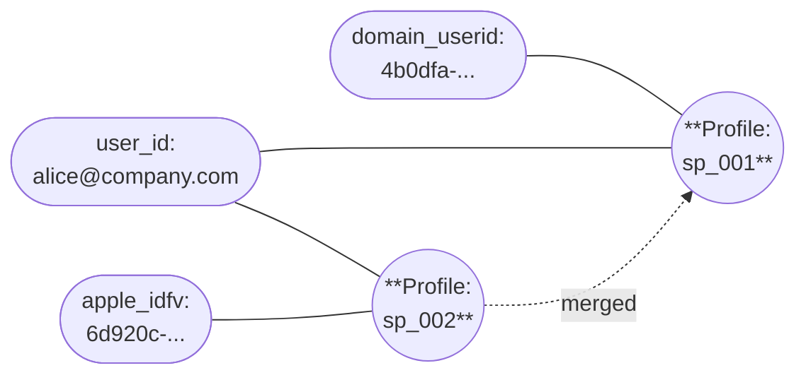

Merges happen when an event contains identifiers that are linked to different profiles. This typically occurs when a user's anonymous activity is later connected to their known identity.

When profiles merge, the older profile's Snowplow ID becomes the ID for the combined profile. All identifiers from both profiles are linked to the combined profile. Merged profiles can also be merged again in the future if new connecting identifiers are observed.

When a merge occurs, Identities emits a [merge event](/docs/identities/concepts/index.md#merge-events) into your enriched event stream.

## Example merge process

In this example, a user has already been browsing the ExampleCompany website. Identities has created a profile `sp_001` with two linked identifiers: a `domain_userid` (browser cookie) and a `user_id` (authenticated email), as shown below.

The same user now installs a Snowplow-enabled ExampleCompany mobile app on their Apple phone, and uses the app anonymously (i.e. is not logged in).

The ExampleCompany team has configured Identities to use the `apple_idfv` identifier from the mobile platform entity.

Identities finds a new `apple_idfv` value in the user's first event, so it creates a new profile.

| Event property | Value        |
| -------------- | ------------ |
| `apple_idfv`   | `6d920c-...` |
| `user_id`      | -            |

The user then logs into the mobile app. The next event contains the known `apple_idfv` and the previously seen `user_id`. Identities detects that profiles `sp_001` and `sp_002` refer to the same user because of the matching `user_id`. It merges them and emits a merge event.

| Event property | Value               |
| -------------- | ------------------- |
| `apple_idfv`   | `6d920c-...`        |
| `user_id`      | `alice@company.com` |

The older profile becomes the active Snowplow ID. All identifiers from both profiles are now linked to `sp_001`; all future events containing any of these identifiers will have an identity entity containing `sp_001` attached.

