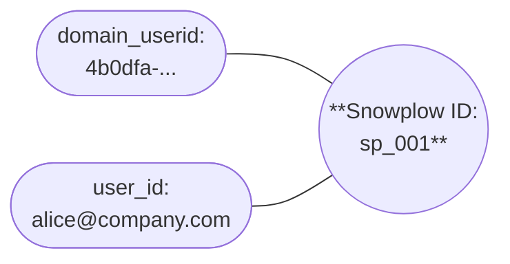
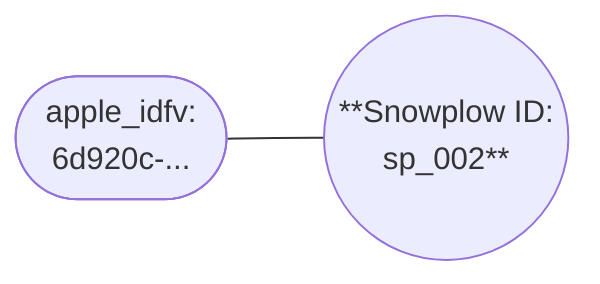
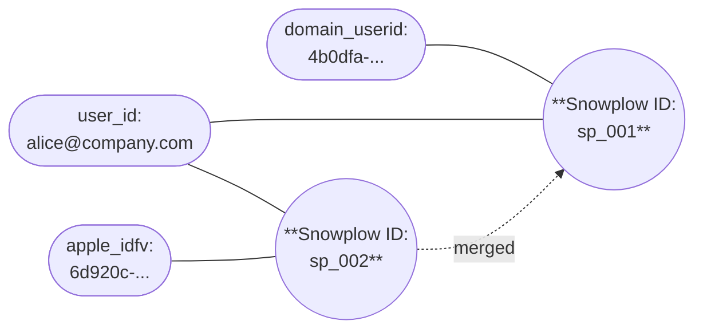

Merges happen when an event contains identifiers that are linked to different Snowplow IDs. This typically occurs when a user's anonymous activity is later connected to their known identity.

When Snowplow IDs merge, the older Snowplow ID becomes the ID for the combined set of identifiers. All identifiers from both Snowplow IDs are linked to the combined Snowplow ID. Merged Snowplow IDs can also be merged again in the future if new connecting identifiers are observed.

When a merge occurs, Identities emits a [merge event](/docs/identities/concepts/index.md#merge-events) into your enriched event stream.

## Example merge process

In this example, a user has been browsing the ExampleCompany website. Identities, running in the ExampleCompany Snowplow pipeline, has created Snowplow ID `sp_001` with two linked identifiers: a `domain_userid` from the browser cookie, and a `user_id` from their authenticated email.

The same user now installs the ExampleCompany mobile app on their iPhone, and uses the app anonymously, i.e. they're not logged in.

The ExampleCompany team has configured Identities to use the `apple_idfv` identifier from the mobile platform entity.

Identities finds a new `apple_idfv` value in the user's first event, so it creates a new Snowplow ID.

| Event property | Value        |
| -------------- | ------------ |
| `apple_idfv`   | `6d920c-...` |
| `user_id`      | -            |

The user then logs into the mobile app. The next event contains the known `apple_idfv` and the previously seen `user_id`. Identities detects that `sp_001` and `sp_002` refer to the same user because of the matching `user_id`. It merges them and emits a merge event.

| Event property | Value               |
| -------------- | ------------------- |
| `apple_idfv`   | `6d920c-...`        |
| `user_id`      | `alice@company.com` |

The older Snowplow ID becomes the active one. All identifiers from both Snowplow IDs are now linked to `sp_001`; all future events containing any of these identifiers will have an identity entity containing `sp_001` attached.

