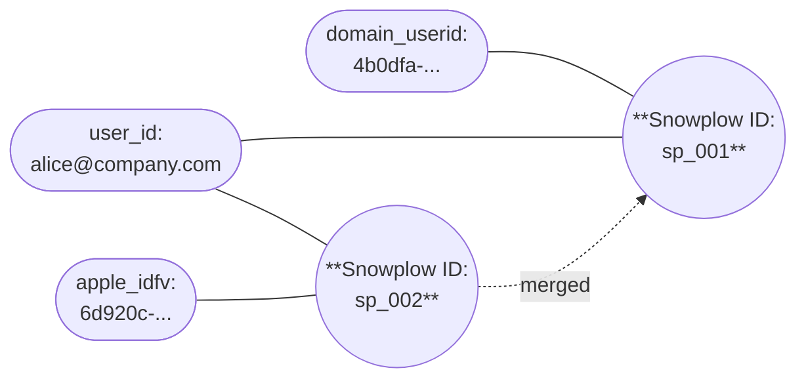
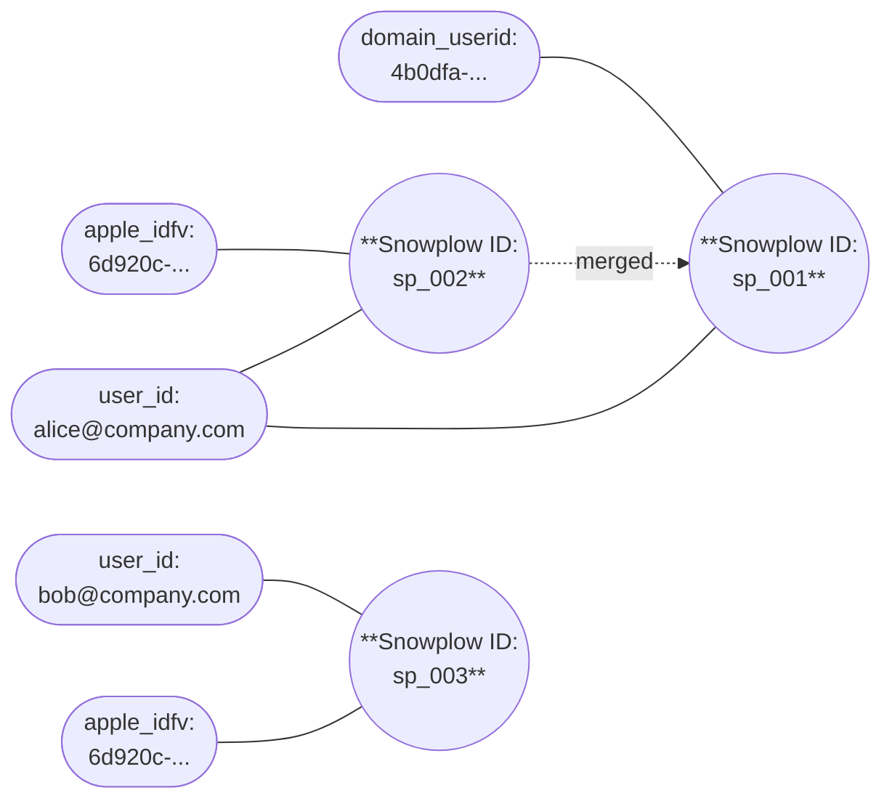
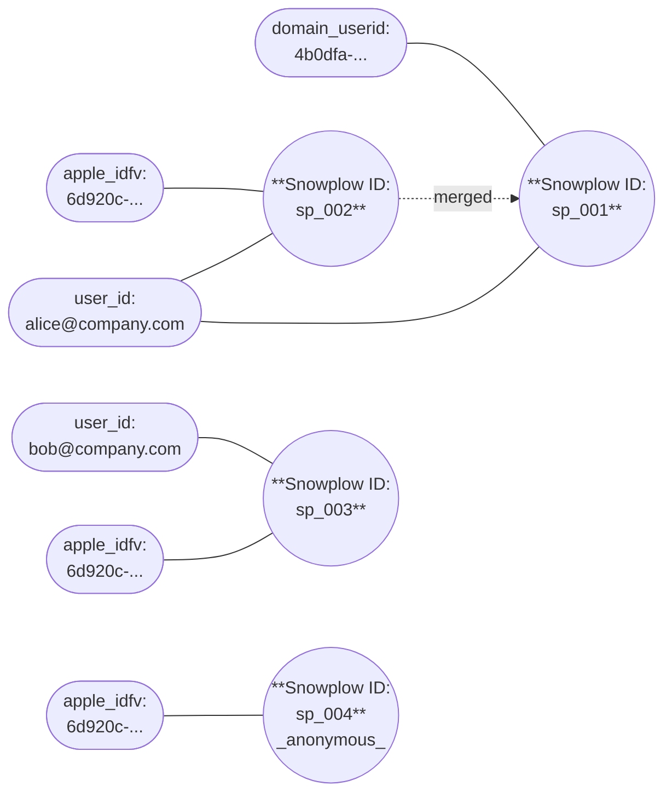

**Unique identifiers** are identifiers that should never cause two Snowplow IDs to merge together if they have different values. For example, if you mark `user_id` as unique, two events with different `user_id` values will never cause their Snowplow IDs to merge, even if they share other identifiers like `domain_userid`. This prevents incorrect merges such as when multiple users share a device or browser.

When Identities processes an event that would cause a merge, it checks whether any unique identifiers would conflict. If they do, Identities creates a new anonymous Snowplow ID for any identifiers that cannot be definitively attributed to either existing Snowplow ID.

## Example merge conflict

In this example, Alice has been using ExampleCompany's website and mobile app. Identities, running in the ExampleCompany Snowplow pipeline, has previously [merged](/docs/identities/concepts/merges/index.md) her web and mobile Snowplow IDs into `sp_001`, linked to her `domain_userid`, `user_id`, and `apple_idfv` identifiers.

ExampleCompany have configured the `user_id` identifier as unique.

Alice shares her phone with a colleague, Bob. Bob logs into the ExampleCompany mobile app on Alice's phone. The event contains the device's `apple_idfv`, already linked to Alice's Snowplow ID via the earlier merge, and Bob's `user_id`.

| Event property | Value             |
| -------------- | ----------------- |
| `apple_idfv`   | `6d920c-...`      |
| `user_id`      | `bob@company.com` |

Identities detects a conflict: the `apple_idfv` is linked to a Snowplow ID with `user_id: alice@company.com`, but the event contains `user_id: bob@company.com`. Because `user_id` is marked as unique, Identities doesn't merge them. Instead, it creates a new Snowplow ID for Bob and links all of the event's identifiers to it — including the shared `apple_idfv`.

Bob logs out, and a third person picks up the device and opens the app without logging in. The event contains only the `apple_idfv`. Identities looks up the identifier and finds it linked to Snowplow IDs with two different unique `user_id` values: `alice@company.com` and `bob@company.com`.

| Event property | Value        |
| -------------- | ------------ |
| `apple_idfv`   | `6d920c-...` |
| `user_id`      | -            |

Identities can't attribute this anonymous activity to either Alice or Bob. Instead of guessing, it creates a new anonymous Snowplow ID. The anonymous Snowplow ID is deterministic, so all future anonymous events from this device receive the same ID until a user logs in.

:::tip[Reset identifiers on logout]
For web browsers, consider calling [`newSession`](/docs/sources/web-trackers/tracking-events/session/index.md) or [`clearUserData`](/docs/sources/web-trackers/anonymous-tracking/index.md#clear-user-data) when a user logs out. This resets the `domain_userid` cookie, preventing it from being shared between users on the same browser.
:::
