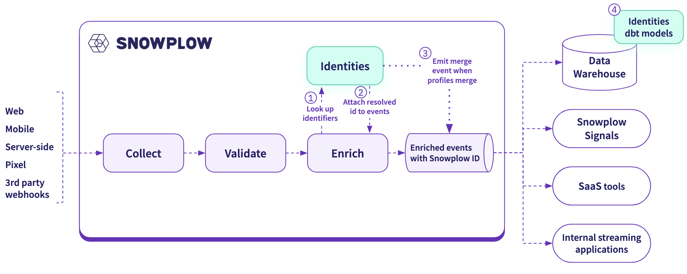

import AvailabilityBadges from '@site/src/components/ui/availability-badges';

<AvailabilityBadges
  available={['cloud', 'pmc', 'addon']}
  helpContent="Identities is a paid addon for Snowplow CDI."
/>

Snowplow Identities provides real-time identity resolution. It stitches together user identifiers to create a unified view of each user, and adds a unified `snowplow_id` to each event.

Identities allows you to:
* Attribute anonymous events to authenticated users, both within the same session and across sessions and devices
* Connect behavior across web, iOS, and Android apps, when users authenticate with the same credentials on different platforms
* Build on [cross-navigation tracking](/docs/events/cross-navigation/index.md) to identify users across domains
* Distinguish between separate users sharing the same device

Use the provided Identities data models to build identifier mapping tables. These tables help with key use cases such as marketing attribution, conversion funnel analysis, multi-touchpoint reporting, audience targeting, feature engineering, and personalization.

## How Identities fits into the Snowplow pipeline

Identity resolution happens in real time as part of the [event enrichment process](/docs/fundamentals/index.md).

After all other configured enrichments run, the pipeline sends user identifiers in the event payload to the Identities service. It either links the identifiers to an existing Snowplow ID, or creates a new one. Enrich then adds the resolved Snowplow ID to the event in an [identity entity](/docs/identities/concepts/index.md#identity-entity).

Some incoming identifiers will reveal that two previously separate Snowplow IDs actually belong to the same user. Identities will merge them in its graph database, and emit a [merge event](/docs/identities/concepts/index.md#merge-events) directly into your enriched event stream.

Your Identities infrastructure is deployed into the same cloud as your pipeline. The core components are:
* **Identities API**: used for identity operations
* **Managed Postgres database**: persists the identity graph and performs graph operations. Snowplow uses [Aurora](https://aws.amazon.com/rds/aurora/) on AWS and [AlloyDB](https://cloud.google.com/products/alloydb) on GCP.

## Get started with Identities

To use Identities, start by deciding which user identifiers are most relevant to your use cases. Identities supports standard Snowplow identifiers such as `user_id` and `domain_userid`, as well as custom identifiers derived from any field in the event payload. See the [configuration](/docs/identities/configuration/index.md) page for more details.

After configuring Identities, set up the [Identities dbt package](/docs/identities/data-models/index.md) to create your identity tables.
