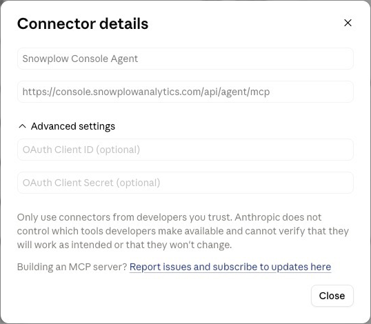
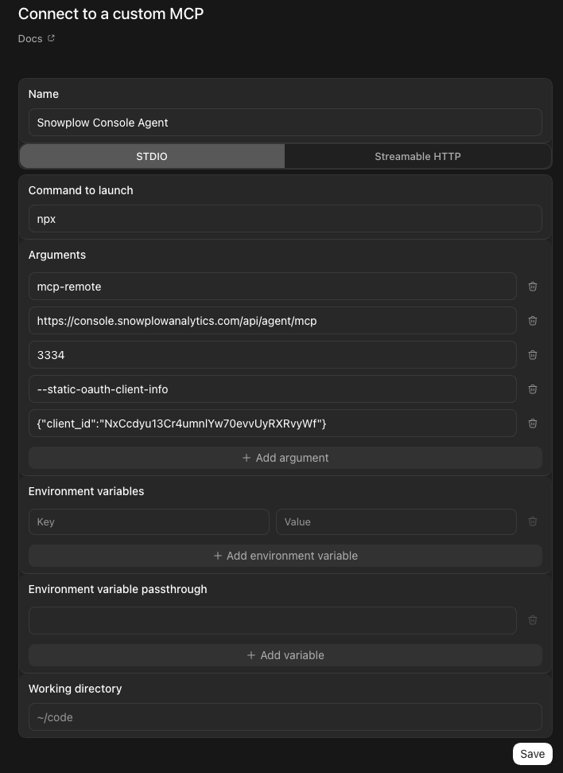

import Tabs from '@theme/Tabs';
import TabItem from '@theme/TabItem';

Snowplow MCP is a remote [Model Context Protocol](https://modelcontextprotocol.io/) (MCP) server that lets AI assistants interact with your Snowplow Console account using natural language.

The MCP server exposes the same set of tools as the Snowplow Assistant, but in your choice of harness and model. The server authenticates through your existing Snowplow Console login via OAuth.

## One-line install (Claude Code, Cursor, Codex)

The recommended way to install Snowplow MCP is with the [`plugins` CLI](https://github.com/vercel-labs/plugins), a vendor-neutral installer that auto-detects supported AI tools. From any terminal, run:

```bash
npx plugins add snowplow/skills
```

This installs the Snowplow MCP server plus six bundled skills — `tracking-design`, `implementation-guidance`, `signals`, `pipeline-infrastructure`, `console-operations`, and `troubleshooting` — into any detected agent tool in a single step. The plugin source lives at [github.com/snowplow/skills](https://github.com/snowplow/skills).

The `plugins` CLI auto-detects [Claude Code](https://claude.com/product/claude-code) and [Cursor](https://cursor.com/). Pass `--target claude-code` or `--target cursor` to scope the install to a specific tool.

On first use, your tool opens a browser for OAuth against [Snowplow Console](https://console.snowplowanalytics.com) — see [Authentication](#authentication) for the permissions model.

:::tip[Skills are model-invoked]
The bundled skills are loaded on demand by the model. Claude or Cursor automatically engages the relevant skill when you ask about tracking design, pipeline troubleshooting, or any of the other areas. There is no slash command to run.
:::

## Configure the MCP server

If your tool isn't supported by the [`plugins` CLI](#one-line-install-claude-code-cursor-codex), or you want the MCP server without the bundled skills, configure it manually using the snippets below.

<Tabs groupId="mcp-client" queryString>
  <TabItem value="claude-ai" label="Claude.ai" default>

Claude.ai supports remote MCP servers as custom connectors. To add Snowplow MCP:

1. Open [Claude.ai](https://claude.ai) and navigate to **Settings**.
2. Under **Connectors**, click **Add connector**.
3. Fill in the connector details:
   - **Name**: `Snowplow MCP`
   - **URL**: `https://console.snowplowanalytics.com/api/agent/mcp`
4. Expand **Advanced settings** and enter the OAuth Client ID: `NxCcdyu13Cr4umnIYw70evvUyRXRvyWf`
5. Click **Add**.



Claude.ai will redirect you to the Snowplow login page to authorize access.

  </TabItem>
  <TabItem value="claude-desktop" label="Claude Desktop">

The custom connector method also works for Claude Desktop. But in case you don't have access to custom connectors, you can configure it directly in Claude Desktop using [`mcp-remote`](https://www.npmjs.com/package/mcp-remote)

Add the following to your Claude Desktop configuration filej:

- macOS: `~/Library/Application Support/Claude/claude_desktop_config.json`
- Windows: `%APPDATA%\Claude\claude_desktop_config.json`

```json
{
  "mcpServers": {
    "snowplow-mcp": {
      "command": "npx",
      "args": [
        "-y",
        "mcp-remote",
        "https://console.snowplowanalytics.com/api/agent/mcp",
        "3334",
        "--static-oauth-client-info",
        "{\"client_id\":\"NxCcdyu13Cr4umnIYw70evvUyRXRvyWf\"}"
      ]
    }
  }
}
```

Restart Claude Desktop after saving. On startup Claude Desktop opens a browser window for Snowplow login and caches the token locally for subsequent sessions.

  </TabItem>
  <TabItem value="claude-code" label="Claude Code">

Add a remote MCP server to Claude Code by running:

```bash
claude mcp add snowplow-mcp \
  --transport http \
  --client-id NxCcdyu13Cr4umnIYw70evvUyRXRvyWf \
  --callback-port 3334 \
  https://console.snowplowanalytics.com/api/agent/mcp
```

Run the "mcp" command, select the "snowplow-mcp" and then "Authenticate". This should open a browser page for Snowplow login.

  </TabItem>
  <TabItem value="codex-cli" label="Codex CLI">

Add a remote MCP server to Codex CLI by running:

```bash
codex mcp add snowplow-mcp -- \
  npx mcp-remote \
  https://console.snowplowanalytics.com/api/agent/mcp \
  3334 \
  --static-oauth-client-info \
  '{"client_id":"NxCcdyu13Cr4umnIYw70evvUyRXRvyWf"}'
```

Codex will redirect you to the Snowplow login page to authorize access.

  </TabItem>
  <TabItem value="codex-ui" label="Codex UI">

1. Open Codex and navigate to **Settings** > **MCP servers** > **Add server** > **STDIO**.
2. Fill in the server details:
   - **Name**: `Snowplow MCP`
   - **Command to launch**: `npx`
   - **Arguments** (one per row):
     1. `mcp-remote`
     2. `https://console.snowplowanalytics.com/api/agent/mcp`
     3. `3334`
     4. `--static-oauth-client-info`
     5. `{"client_id":"NxCcdyu13Cr4umnIYw70evvUyRXRvyWf"}`
3. Click **Save**.



Codex will redirect you to the Snowplow login page to authorize access.

  </TabItem>

  <TabItem value="cursor" label="Cursor">

1. Open Cursor and navigate to **Settings** > **Cursor Settings** > **Tools & MCPs**.
2. Click **New MCP Server**. This opens the `mcp.json` configuration file.
3. Add the following configuration:

```json
{
  "mcpServers": {
    "snowplow-mcp": {
      "command": "npx",
      "args": [
        "-y",
        "mcp-remote",
        "https://console.snowplowanalytics.com/api/agent/mcp",
        "3334",
        "--static-oauth-client-info",
        "{\"client_id\":\"NxCcdyu13Cr4umnIYw70evvUyRXRvyWf\"}"
      ]
    }
  }
}
```

4. Save the file and return to **Tools & MCPs**. The server should appear in the list.

Cursor will redirect you to the Snowplow login page to authorize access.

  </TabItem>

</Tabs>

## Authentication

The MCP server authenticates via OAuth using your Snowplow Console credentials. The AI assistant operates with the same permissions as your user account — it can access and modify only things that you can.

The server automatically connects to the organization your account belongs to. Selecting a different organization is not currently supported.

## Capabilities of the server

The MCP server gives your AI assistant read and write access to the main areas of Snowplow Console. The full list of tools is visible in your MCP client after connecting.

- **Data structures and schemas** — browse, inspect, and create [data structures](/docs/fundamentals/schemas/index.md), and search [Iglu Central](https://github.com/snowplow/iglu-central) for reusable public schemas.
- **Event specifications and tracking plans** — manage [event specifications](/docs/event-studio/tracking-plans/event-specifications/index.md) and [tracking plans](/docs/event-studio/tracking-plans/index.md), and view event volume metrics.
- **Source applications** — manage [source applications](/docs/event-studio/source-applications/index.md) and their associated entities.
- **Pipelines** — inspect [pipeline](/docs/pipeline/index.md) configuration, health metrics, and collector settings, including [Snowplow Micro](/docs/testing/snowplow-micro/index.md) instances.
- **Failed events and data quality** — investigate [failed events](/docs/fundamentals/failed-events/index.md) and manage data quality alerts.
- **Enrichments** — view and update [enrichment](/docs/pipeline/enrichments/index.md) configurations.
- **Data catalog** — browse and search tracked data structures.
- **Signals** — manage the full [Signals](/docs/signals/index.md) workflow, including attribute groups, services, interventions, and publishing to compute engines.
- **Documentation** — fetch pages from the Snowplow documentation site for quick reference.

## Example prompts

After connecting, try asking your assistant:

- "What pipelines do I have and what's their current status?"
- "Show me the failed events from the last 24 hours"
- "Create a new event specification for a signup_completed event"
- "What enrichments are enabled on my production pipeline?"
- "Search the data catalog for anything related to ecommerce"
