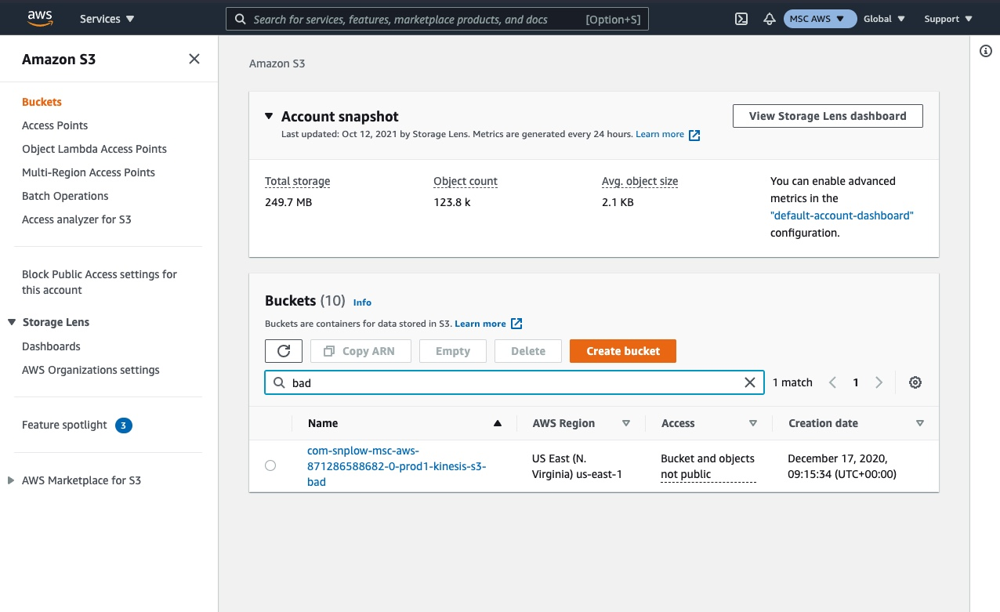
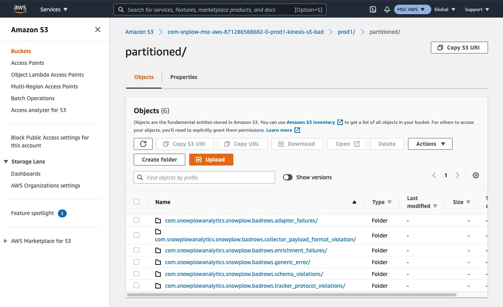
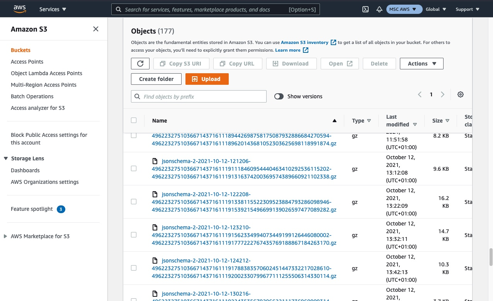
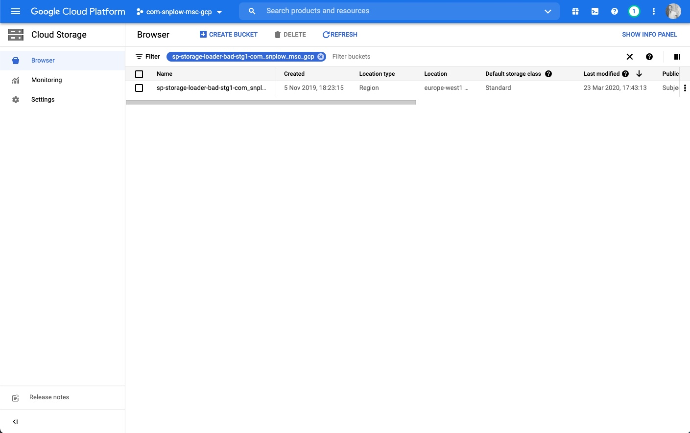
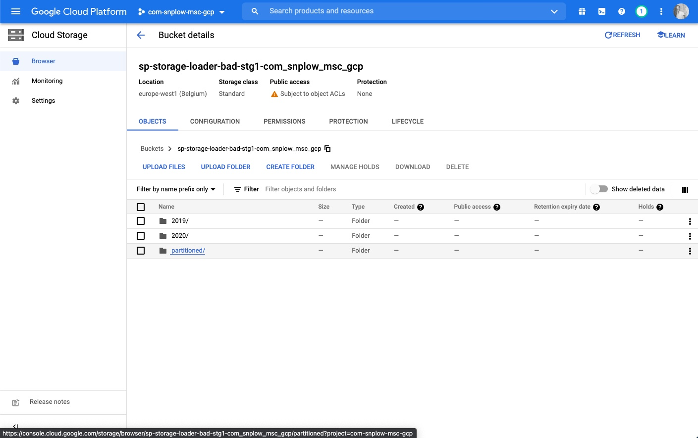
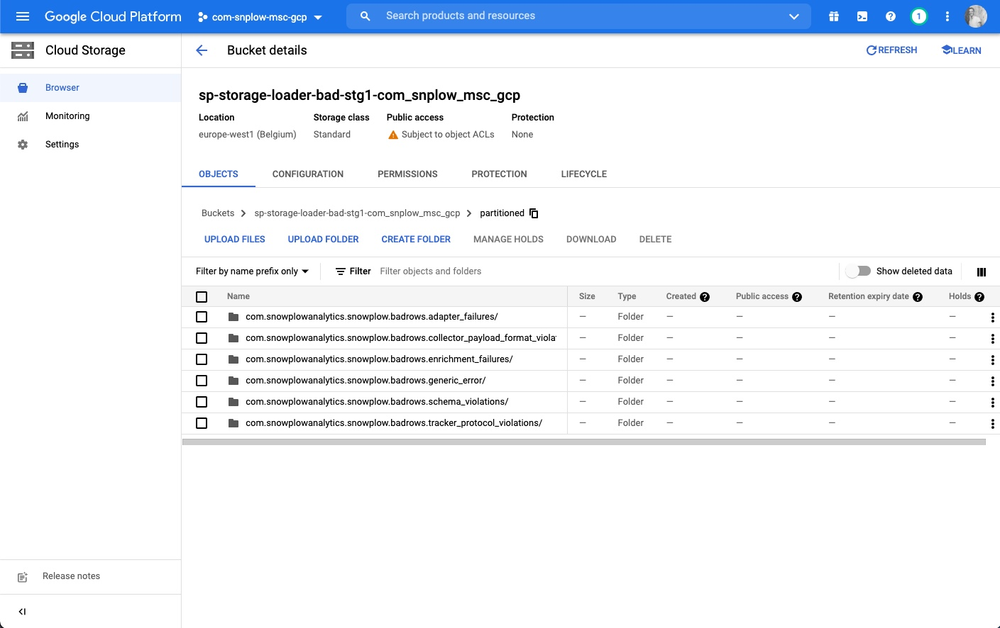
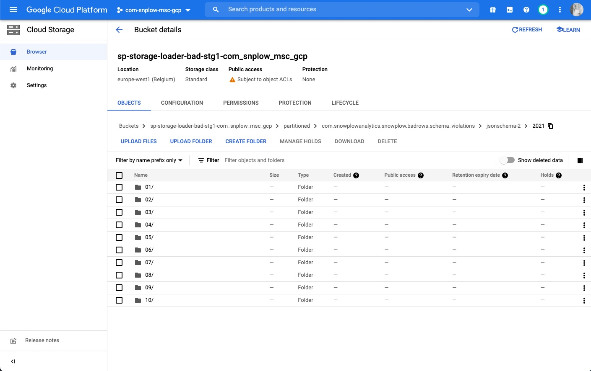
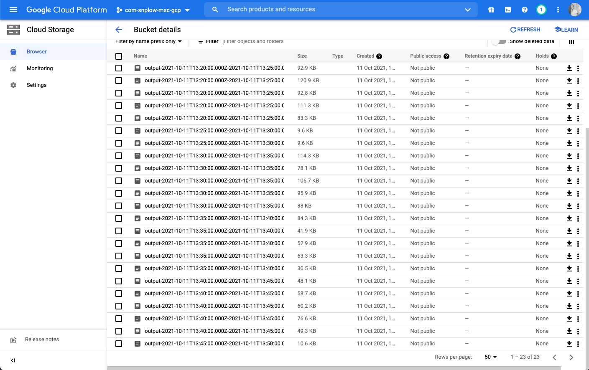

When failed events are generated on your pipeline the raw event payload along with details about the failure are saved into file storage (S3 on AWS, GCS on Google Cloud).

:::info Community Edition quick start guide on GCP

If you followed the [Community Edition quick start guide](/docs/getting-started-on-snowplow-open-source/quick-start/index.md) on GCP, you will need to manually deploy the [GCS Loader](/docs/pipeline-components-and-applications/loaders-storage-targets/google-cloud-storage-loader/index.md) to save failed events into GCS, as it’s currently not included in the Terraform scripts.

:::

You can directly access and download examples of events that are failing from file storage, this is useful for further investigation and also required to design a recovery operation.

## Retrieving raw data from S3 on AWS

- Login to your AWS Console account and navigate to the sub-account that contains your Snowplow pipeline
- Navigate to your S3 storage buckets
- You should find a bucket with a name ending in `-kinesis-s3-bad` and within that a folder with your pipeline name e.g. `prod1`
- Navigate into this folder and you should see `partitioned` (search if it isn't visible), and within this a folder for each type of failed event. Select the relevant type for the failed events you wish to find.
- You can now browse the folder using date and time to find a batch of failed events that occurred on that date / time period.

Step 1 - login to AWS and navigate to S3, find or search for the '-kinesis-s3-bad' folder for your pipeline

Step 2 - locate or search for the folder called 'partitioned'

Step 3 - select the relevant folder for your error type

Step 4 - use the date and timestamps to find a batch of failed events that will contain an example of the event you wish to find

## Retrieving raw data from GCS on GCP

- Login to your Google Cloud Platform account and navigate to the project that contains your Snowplow pipeline
- Navigate to your Google Cloud Storage buckets
- You should find a bucket named with a prefix of `sp-storage-loader-bad`
- Navigating into this you should see `partitioned`, and within this a folder for each type of failed event. Select the relevant type for the failed event you wish to find.
- You can now drill down by year, month, day, and hour to find a batch of failed events that occured on that date / time period.

Step 1 - find the right folder

Step 2 - select the partitioned folder

Step 3 - select the relevant folder for your error type

Step 4 - drill down into the folder structure by year, month, day and time

Step 5 - once you find the raw files you can download them and view them in a text editor
