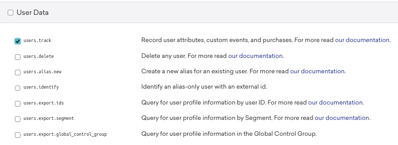

## Configuration options

### Braze REST API Endpoint (required)

Set this to the URL of your Braze REST [endpoint](https://www.braze.com/docs/api/basics/#endpoints).

### Braze API Key (required)

Set this to your Braze [API Key](https://www.braze.com/docs/api/basics/#app-group-rest-api-keys) that will be included in each request. The minimum permission that you need to assign for this API Key is to access the `/users/track` endpoint.

### Braze external\_id (required)

Set this key to the client event property (e.g. `client_id`) that corresponds to your users' `external_id` and will be used as the [Braze User Identifier](https://www.braze.com/docs/api/basics/#external-user-id-explanation).

## Snowplow Event Mapping Options

This section includes the mapping rules that concern a Snowplow event as claimed by the [Snowplow Client](/docs/migrated/forwarding-events-to-destinations/forwarding-events/google-tag-manager-server-side/snowplow-client-for-gtm-ss/):

### Include Self Describing event

This option indicates if the Snowplow Self-Describing event data will be included in the event's properties object that will be sent to Braze. By default, this option is enabled.

### Snowplow Event Context Rules

This section describes how the Braze Tag will use the context Entities attached to a Snowplow Event.

#### Extract entity from Array if single element

Snowplow Entities are always in Arrays, as multiple of the same entity can be attached to an event. This option will pick the single element from the array if the array only contains a single element.

#### Include all Entities in event object

Leaving this option enabled (default) ensures that all Entities on an event will be included within the Braze event's properties object.

Disabling this option, reveals the options so that individual entities can be selected for inclusion.

#### Snowplow Entity Mapping

Using the "Snowplow Entity Mapping" table, the entities can also be remapped to have different names in the Braze and can be included in either event's properties or user attributes object.. The entity can be specified in two different formats:

- Major version match: `x-sp-contexts_com_snowplowanalytics_snowplow_web_page_1` where `com_snowplowanalytics_snowplow` is the event vendor, `web_page` is the schema name and `1` is the Major version number. `x-sp-` can also be omitted from this if desired
- Full schema match: `iglu:com.snowplowanalytics.snowplow/webPage/jsonschema/1-0-0`

#### Include unmapped entities in event

When remapping or moving some entities to User Attributes with the above customization, this option enables you to ensure that all unmapped entities (i.e. any entites not found in the "Snowplow Entity Mapping" rules above) will be included in the properties object of the Braze event.

## Additional Event Mapping Options

If you wish to pick other properties from the Client event and map them onto the Braze event, these can be specified in this section.

### Event Property Rules

#### Include common event properties

Enabled by default, this option sets whether to automatically include the event properties from the [Common Event definition](https://developers.google.com/tag-platform/tag-manager/server-side/common-event-data) in the properties of the Braze event.

#### Additional Event Property Mapping Rules

Specify the Property Key from the Client Event, and then the properties' object key you could like to map it to or leave the mapped key blank to keep the same name. You can use Key Path notation here (e.g. `x-sp-tp2.p` for a Snowplow events platform or `x-sp-contexts_com_snowplowanalytics_snowplow_web_page_1.0.id` for a Snowplow events page view id (in array index 0) or pick non-Snowplow properties if using an alternative Client. These keys will populate the Braze event's properties object.

#### Include common user properties

Enabled by default, this option sets whether to include the `user_data` properties from the common event definition in the Braze User Attributes object.

#### Additional User Property Mapping Rules

Using this table, you can additionally specify the Property Key from the Client Event, and then the User Attribute key you could like to map it to (or leave the mapped key blank to keep the same name). You can use Key Path notation here (e.g. `x-sp-tp2.p` for a Snowplow events platform or `x-sp-contexts_com_snowplowanalytics_snowplow_web_page_1.0.id` for a Snowplow events page view id (note the array index 0) or pick non-Snowplow properties if using an alternative Client.

## Advanced Event Settings

Finally, this section offers an additional configuration option:

### Event time property

This option enables you to specify the client event property to populate the event time (in ISO-8601 format) or leave it empty to use the current time (default behaviour).
