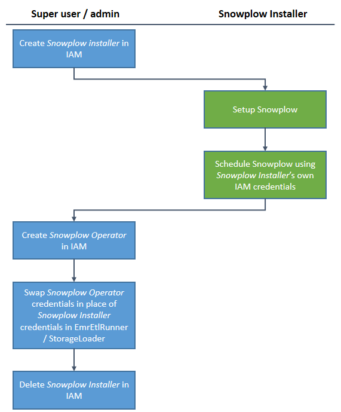

## Set up a sub-account

### Overview

We recommend that Snowplow users create an AWS sub-account and sandbox all of their Snowplow operations into that account.

### Setting up an AWS sub-account

#### 1\. Setup Consolidated Billing

As a first step, log into your AWS account and click the "Sign up for Consolidated Billing" button:

[https://portal.aws.amazon.com/gp/aws/developer/account?ie=UTF8...](https://portal.aws.amazon.com/gp/aws/developer/account?ie=UTF8...)

#### 2\. Create a new account

From a non-logged in browser, you will then want to sign up again to AWS again like this:

[https://portal.aws.amazon.com/gp/aws/developer/registration/in...](https://portal.aws.amazon.com/gp/aws/developer/registration/in...)

Call this new account `snowplow-acme` (where Acme is your company name). Note the email address you signed up with.

#### 3\. Link the accounts

In your main account, head back to ConsolidatedBilling and click the Send a Request button. Provide the email address for your new sub-account.

You should receive an email to the email address for your new sub-account. Copy the activation link and paste it into your browser logged in to the sub-account.

Your accounts are now linked! This will allow us to spin up instances, create new S3 buckets etc.

#### 4\. Enable the services that Snowplow requires

Next, you need to enable the services Snowplow will require in the new subaccount.

For the Snowplow batch (Spark) flow:

- CloudFront
- CloudFormation
- EC2
- Elastic Beanstalk
- Elastic MapReduce
- S3
- Redshift

For the Snowplow real-time (Kinesis) flow:

- As above, plus:
- Kinesis
- DynamoDB

## Create IAM roles

IAMs gives you fine grained control over the level of permissions each user has in accessing your AWS account. It is wise to limit the permissions to each user to the minimum to enable them to do the job required, so that if those credentials are compromised, the hacker who gains access to them has limited access to your AWS account.

You need to setup different groups / users in IAMs at different stages of your Snowplow setup:

1. [A user to setup Snowplow on your AWS account (the _Snowplow Installer_)](/docs/migrated/getting-started-on-snowplow-open-source/setup-snowplow-on-aws/setting-up-your-aws-environment/iam-permissions-for-installing-snowplow/). Create credentials for a user to install Snowplow on your AWS account. This user has lots of permissions, as she will need to setup all the relevant collectors, buckets on Amazon S3 and Redshift cluster, if required.
2. [A user to run the Snowplow data pipeline (the _Snowplow Operator_)](/docs/migrated/getting-started-on-snowplow-open-source/setup-snowplow-on-aws/setting-up-your-aws-environment/iam-permissions-for-operating-snowplow/). _Once_ your Snowplow stack has been setup, you create a new user with much more limited permissions than those allocated to the user who installed Snowplow, and use these credentials for EmrEtlRunner to manage your data pipeline over time.

**Disclaimer: Snowplow Analytics Ltd will not be liable for any problems caused by the full or partial implementation of these instructions on your Amazon Web Services account. If in doubt, please consult an independent AWS security expert.**
