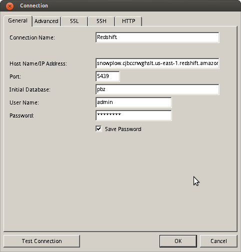

There are two ways to connect to your Redshift cluster.

### Directly connect

Amazon has helpfully provided detailed instructions for connecting to Redshift using [SQL Workbench](http://docs.aws.amazon.com/redshift/latest/gsg/getting-started.html). In this tutorial, we will connect using [Navicat](http://www.navicat.com/), a database querying tool which we recommend (30-day trial version are available from the [Navicat website](http://www.navicat.com/)).

**Note: Redshift can be accessed using PostgreSQL JDBC or ODBC drivers. Only specific versions of these drivers work with Redshift**. These are:

- JDBC [http://jdbc.postgresql.org/download/postgresql-8.4-703.jdbc4.jar](http://jdbc.postgresql.org/download/postgresql-8.4-703.jdbc4.jar)
- ODBC [http://ftp.postgresql.org/pub/odbc/versions/msi/psqlodbc\_08\_04\_0200.zip](http://ftp.postgresql.org/pub/odbc/versions/msi/psqlodbc_08_04_0200.zip) or [http://ftp.postgresql.org/pub/odbc/versions/msi/psqlodbc\_09\_00\_0101-x64.zip](http://ftp.postgresql.org/pub/odbc/versions/msi/psqlodbc_09_00_0101-x64.zip) for 64 bit machines

We've found that many other Postgres clients generally do work with Redshift for _most_ queries. (Especially where those queries are being hand crafted rather than generated by the client itself so that the user can make sure any SQL is Redshift-compatible.)

Open Navicat, select "Connection" -> "PostgreSQL" to establish a new connection:

Give your connection a suitable name. We now need to enter the host name, port, database, username and password. With the exception of the password, these are all available directly from the AWS UI. Go back to your browser, open the AWS console, go to Redshift and select your cluster:

Copy the endpoint, port, database name and username into the relevant fields in Navicat, along with the password you created when you setup the cluster:

Click "Test Connection" to check that it is working. Assuming it is, click "OK".

The Redshift cluster is now visible on Navicat, alongside every other database it is connected to.

### Connect via SSL

Amazon Redshift supports Secure Sockets Layer (SSL) connections to encrypt data and server certificates to validate the server certificate that the client connects to.

ODBC DSNs contain an `sslmode` setting that determines how to handle encryption for client connections and server certificate verification. The following `sslmode` values from the client connection are supported:

- `disable`: SSL is disabled and the connection is not encrypted.
- `allow`: SSL is used if the server requires it.
- `prefer`: SSL is used if the server supports it. Amazon Redshift supports SSL, so SSL is used when you set `sslmode` to `prefer`.
- `require`: SSL is required.
- `verify-ca`: SSL must be used and the server certificate must be verified.
- `verify-full`: SSL must be used. The server certificate must be verified and the server hostname must match the hostname attribute on the certificate.

The difference between `verify-ca` and `verify-full` depends on the policy of the root CA. If a public CA is used, `verify-ca` allows connections to a server that somebody else may have registered with the CA to succeed. In this case, `verify-full` should always be used. If a local CA is used, or even a self-signed certificate, using verify-ca often provides enough protection.

The default value for `sslmode` is `prefer`. It is only provided as the default for backwards compatibility, and not recommended in secure deployments.
