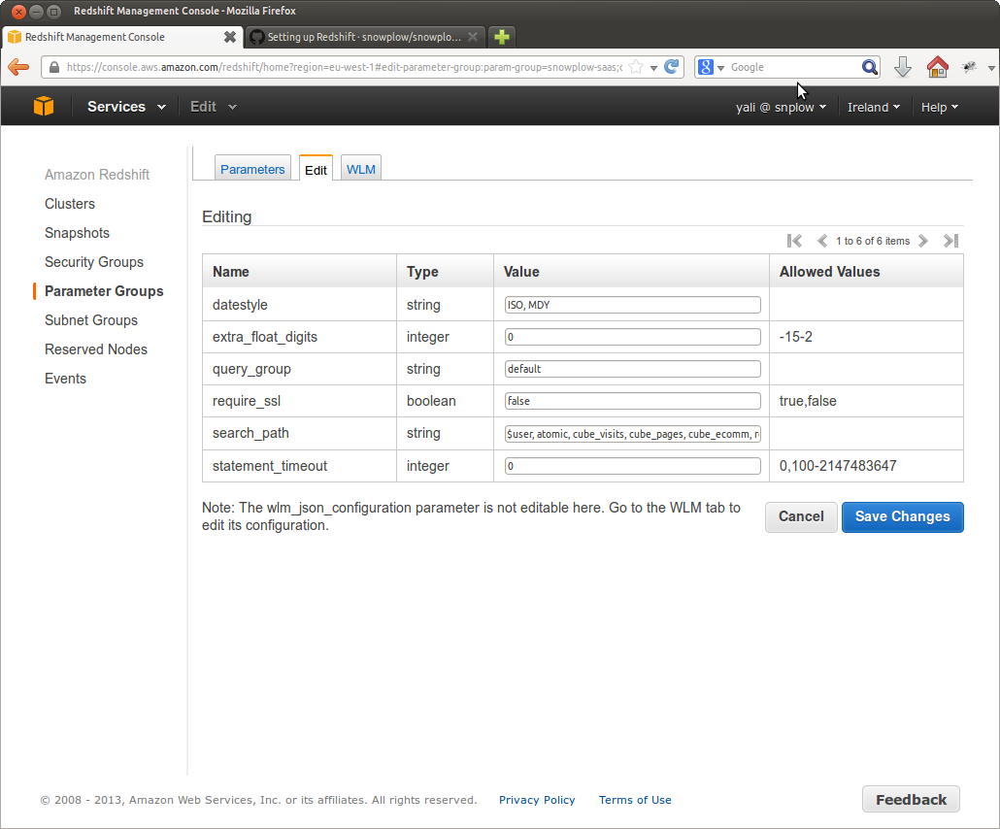
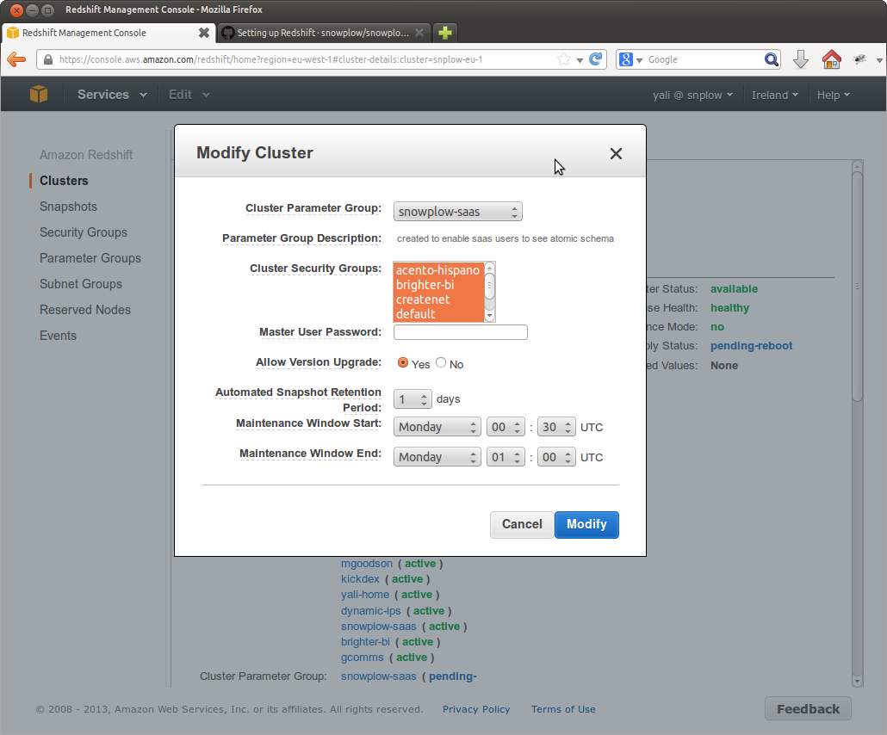

The `search path` specifies where Redshift should look to locate tables and views that are specified in queries submitted to it. This is important because the Snowplow events table is located in the "atomic" schema, whilst derived tables can be located in their own schemas. By adding these schemas to the Redshift search path, it means that when you connect to Redshift from different tools (e.g. Tableau, SQL workbench), those tools can identify tables and views in each of those schemes, and present them as options for the user to connect to.

Updating the search path is straightforward. In the AWS Redshift console, click on the **Parameters Group** menu item on the left hand. menu, and select the button to **Create Cluster Parameter Group**:


Give your parameter group a suitable name and click **Create**. The parameter group should appear in your list of options.

Now open up your parameter group, by clicking on the magnifying glass icon next to it, and then selecting **Edit** in the menu across the top:



Update the **search\_path** section to read the following:

```
atomic,  derived
```

Note: you can choose to add and remove schemas. Do note, however, that if you include a schema on the search path that does not exist yet on your database, you will cause Redshift to become very unstable. (For that reason, it is often a good idea to leave the `search_path` with the default settings, and only update it once you've setup the relevant schemas in Redshift.)

Save the changes. We now need to update our cluster to use this parameter group. To do so, select **Clusters** from the left hand manu, select your cluster and click the modify button. Now you can select your new parameter group in the **Cluster Parameter Group** dropdown:



Click the **Modify** button to save the changes. We now need to reboot the cluster, so that the new settings are applied. Do this by clicking the **Reboot** button on the top menu.
