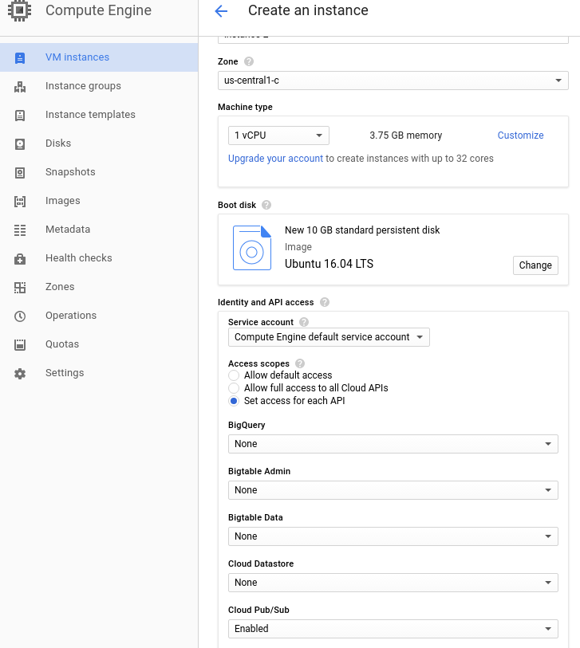
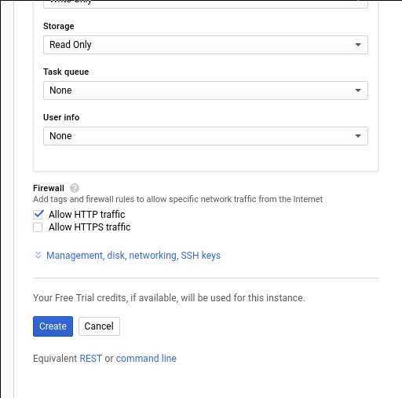

To run the collector on a single GCP instance, you'll first need to spin one up:

- Go to the [GCP dashboard](https://console.cloud.google.com/home/dashboard), and once again, make sure your project is selected.
- Click the hamburger on the top left corner, and select Compute Engine, under Compute
- Enable billing if you haven’t (if you haven’t enabled billing, at this point the only option you’ll see is a button to do so)


- Click “Create instance” and pick the apropriate settings for your case, making sure of, at least the following:
    - Under _Access scopes_, select “Set access for each API” and enable “Cloud PubSub”
    - Under _Firewall_, select “Allow HTTP traffic”
    - _Optional_ Click _Management, disk, networking, SSH keys_Under _Networking_, add a Tag, such as “collector”. (This is needed to add a tagged Firewall rule, explained below)





- Click the hamburger on the top left corner, and click on “VPC Network”, under _Networking_
- On the sidebar, click on “Firewall rules”
- Click “Create Firewall Rule”
- Name your rule
- Under _Source filter_ pick “IP ranges” and specify "0.0.0.0/0" (to allow traffic from everywhere)
- Under _Protocols and ports_ add “tcp:8080”
    - Note that 8080 is the port assigned to the collector in the configuration file. If you choose another port here, make sure you change the config file
- Under _Target tags_ add the Tag with which you labeled your instance (here `collector`)
- Click “Create”
- Now prepare your collector config file by following [the configuration guide](/docs/migrated/pipeline-components-and-applications/stream-collector/configure/).
- Create a Google Cloud Storage bucket that will host this configuration file for the collector


- Then click “Upload Files” and upload your configuration file.

Once you have your config file in place, ssh into your instance:

```
$ gcloud compute ssh your-instance-name --zone your-instance-zone
```

And then run:

```
$ sudo apt-get update
$ sudo apt-get -y install default-jre
$ sudo apt-get -y install unzip
$ wget "https://github.com/snowplow/stream-collector/releases/download/2.3.0/snowplow-stream-collector-google-pubsub-<VERSION>.jar"
$ gsutil cp gs://<YOUR-BUCKET-NAME/<YOUR-CONFIG-FILE-NAME> .
$ java -jar snowplow-stream-collector-google-pubsub-<VERSION>.jar --config <YOUR-CONFIG-FILE-NAME>
```
