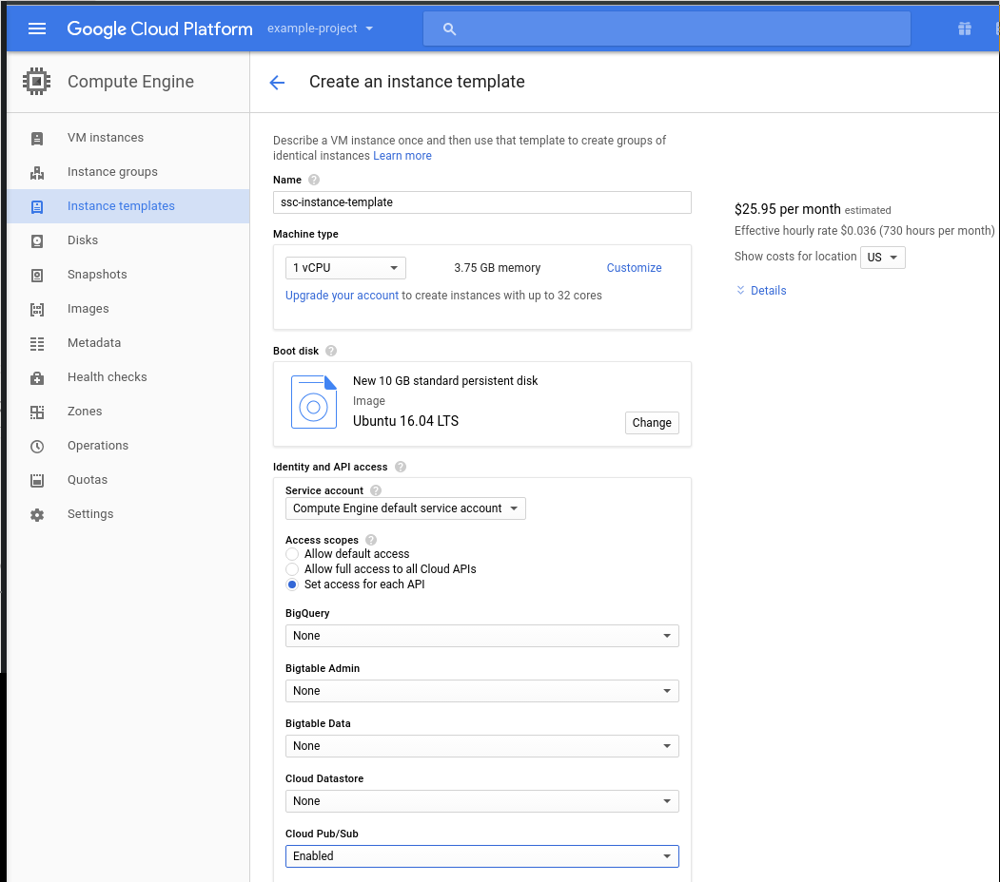
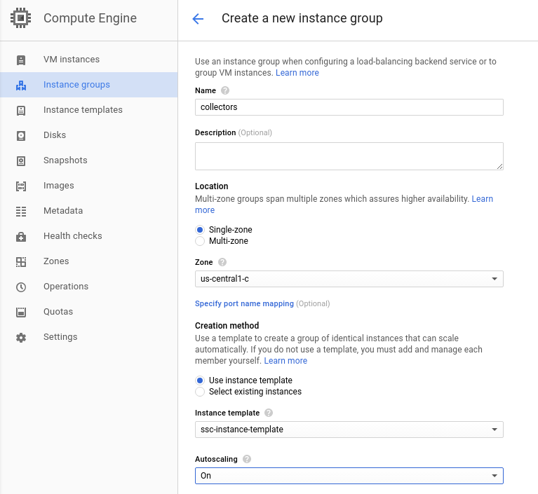
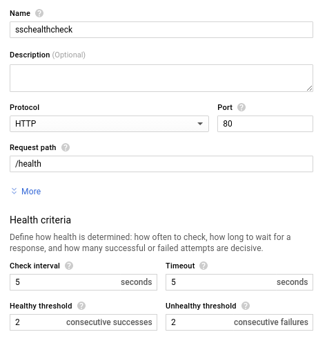

This is the recommended production setup.

To run a load balanced auto-scaling cluster, you’ll need to follow the following steps:

- Create an instance template
- Create an auto managed instance group
- Create a load balancer

## Creating an instance template

First you’ll have to store your config file in some place that your instances can download from, like Google Cloud Storage. We suggest you store it in a GCP Storage bucket, as described above.

- Click the hamburger on the top left corner and find “Compute Engine”, under _Compute_
- Go to “Instance templates” on the sidebar. Click “Create instance template”
- Choose the appropriate settings for your case. Do (at least) the following:
    - Under _Access scopes_, select “Set access for each API” and enable “Cloud PubSub”
    - Under _Firewall_, select “Allow HTTP traffic”
    - Click _Management, disk, networking, SSH keys_



- Under _Networking_, add a tag, such as “collector”. (This is needed to add a Firewall rule)
- Under _Management_ “Startup script” add the following script (changing the relevant fields for your case):

```
#! /bin/bash
sudo apt-get update
sudo apt-get -y install default-jre
sudo apt-get -y install unzip
wget "https://github.com/snowplow/stream-collector/releases/download/2.3.0/snowplow-stream-collector-google-pubsub-<VERSION>.jar"
gsutil cp gs://<YOUR-BUCKET-NAME/<YOUR-CONFIG-FILE-NAME> .
java -jar snowplow-stream-collector-google-pubsub-<VERSION>.jar --config <YOUR-CONFIG-FILE-NAME> &
```

- Click “Create”
- Add a Firewall rule as described above (if you haven’t already)

### Create an auto managed instance group

- On the side bar, click “Instance groups”
- Click “Create instance group”
- Fill in with the appropriate values. We named our instance group “collectors”.
- Under _Instance template_ pick the instance template you created previously
- Set _Autoscaling_ to “On”. By default the Autoscale is based on CPU usage and set with default settings. We’ll leave them as they are for now.
- Under _Health Check_, pick “Create health check”
    - Name your health check
    - Under _Port_ add 8080 or the port you configured above
    - Under _Request path_ add “/health”
    - Click “Save and Continue”
- Click “Create”





### Configure the load balancer

- Click the hamburger on the top left corner, and find “Network services” under _Networking_
- On the side bar, click “Load Balancing”
- Click “Create load balancer”
- Select “HTTP load balancing” and click “Start configuration”


- Under _Backend configuration_:
    - Click “Create a backend service”
    - Pick an appropriate name
    - Pick the instance group we created above
    - Pick the port number we configured earlier
    - Input a maximum number of requests per second per instance
    - You can input “Maximum CPU utilization” and “Capacity” at your discretion
    - Under _Health check_ pick the health check you created previously
- Under _Host and path rules_: you can just make sure that the backend service selected is the one we just created
- Under _Frontend configuration_:
    - Leave _IP_ as “Ephemeral” and leave _Port_ to 80
- Click “Review and finalize” to check everything is OK.
- Click “Create”
- You’ll be able to check out this load balancer IP and port by clicking on it
- You can then make sure this load balancer is used by your instance group by going back to “Instance groups”
