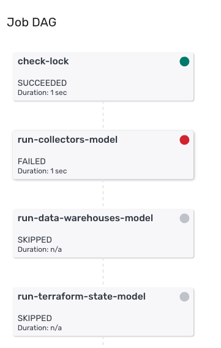

Please note this documentation assumes you are running your data models via the data modeling UI in Snowplow BDP Console, as described in [the documentation for configuring and running data models via Snowplow BDP](/docs/migrated/modeling-your-data/configuring-and-running-data-models-via-snowplow-insights/#21_Configuring_data_models_via_the_data_modeling_UI_new).

### Receiving alerts

If a run of a data model fails for any reason, all owners are notified automatically. A link to the jobs UI in console is provided in the alert, which you can review to diagnose the failure.

### Diagnosing failures

You will be able to see the details of your data model failure in the jobs interface in console. Under 'Job Dag' for the failed job, click on the failed step to see details of what went wrong.

The 'Error Output' will show you the error logs from the sql runner job. These logs will contain the information the database relayed back to sql runner about the failure.

### Understanding and resolving issues

An error output message such as a 'connection refused' related message, or for example an `EOF` error is typically down to some external database process, or a network connection error. These errors do not need to be resolved, however you might still need to resume the model (more details on this in the next section).

If the error output shows a SQL, playbook or syntax error, then the issue is with the model's SQL. You will need to resolve this issue in GitHub. In these cases, we recommend testing the fix by running the SQL locally before merging it to `master` (using either sql runner or some other tool to connect to the database).

If you have any questions about the data model failure, simply reply to alert email to create a Support ticket.

### Resuming data models

#### Hard and soft locks

Locks determine what happens when a job is currently running, and when a job fails.

Both hard and soft locks prevent a job from starting if the same job is already running. Hard locks remain in place if the job fails - and so prevent the next run of the job from starting. Soft locks are removed when a job fails, and so a failed job will be retried on the next scheduled run.

If a hard lock is in place, the job can not be restarted until the lock is removed manually by the Snowplow support team - this can be requested by emailing `support@snowplowanalytics.com`.

Unless the data model is not safe to restart, we recommend using soft locks. Any standard use of the Snowplow v1 data models are safe to restart, and so can use soft locks. This allows you to resolve any issues that occur in your model without needing to wait for any manual action.

#### If your model is running on a soft lock

If your model is running on a soft lock, you do not need to do anything to resume it. This is the reason for recommending all models run on a soft lock if they are safe to resume from the top.

If there is an issue with the SQL or playbooks of the model when it fails on a soft lock, it will continue to run on schedule, and will continue to send alerts each time it fails. There's nothing wrong with letting this happen, however you can also pause the model until you have fixed the issue and are ready to retry it. This is done by setting the status to `disabled`:

Once the issue is resolved, simply set it back to `enabled` and the model will run again on its schedule.

#### If your model is running on a hard lock

##### If your model is safe to resume from the top

If your model is running on a hard lock, the lock needs to be removed to resume the data model. You will need to email Support to get the lock removed once you have resolved the issue. You can simply reply to the alert email to create a Support ticket.

Recommendation

If your data model is safe to resume from the top, we recommend you run it on a soft lock. For example, all Snowplow standard v1 data models can run on a soft lock.

You can configure the lock type in the data modeling interface in console.

##### If your model is not safe to resume from the top

If your model in not safe to resume from the top, you will need to resume it from the step it failed from.

If you want to resume it from a specific playbook, please follow this process after resolving the issue that resulted in failure:

1. Pause the model by disabling the schedule.
2. Ask Support to unlock the model.
3. Copy the current production playbook configuration of the model for later. Remove all playbooks ahead of the playbook you want to run in the playbook configuration in the data modeling interface in console.
4. Enable the model and wait for one scheduled run with the modified playbook configuration to complete. You may want to edit the schedule temporarily if your models runs very frequently / not frequently enough. If there is not much time in between runs, you might also want to disable the model again after one run to give yourself enough time for the next step.
5. Copy the production playbook configuration (and schedule if modified) back into the interface, returning the model back to its original configuration.

If you want to resume it from a specific step in a playbook, please follow this process after resolving the issue that resulted in failure:

1. Pause the model by disabling the schedule.
2. Ask Support to unlock the model.
3. In GitHub, copy the relevant playbook (renaming the original production playbook to `{PLAYBOOK_NAME}_paused.yml`) and remove all steps you do not want to run. Merge these changes to master.
4. Enable the model and wait for one scheduled run to complete. You may want to edit the schedule temporarily if your models runs very frequently / not frequently enough. If there is not much time in between runs, you might also want to disable the model again after one run to give yourself enough time for the next step.
5. Delete the temporary playbook and return the production playbook name back to its original. If you have updated the schedule or disabled the model, return both settings back to their original values as well.
