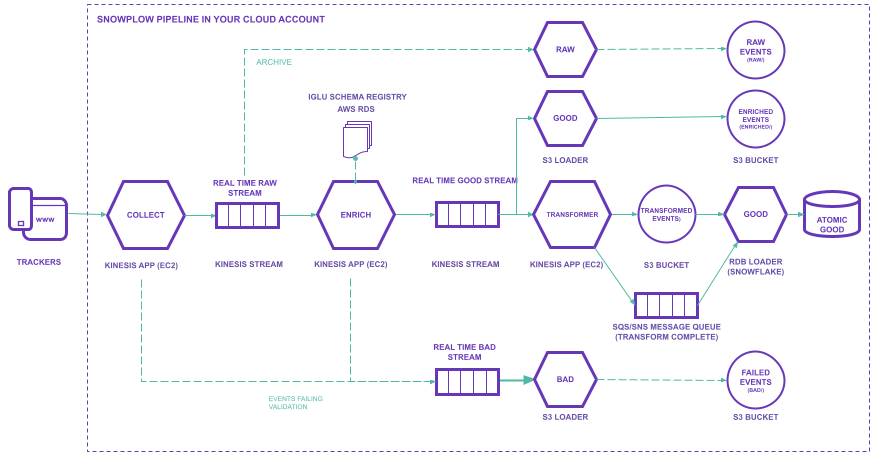

**Let’s take a look at what is deployed on AWS upon running the quick start example script.**

Note: you can very easily edit the script or run each of the terraform modules independantly, giving you the flexibility to design the topology of your pipeline according to your needs.

#### **Collector load balancer**

This is an application load balancer (ELB) for your inbound HTTP/S traffic. Traffic is routed from the load balancer to the collector. 

_For further details on the resources, default and required input variables, and outputs see the [terraform-aws-alb module](https://github.com/snowplow-devops/terraform-aws-alb) github repository._

#### **Stream Collector**

This is a Snowplow event collector that receives raw Snowplow events over HTTP, serializes them to a [Thrift](http://thrift.apache.org/) record format, and then writes them to Kinesis. More details can be found [here](/docs/migrated/pipeline-components-and-applications/scala-stream-collector/).

_Find out more about the Collector terraform module, and explore the full set of variables here: [https://registry.terraform.io/modules/snowplow-devops/collector-kinesis-ec2/aws/latest](https://registry.terraform.io/modules/snowplow-devops/collector-kinesis-ec2/aws/latest)_

#### **Stream Enrich**

This is a Snowplow app written in scala which: 

- Reads raw Snowplow events off a Kinesis stream populated by the Scala Stream Collector
- Validates each raw event
- Enriches each event (e.g. infers the location of the user from his/her IP address)
- Writes the enriched Snowplow event to another stream

It is designed to be used downstream of the [Scala Stream Collector](/docs/migrated/pipeline-components-and-applications/scala-stream-collector/). More details can be found [here](/docs/migrated/pipeline-components-and-applications/enrichment-components/stream-enrich/). 

_FInd out more about the Enrich modules and explore the full set of variables available here: [https://registry.terraform.io/modules/snowplow-devops/enrich-kinesis-ec2/aws/latest](https://registry.terraform.io/modules/snowplow-devops/enrich-kinesis-ec2/aws/latest)_

#### **Kinesis streams**

Your kinesis streams are a key component of ensuring a non-lossy pipeline, providing crucial back-up, as well as serving as a mechanism to drive real time use cases from the enriched stream. 

__FInd out more about the Kinesis stream module and explore the full set of variables available here: [https://registry.terraform.io/modules/snowplow-devops/enrich-kinesis-ec2/aws/latest](https://registry.terraform.io/modules/snowplow-devops/kinesis-stream/aws/latest)__

**Raw stream**

Collector payloads are written to this raw kinesis stream, before being picked up by the Enrich application. The S3 loader (raw) also reads from this raw stream and writes to the raw S3 folder.

**Enriched stream**

Events that have been validated and enriched by the Enrich application are written to this enriched stream. The S3 loader (enriched) reads from this enriched stream and writes to the enriched folder on S3.

**Bad 1 stream**

This bad stream is for events that the collector, enrich or S3 loader (raw and enriched) applications fail to process. An event can fail at the collector point due to, for instance, it being too large for the stream creating a size violation bad row, or it can fail during enrichment due to a schema violation or enrichment failure.  More details can be found [here](/docs/migrated/managing-data-quality/failed-events/understanding-failed-events/). 

**Bad 2 stream**

This bad stream is for failed events generated by the S3 loader as it tries to write from the bad 1 stream to the bad folder on S3.

#### **Iglu** 

[Iglu](/docs/migrated/pipeline-components-and-applications/iglu/) allows you to publish, test and serve schemas via an easy-to-use RESTful interface. It is split into a few services.

**Iglu load balancer**

This load balances the inbound traffic and routes traffic to the Iglu Server. 

___FInd out more about the application load balancer module and explore the full set of variables available here:__ [https://registry.terraform.io/modules/snowplow-devops/alb/aws/latest](https://registry.terraform.io/modules/snowplow-devops/alb/aws/latest)_

**Iglu Server**

The [Iglu Server](https://github.com/snowplow/iglu/tree/master/2-repositories/iglu-server) serves requests for Iglu schemas stored in your schema registry. 

__Find out more about the Iglu Server module and explore the full set of variables available here:_ [https://registry.terraform.io/modules/snowplow-devops/iglu-server-ec2/aws/latest](https://registry.terraform.io/modules/snowplow-devops/iglu-server-ec2/aws/latest)_

**Iglu RDS**

This is the Iglu Server database where the Iglu schemas themselves are stored. 

___Find out more about the RDS module and explore the full set of variables available here:_ [https://registry.terraform.io/modules/snowplow-devops/rds/aws/latest](https://registry.terraform.io/modules/snowplow-devops/iglu-server-ec2/aws/latest)__

#### **S3 loader**

The Snowplow S3 Loaders consume records from your relevant [Amazon Kinesis](http://aws.amazon.com/kinesis/) streams (as outlined above) and writes them to [S3](http://aws.amazon.com/s3/). 

___Find out more about the S3 loader module and explore the full set of variables available here: [https://registry.terraform.io/modules/snowplow-devops/s3-loader-kinesis-ec2/aws/latest](https://registry.terraform.io/modules/snowplow-devops/s3-loader-kinesis-ec2/aws/latest)___

**S3 loader raw**

Responsible for reading from the raw stream (i.e. events from the collector that have not yet been validated or enriched) and writing to the raw folder on S3. Any events that have failed to be processed by the raw S3 loader get written to your bad-1 stream.

**S3 loader bad**

Responsible for reading from the bad-1 stream and writing to the bad folder on S3. Any events that fail to be processed by the bad S3 loader get written to the bad-2 stream.

**S3 loader enriched**

Responsible for reading from the enriched stream and writing to your enriched folder on S3. Any events that fail to be processed by the enriched S3 loader get written to the bad-1 stream.

#### S3 loader bucket

Your S3 bucket where the raw, enriched and bad data gets written to by the S3 loader.

___Find out more about the S3 bucket module and explore the full set of variables available here: [https://registry.terraform.io/modules/snowplow-devops/s3-bucket/aws/latest](https://registry.terraform.io/modules/snowplow-devops/s3-bucket/aws/latest)___

#### SQS Queue

SQS queue is used for communication between Transformer Kinesis and Snowflake Loader.

Transformer Kinesis sends SQS message to Snowflake Loader after finishing transforming some window of data. Snowflake Loader listens to SQS queue. When a new message is received, it extracts necessary information from the message and loads data to Snowflake. More details can be found in [How `transformer` and `loader` interface with other Snowplow components and each other](/docs/migrated/pipeline-components-and-applications/loaders-storage-targets/snowplow-rdb-loader-3-0-0/#how-transformer-and-loader-interface-with-other-snowplow-compone).

#### Transformer Kinesis

This is Snowplow application reads the enriched data from Kinesis stream, transforms it to format expected by Loader and write it to S3 bucket.

After transforming is finished, it sends SQS message to Loader to notify that it can load the transformed data. More details can be found in the [Stream Transformer documentation](/docs/migrated/pipeline-components-and-applications/loaders-storage-targets/snowplow-rdb-loader-3-0-0/transforming-enriched-data/stream-transformer/).

Find out more about the Transformer Kinesis module and explore the full set of variables available here: [_https://registry.terraform.io/modules/snowplow-devops/transformer-kinesis-ec2/aws/latest_](https://registry.terraform.io/modules/snowplow-devops/transformer-kinesis-ec2/aws/latest)

#### Snowflake Loader

The Snowplow application responsible for [loading transformed enriched data from S3 to Snowflake](/docs/migrated/pipeline-components-and-applications/loaders-storage-targets/snowplow-rdb-loader-3-0-0/loading-transformed-data/snowflake-loader/).

Find out more about the Snowflake Loader module and explore the full set of variables available here: [_https://registry.terraform.io/modules/snowplow-devops/snowflake-loader-ec2/aws/latest_](https://registry.terraform.io/modules/snowplow-devops/snowflake-loader-ec2/aws/latest)

#### DynamoDB

On the first run of each of the applications (Enrich, S3 loaders, Transformer) the Kinesis Connectors Library creates a DynamoDB table to keep track of what they have consumed from the stream so far. Each Kinesis consumer maintains its own checkpoint information.

The DynamoDB autoscaling module enables autoscaling for a target DynamoDB table. Note that there is a `kcl_write_max_capacity` variable which can be set to your expected RPS, but setting it high will of course incur more cost.

_You can find further details here: [https://registry.terraform.io/modules/snowplow-devops/dynamodb-autoscaling/aws/latest](https://registry.terraform.io/modules/snowplow-devops/dynamodb-autoscaling/aws/latest)_

##### Have more questions? Take a look at our [Quick Start FAQs](/docs/migrated/open-source-quick-start/quick-start-faqs/) or reach out to us on [discourse](https://discourse.snowplowanalytics.com/)!
