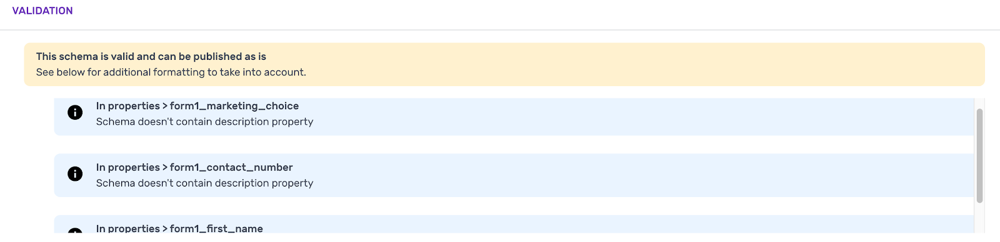

Let's take an example of collecting data for the filling out of a form there are several data points that we want to make sure we get right and therefore want to be explicit in defining their schema.

Example form on a website:


### Create the schema

First let's create the skeleton for our schema that will describe the structure of the data we want to capture from this form.

We'll give it the following details:

- We'll set name to `basic_form_tracking`
- And give it a description of `Schema for tracking our demo form`

```
{
    "$schema" : "http://iglucentral.com/schemas/com.snowplowanalytics.self-desc/schema/jsonschema/1-0-0#",
    "description": "Schema for tracking our demo form",
    "self": {
        "vendor": "com.snowplowanalytics",		
	"name": "basic_form_tracking",						
	"format": "jsonschema",
	"version": "1-0-0"
    },
    "type": "object",
    "properties": {	
        ...
    },
    "additionalProperties": false
}
```

### Adding properties

If we take the first field “First Name” and assume that the form owner makes the decisions that:

1. The name of the field should be ‘form1\_first\_name’ (so everyone knows how to find it in the database later)
2. Values entered should be a string (text)
3. The string should have a minimum of two characters (to avoid initials) and a maximum of 100 characters.
4. This field is required.

Therefore in the schema for this data structure we would display these decisions as properties of the field and specify this field as required:

```
...
    "properties": {
        "form1_first_name": {
            "type": "string",
            “minLength”: 2,
            "maxLength": 100
        },
    },
    "required": [
        "form1_first_name"
    ]
...
```

For the second form field the form owner might decide:

1. The name of the field should be “form1\_contact\_number”
2. The values entered must be a number
3. The minimum and maximum number length should be 10 digits
4. This is an optional field

So we would add another field to the properties in the schema as such:

```
...
    "properties": {
        "form1_first_name": {
            "type": "string",
            “minLength”: 2,
            "maxLength": 100
        },
        "form1_contact_number": {
            "type": ["number",”null”]
            “minLength”: 10,
            "maxLength": 10
        },
    },
    "required": [
        "form1_first_name"
    ]
...
```

By adding the “null” type above this means that if there is no data value sent across for this field the event will still pass schema validation.

Finally for the 3rd form field the decisions are as follows:

1. The name of the field should be “opt\_into\_marketing”
2. The values sent are True/False; Yes = true, No = false
3. This field is required.

Our schema definition would be as follows:

```
...
    "properties": {
        "form1_first_name": {
            "type": "string",
            “minLength”: 2,
            "maxLength": 100
        },
        "form1_contact_number": {
            "type": ["number",”null”]
            “minLength”: 10,
            "maxLength": 10
        },
        "opt_into_marketing": {
            "type": "boolean"
        },
    },
    "required": [
        "form1_first_name",
        "opt_into_marketing"
    ]
...
```

### Putting it all together

Putting it all together our schema for capturing the additional contexts of individual form fields on the event that someone submits this form might look something like this:

```
{
     "$schema" : "http://iglucentral.com/schemas/com.snowplowanalytics.self-desc/schema/jsonschema/1-0-0#",
     "description": "Schema for tracking our demo form",
     "self": {
         "vendor": "com.snowplowanalytics",        
     "name": "basic_form_tracking",                      
     "format": "jsonschema",
     "version": "1-0-0"
     },
     "type": "object",
     "properties": {
         "form1_first_name": {
             "type": "string",
             “minLength”: 2,
             "maxLength": 100
         },
         "form1_contact_number": {
             "type": ["number",”null”]
             “minLength”: 10,
             "maxLength": 10
         },
         "opt_into_marketing": {
             "type": "boolean"
         },
     },
     "required": [
         "form1_first_name",
         "opt_into_marketing"
     ],
     "additionalProperties": false
 }
```

##### `additionalProperties: false`

Set to **false** this means any events sent with properties not defined in the schema will fail validation

Set to **true**, the events will pass validation but properties not in the schema will be archived rather than loaded into your data warehouse when using Big Query or Redshift. Snowflake DB will load the event.

In cases where you have more control over the data collection like 1st party sources you may want to be more strict, whereas with 3rd party sources you might not want to be as strict.

Great! We now have a schema written for our form. Next we need to upload it to our environments.

### Uploading your schema

For this step, follow the documentation on [using Snowplow Console to manage your data structures](/docs/migrated/using-the-snowplow-console/managing-data-structures/).

Once you have successfully created and published your schema to the development registry you can begin sending test events to your Snowplow Mini.

#### A note on validating our schema

When you validate the schema you will see a few validation warnings, letting us know that our properties don’t have “descriptions”.



Descriptions within properties, like the description for the overall schema help others that might need to use or edit your schema, understand the purpose of the field and/or where this field is being collected. Although in this case, the warning messages are not mandatory to fix, you should take them into account if they are relevant to your schema.

Let’s add descriptions to the properties, for example:

```
...
    "form1_contact_number": {
        "type": ["number", "null"],
        "minimum": 0,
        "maximum": 9999999999,
        "description": "This is the contact number field from form1 on acme.com/form1"
    },
...
```

## 2\. Testing Your Schema

Now that you have written your schema and published to the development registry, the next step is to test it to ensure that it works the way you want.

To do this we'll need to:

- Create the HTML for our form
- Initialize the Snowplow Javascript Tracker
- Set up our event tracking
- Send the events to Snowplow Mini

### HTML

Create a new HTML page with this content:

```
<html>
<body>
<form class="form-horizontal">
<fieldset>

<!-- Form Name -->
<legend>Form Name</legend>

<!-- Text input-->
<div class="form-group">
  <label class="col-md-4 control-label" for="form1_first_name">First name</label>  
  <div class="col-md-4">
  <input id="form1_first_name" name="form1_first_name" type="text" placeholder="" class="form-control input-md" required="">
    
  </div>
</div>

<!-- Text input-->
<div class="form-group">
  <label class="col-md-4 control-label" for="form1_contact_number">Contact number</label>  
  <div class="col-md-4">
  <input id="form1_contact_number" name="form1_contact_number" type="text" placeholder="" class="form-control input-md">
    
  </div>
</div>

<!-- Multiple Checkboxes -->
<div class="form-group">
  <label class="col-md-4 control-label" for="opt_into_marketing">Receive marketing info?</label>
  <div class="col-md-4">
  <div class="checkbox">
    <label for="opt_into_marketing-0">
      <input type="checkbox" name="opt_into_marketing" id="opt_into_marketing-0" value="1">
      Yes
    </label>
	</div>
  <div class="checkbox">
    <label for="opt_into_marketing-1">
      <input type="checkbox" name="opt_into_marketing" id="opt_into_marketing-1" value="0">
      No
    </label>
	</div>
  </div>
</div>

<!-- Button -->
<div class="form-group">
  <label class="col-md-4 control-label" for="button"></label>
  <div class="col-md-4">
    <button id="button" name="button" class="btn btn-primary" onclick="form1submit()">Submit</button>
  </div>
</div>

</fieldset>
</form>
</body>
</html>
```

### JavaScript

#### Initializing the tracker

Follow the Web Quick Start Guide to [download the Javascript Tracker and call it into your HTML](/docs/migrated/collecting-data/collecting-from-own-applications/javascript-tracker/web-quick-start-guide/).

#### Setting up tracking

For our form example we would likely be using the JavaScript Tracker to send across the necessary data on the submit button click event.

Let's add a function into our page, you'll need to pass in the values from your form:

```
<script>
function form1submit(){ 
  window.snowplow('trackSelfDescribingEvent', {
    schema: 'iglu:com.snowplowanalytics/form1_fields/jsonschema/1-0-0',
    data: {
        form1_first_name: VALUE HERE,
        form1_contact_number: VALUE HERE,
        opt_into_marketing: VALUE HERE
    }
  });
};
</script>
```

#### Testing the tracking

Once you get the tracking set up and start sending events you can see if they validate against your schema by using the Kibana discovery tool. You'll find a link to Kibana in your Snowplow Console.
