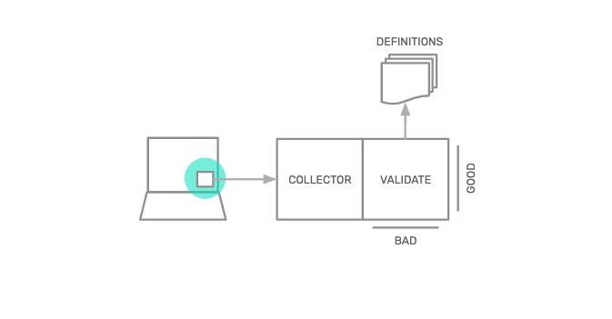

[Snowplow Micro](https://github.com/snowplow-incubator/snowplow-micro) is a very small Snowplow pipeline, with a few added extras:

- It is small enough to be spun up as part of an automated test suite
- It can be configured to connect to your schema registries, so that it can perform validation on any data that is sent into it
- It exposes a REST API that means it can be queried to see:
    - What events have been sent
    - How many of those events ended up being successfully processed, and for those that were successfully processed, what values they were recorded with
    - How many events failed validation, and what error messages were generated

**What does this mean?**

- Snowplow customers can use Snowplow Micro to add tests to their automated test suites on any platform that:
    - Simulate particular situations, and check that the data sent is as expected.
    - Validate that the right event data is sent with each event
    - Validate that the right entities / contexts are attached to each event
    - Validate that the right values are sent with each event
- Snowplow users can then release new versions of their apps, websites and servers with confidence that new changes won’t break the tracking set up.

## Conceptual diagram

The diagram above illustrates the make-up of Snowplow Micro. It has a Collector endpoint and the Validation logic of the Snowplow pipeline, and it can connect to your schema registries to test against your custom defined data structures.

By pointing your tracker(s) to the Collector on your Snowplow Micro you can send events from your local environments and automated test suites to Snowplow Micro for instant testing.
