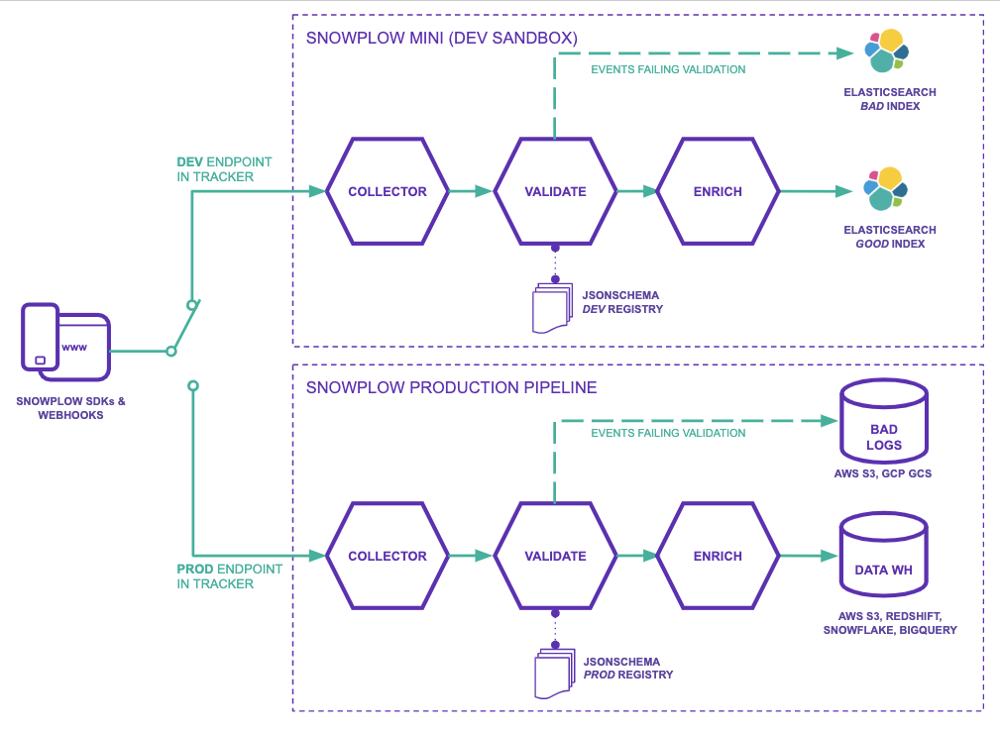

[Snowplow Mini](/docs/migrated/pipeline-components-and-applications/snowplow-mini/) is a small, single instance version of Snowplow that primarily serves as a development sandbox which gives you a quick way to debug tracker updates and changes to your schema and pipeline configuration.

You might use Snowplow Mini when:

- You've updated a schema in your Development environment and wish to send some test events against it before promoting it to Production
- You want to enable an Enrichment in a test environment before enabling it on Production

## Conceptual diagram

The diagram above illustrates how Snowplow Mini (top) works alongside your Production pipeline (bottom).

By pointing your tracker(s) to the Collector on your Snowplow Mini you can send events from your applications development and QA environments to Snowplow Mini for testing.

Once you are happy with the changes you have made you would then change the trackers in your application to point to the Collector on your Production pipeline.

## Features of Snowplow Mini

- Data is tracked and processed in real time
- Your Snowplow Mini speaks to your [Schema registries](/docs/migrated/understanding-tracking-design/understanding-schemas-and-validation/) to allow events to be sent against your [custom schemas](/docs/migrated/understanding-tracking-design/)
- Data is validated during processing
- Data is loaded into Elasticsearch and can be queried directly or through a Kibana dashboard
- Successfully processed events and failed events are in distinct good and bad indexes

## Topology

Snowplow-Mini runs several distinct applications on the same box which are all linked by NSQ topics. In a production deployment each instance could be an Autoscaling Group and each NSQ topic would be a distinct Kinesis Stream.

- Scala Stream Collector:
    - Starts server listening on `http://< sp mini public ip>/` which events can be sent to.
    - Sends "good" events to the `RawEvents` NSQ topic
    - Sends "bad" events to the `BadEvents` NSQ topic
- Stream Enrich:
    - Reads events in from the `RawEvents` NSQ topic
    - Sends events which passed the enrichment process to the `EnrichedEvents` NSQ topic
    - Sends events which failed the enrichment process to the `BadEvents` NSQ topic
- Elasticsearch Sink Good:
    - Reads events from the `EnrichedEvents` NSQ topic
    - Sends those events to the `good` Elasticsearch index
    - On failure to insert, writes errors to `BadElasticsearchEvents` NSQ topic
- Elasticsearch Sink Bad:
    - Reads events from the `BadEvents` NSQ topic
    - Sends those events to the `bad` Elasticsearch index
    - On failure to insert, writes errors to `BadElasticsearchEvents` NSQ topic

These events can then be viewed in Kibana at `http://< sp mini public ip>/kibana`.
