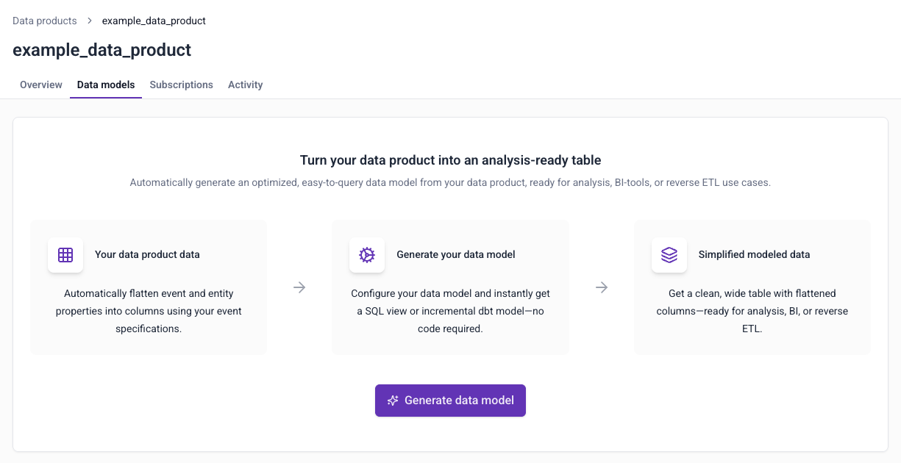
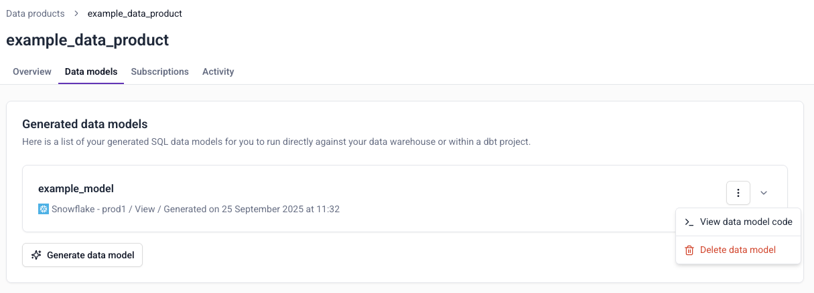

Automatic data model generation allows you to generate optimized models directly from your [tracking plans](/docs/event-studio/tracking-plans/index.md) in [Snowplow Console](https://console.snowplowanalytics.com). You can use the models directly in your warehouse, or integrate them into existing dbt projects. The models are ready for analysis, BI tool, or reverse ETL use cases.

The autogenerated data models filter for only the events of interest, while flattening your event and entity data structures into a column for each property.

:::note Warehouse support
Automatically generated data models is not supported for Redshift.
:::

## Key features

Choose exactly how you want the model to look, based on your use case.

### Configurable events and entities

You can specify which parts of the tracking plan to include:
* Event specifications
* Entities
* [Atomic Snowplow event properties](/docs/fundamentals/canonical-event/index.md#out-of-the-box-fields)

### Automatic data flattening

To create a single wide table, the tool automatically flattens data structures into individual columns.

For event data structures, all properties are flattened into their own columns.

For entities, flattening depends on cardinality:
  - Single entities, such as `user`, are flattened into separate columns, e.g., `user_id`, `user_email`
  - Multiple entities, such as a `products` array, are stored as a single array column that you can unnest later

### Event specification inference

If you're using [Snowtype](/docs/event-studio/snowtype/index.md) to generate your tracking code, the model generator can filter for event specification IDs, using the attached event specification entity. This guarantees that all events were sent with the intent to implement this tracking plan, and ensures high data quality.

If you're not using Snowtype, the generated models perform more complex event filtering:
- Models include all rows matching the tracking plan definition
- Use "best effort" matching based on events, entities, cardinalities, and rules

These no-Snowtype models may include some unintended events that aren't part of the tracking plan. However, this approach allows access to historical data, and requires no adjustments to existing tracking implementations.

### Deployment options

You can choose to create a view or an incremental dbt model.

**Views** are best for lightweight use cases when you need immediate access to data, with minimal setup.

View statements can be run directly in your data warehouse without the need for additional tools. We recommend using views when your atomic events table is small, or when you won't be regularly querying the data. When using a view, ensure you reference the partition key of the atomic table to ensure your queries are performant and cost efficient.

**Incremental dbt models** are ideal for production pipelines when you want to materialize data efficiently, and integrate it into existing dbt projects. We recommend using incremental models when your atomic events table is large, or when you'll be regularly querying the data.

Choose to create a simple model without dependencies, or one based on the Snowplow [Unified Digital](/docs/modeling-your-data/modeling-your-data-with-dbt/dbt-models/dbt-unified-data-model/index.md) or [Normalize](/docs/modeling-your-data/modeling-your-data-with-dbt/dbt-models/dbt-unified-data-model/index.md) packages:

- **Simple** models are compatible with any dbt project with no package dependencies. These models will materialize all data for the model on the first run, while processing only new events for every subsequent run.
- **Models based on [Unified Digital](/docs/modeling-your-data/modeling-your-data-with-dbt/dbt-models/dbt-unified-data-model/index.md) or [Normalize](/docs/modeling-your-data/modeling-your-data-with-dbt/dbt-models/dbt-unified-data-model/index.md)** are designed to work with our existing dbt packages. They build on `events_this_run` tables for efficient incremental processing.

This table compares the different options:

| Consideration             | View                                        | Simple incremental                           | Unified Digital or Normalize incremental   |
| ------------------------- | ------------------------------------------- | -------------------------------------------- | ------------------------------------------ |
| **Best for**              | Real-time data access, exploratory analysis | Standalone projects, new dbt implementations | Existing Snowplow dbt package users        |
| **Dependencies**          | None                                        | None                                         | Requires Snowplow dbt packages             |
| **Setup complexity**      | Minimal                                     | Minimal                                      | Moderate (variable configuration required) |
| **Processing efficiency** | Query-time processing                       | Standard incremental                         | Optimized with `events_this_run` tables    |
| **Integration**           | Independent operation                       | Independent operation                        | Coordinated with existing Snowplow models  |
| **Storage requirements**  | No additional storage                       | Materializes data                            | Materializes data                          |
| **Query performance**     | Depends on underlying data volume           | Fast (pre-computed)                          | Fast (pre-computed)                        |
| **Data freshness**        | Real-time                                   | Batch incremental updates                    | Batch incremental updates                  |

## Generating models

To generate a data model, find the **Data models** tab in [Console](https://console.snowplowanalytics.com/) > **Data collection** > **Tracking plans** > tracking plan details page.

Follow the instructions to create your model:
* Provide basic information such as name and warehouse destination
* Choose which event specifications, entities, and columns to include
* Confirm if you're using Snowtype
* Choose which kind of model to create

Once you've completed these steps, click **Save to tracking plan** to save the model. You can also download the model now.

You can view the SQL at any time by choosing **View data model code** from the `⋮` menu.

## Deploying models

How to deploy the model depends on the kind of model you've generated. The first step is the same for all: download the model from Console.

### Views

Deployment steps:
1. Configure the model schema to specify where to create the view
2. Run the model to create the view in your warehouse

### Simple incremental

Deployment steps:
1. Add the SQL file to your dbt project's models directory
2. Run the model

The initial run will materialize all historical data from your `atomic` events table. Subsequent runs will process only new events since the last run timestamp.

### Unified Digital or Normalize incremental

Deployment steps:
1. Add the SQL file to your dbt project's models directory
2. Configure dbt project variables:
	* Set `snowplow__start_date` in your dbt project variables
	* Configure `snowplow__backfill_limit_days` to control the volume of data processed per run
1. Run the model iteratively until the new model catches up to your existing models
2. Monitor progress through dbt logs and manifest updates

New models begin processing from `snowplow__start_date` since they're not yet tracked in the Snowplow Manifest table.

The model won't run if the required dependency isn't already installed in your dbt project.
