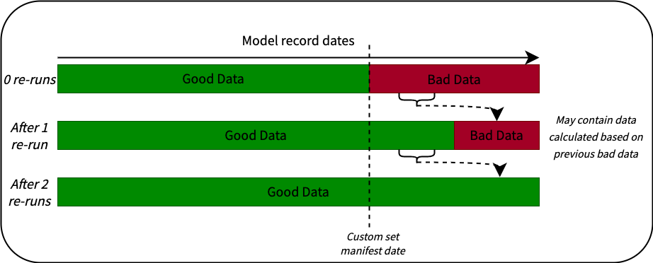

```mdx-code-block
import Tabs from '@theme/Tabs';
import TabItem from '@theme/TabItem';
```

## Asynchronous Runs

You may wish to run the modules asynchronously, for instance run the screen views module hourly but the sessions and users modules daily. You would assume this could be achieved using e.g.:

```bash
dbt run --select +snowplow_mobile.screen_views
```

Currently however it is not possible during a dbt jobs start phase to deduce exactly what models are due to be executed from such a command. This means the package is unable to select the subset of models from the manifest. Instead all models from the standard and custom modules are selected from the manifest and the package will attempt to synchronize all models. This makes the above command unsuitable for asynchronous runs.

However we can leverage dbt's `ls` command in conjunction with shell substitution to explicitly state what models to run, allowing a subset of models to be selected from the manifest and thus run independently.

<Tabs groupId="dbt-packages">
<TabItem value="web" label="Snowplow Web" default>

To run just the page views module asynchronously:

```bash
dbt run --select +snowplow_web.page_views --vars "{'models_to_run': '$(dbt ls --m  +snowplow_web.page_views --output name)'}"
```

</TabItem>
<TabItem value="mobile" label="Snowplow Mobile">

To run just the screen views module asynchronously:

```bash
dbt run --select +snowplow_mobile.screen_views --vars "{'models_to_run': '$(dbt ls --m  +snowplow_mobile.screen_views --output name)'}"
```

</TabItem>
</Tabs>

## Custom Re-running of models

For any models that use the [snowplow incremental materialization](/docs/modeling-your-data/modeling-your-data-with-dbt/dbt-advanced-usage/dbt-incremental-materialization/index.md), and have a defined `upsert` key, it is *possible* to re-run these models from a particular date in the past by manipulating the date stored in the manifest table for each of the relevant models. This will update and overwrite data that was generated from this date without you needing to do a full refresh. This feature is **not** directly supported and should be used at your own risk due to the high complexity involved, but those with advanced experience and understanding of the processing that package does may wish to do this in the case of incorrect data processing due to either invalid input data or dbt models changes where a full refresh would be too costly.

In this situation it is highly recommended to ensure you set your `snowplow__backfill_limit_days` large enough to complete this in a single run to avoid your data being left in a state where you have incorrect future calculated information; this is particularly a concern for any aggregation or rolling aggregation fields e.g. the users table, and if you have any reporting or visualizations based off this data.



:::danger

Manipulating the values in the manifest tables will cause that and all downstream models to run from the new dates provided (with some buffers, see [incremental logic](/docs/modeling-your-data/modeling-your-data-with-dbt/dbt-advanced-usage/dbt-incremental-logic/index.md)). Any custom models must have been built a way that this approach would work to correct historic records.

This method is also only suitable if the value of your source data in your `upsert` key has not changed, if this is not the case there is no choice but to run a full refresh of the model.

:::


## Cluster Keys

All the incremental models in the Snowplow packages have recommended cluster keys applied to them. Depending on your specific use case, you may want to change or disable these all together. This can be achieved by overriding the following macros with your own version within your project:

<Tabs groupId="dbt-packages">
<TabItem value="web" label="Snowplow Web" default>

- `web_cluster_by_fields_sessions_lifecycle()`
- `web_cluster_by_fields_page_views()`
- `web_cluster_by_fields_sessions()`
- `web_cluster_by_fields_users()`


</TabItem>
<TabItem value="mobile" label="Snowplow Mobile">

- `mobile_cluster_by_fields_sessions_lifecycle()`
- `mobile_cluster_by_fields_screen_views()`
- `mobile_cluster_by_fields_sessions()`
- `mobile_cluster_by_fields_users()`

</TabItem>

</Tabs>

## Overriding Macros

The cluster key macros (see above), the `allow_refresh()` and the `filter_bots` macro can be overridden. These are all [dispatched macros](https://docs.getdbt.com/reference/dbt-jinja-functions/dispatch) and can be overridden by creating your own version of the macro and setting a project level dispatch config. More details can be found in [dbt's docs](https://docs.getdbt.com/reference/dbt-jinja-functions/dispatch#overriding-package-macros)

``` yaml
# Your_dbt_project/macros/filter_bots.sql

and ev.useragent not similar to '%(YOUR_CUSTOM_PATTERN|bot|crawl|slurp|spider|archiv|spinn|sniff|seo|audit|survey|pingdom|worm|capture|(browser|screen)shots|analyz|index|thumb|check|facebook|PingdomBot|PhantomJS|YandexBot|Twitterbot|a_archiver|facebookexternalhit|Bingbot|BingPreview|Googlebot|Baiduspider|360(Spider|User-agent)|semalt)%'

```
