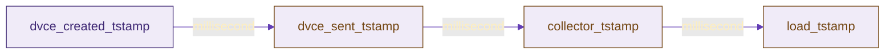
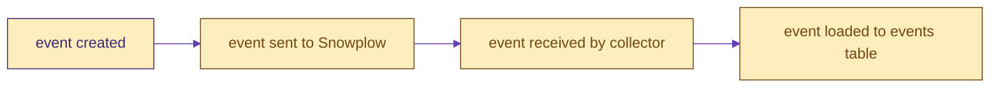
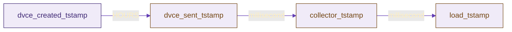
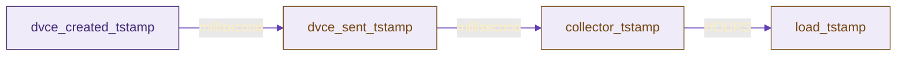

```mdx-code-block
import Tabs from '@theme/Tabs';
import TabItem from '@theme/TabItem';
```

:::tip
On this page, `<package>` can be one of: `unified`, `web`, `mobile`, `ecommerce`, `normalize`
:::

## Snowplow timestamps
- `collector_tstamp` - the time Snowplow receives the data by the collector
- `etl_tstamp` - the time the Snowplow pipeline processes the event
- `load_tstamp` - the time the event is added to the raw events table
- `dvce_created_tstamp` - the timestamp when the event was created
- `dvce_sent_tstamp` - the timestamp when the event was sent first
- `derived_tstamp` - the timestamp making allowance for inaccurate device clock, `derived_tstamp = collector_tstamp - (dvce_sent_tstamp - dvce_created_tstamp)`, this should be regarded as the most reliable timestamp to take into account to know when the event actually happened

For more details on timestamp check out this [Discourse forum](https://discourse.snowplow.io/t/which-timestamp-is-the-best-to-see-when-an-event-occurred/538).

## Timestamps used in our packages
By default we filter the events table on `collector_tstamp` because that is what was historically more likely to be partitioned on. Nowadays `load_tstamp` is increasingly common as well. (Which field being used for partitioning will depend on the warehouse, in Snowflake for instance it is dependent on the ingestion timestamp). To accomodate this and make use of more efficient filtering we advise you to verify which field it is and set `snowplow__session_timestamp` to that field.

For modelling reasons we try to use the `derived_tstamp` as this is the truest to the actual timestamp of the event itself.


### Normal data flow






## Balancing variables

Below we explain some use cases that are outside the normal flow, like late arriving data. Although some of these exceptions are quite rare, they have the ability to break the package by creating duplicates certain tables (manifest or derived tables). We try our best to prevent such rare events causing issues and interrupting the incremental flow in our packages but in case they may happen, our tests will likely detect them even if the model does not stop during execution. 

Another way to avoid issues is to configure the package in a way that it avoids/handles exceptional use cases with a range of variables that you can use to specify lookback ranges and session periods. The key is to balance the risk with processing power to keep costs down:

- `snowplow__backfill_limit_days` (default= 30): to avoid processing too much at once
- `snowplow__lookback_window_hours` (default= 6): to limit how far to look back (not really necessary to be more than 1 when doing historic runs as data can’t arrive “late” from months ago
- `snowplow__start_date` to not process data older than you actually need, there has to be data between this date and the back_fill_limit_days in the warehouse
- `snowplow__days_late_allowed`(default= 3): to configure how late is too late to be included. The maximum allowed number of days between the event creation and it being sent to the collector. If the `dvce_sent_tstamp` - `dvce_created_tstamp` > days_late_allowed, then the event is excluded.  
- `snowplow__upsert_lookback_days` (default= 730): Period of time (in days) to look back over the production table in order to find rows to delete when upserting data. Where performance is not a concern, should be set to as long a value as possible to avoid potential duplicates.
- `snowplow__max_session_days` (default= 3): Bots can keep alive a session for quite some time and with each incremental run, if there is a new event for that session in the incremental lookback period the whole session will be reprocessed which can become a very costly operation on your events table over time, if kept "alive". This variable will prevent those ongoing sessions to be reprocessed over and over and if they are over the limit they will be migrated to the `base_quarantined_sessions` table to exlude from processing further.

### Late arriving data

Late arriving data can happen due to a number of things and can denote different things, therefore it is not easy to understand. The most common scenario is that the device the event is generated on goes offline making a larger than usual gap between the `dvce_created_tstamp` and the `dvce_sent_tstamp`:



One variable to look at is the `snowplow__days_late_allowed`. To process these events this needs to be set to the maximum number of days you would like the events to be processed. This will take effect in the `events_this_run` table:

```sql
and a.dvce_sent_tstamp <= {{ snowplow_utils.timestamp_add('day', days_late_allowed, 'a.dvce_created_tstamp') }}
```

#### Late loaded events
Another case of "late arriving data" is when there is a data downtime (e.g. failed events reprocessing, servers in your ETL infrastructure going down):




##### Rare use case of late loading events
Any data model that user snowplow-utils >=0.15.1 to generate the `events_this_run` table is safe to handle a rare use case where there is:
- some late loading data (large delay between collector and load_tstamp) for the first event in the session
- late arriving event very close to the max session length cut off (which means other session lengths were capped at this close timeframe) causing the session to be reprocessed
- another session in the same run starting before this session, but then being not reprocessed in a later run

```sql
        and a.{{ session_timestamp }} >= b.start_tstamp -- deal with late loading events
```

Another parameter related to late arriving data in general is the `snowplow__lookback_window_hours`, which is an additional lookback window beyond the end of the last run. 

If the newest processed data is let's say from 5 days ago the package will start looking for new events from 5 days - 6hours ago. In most cases of late arriving data, this is not necessary to reset.

<details>
<summary>Expand for explanation</summary>
Either the new event will arrive when it arrives and the package will process it as normal new event, just later, or if the late arriving event is due to a late loaded event (bigger gap between collector and load_tstamp due to some infrastructure issues for instance) even if the data model has been processed already during the time the late arriving data is not in the warehouse, there can be longer running sessions that produce new events in subsequent runs so that the reprocessing window will usually be large enough to reprocess those missed events. 
For more details on this they can check out the docs on the [incremental logic](https://docs.snowplow.io/docs/modeling-your-data/modeling-your-data-with-dbt/dbt-advanced-usage/dbt-incremental-logic/).
</details>

In the rare event when this needs to be reset as a one-off still, you can just change this variable to reprocess and backfill a larger period to include sessions that were completely missed or events that were missed from sessions during this time.

Finally, we have the `snowplow__upsert_lookback_days` variable, which although minor due to the default number of days, might impact here too. If you wish to disable the buffer we apply to the upsert in the case of late arriving data either set the `snowplow__upsert_lookback_days` to `0` or if your package has it, you can set `disable_upsert_lookback` to `true` in your model config.
