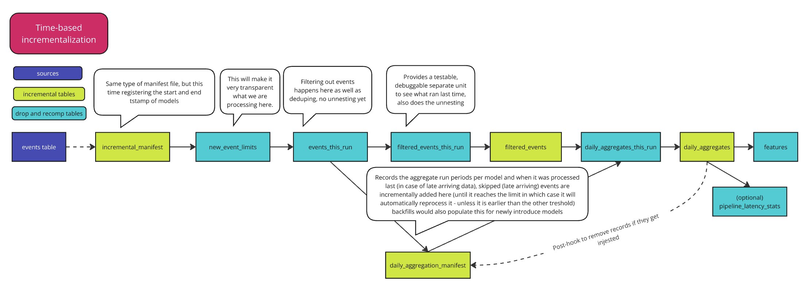

# Time Based Incremental Macros

The process flow of these macros and the tables generated is shown below:

## The need for an alternative incrementalization method
For a long time, Snowplow data has been processed based on sessions, after all that is the core of Snowplow data, especially web behavioral data that is most often evaluated in the context of a user session. However, as the use cases grew, the need for third party data integration became increasingly more important, and we have learned about several data challenges from our customers that highlighted the limitations the session based incrementalization brings with itself. Let's list a few of them to understand it better:

### Drawbacks of session based incremental processing:
- lack of control on data processing: run limits are calculated automatically through a combination of intricate web of variables that mean that model users can't predict how far the package really goes back in time for each run and we might be requerying the events table directly over and over for the same period
    - it may be every three days every hour (if within the last hour we have events arriving to sessions that started 3 days ago due to bots, long-running sessions and later arriving data unless it is capped at one day for instance)
- models need to be kept in sync, if a newly introduced model has issues, and it gets backfilled we can't move forward in processing
    - this in practice may mean that some of the business critical models have to wait until the data is backfilled, or other workarounds need to be made to avoid this that is a bit more tedious than liked
- hard to understand (both as a developer and as an end user, especially if there is a need to create custom models on top of the package)
- models produced by packages relying on session based incrementalization can't have custom partial backfills that are between two past dates
- it was developed at a time when load_tstamp field did not exist, which lead to complications and timestamp buffers in processing, which is not cost-effective, there are workarounds in the other package, but a lot of the code can be refactored

## How it works
On a high level, the macros work for an incremental data model structure where the first layer of incremental aggregation is a denormalized, `filtered events` table, with relevant event types (exactly the same way as the `snowplow_normalize` package works for those familiar with it). It also provides a mechanism to automatically refresh `daily aggregate` tables, which get processed and reprocessed automatically based on the filtered events tables. This makes it possible to create a drop and recompute style custom `attributes` table, where the daily aggregate metrics are aggregated into lifetime or last_x_day type metrics.

Similarly to the session based processing, here there is also an incremental_manifest table which keeps record of which model ran between which dates, with both upper and lower limits to facilitate custom backfills (this is not fully implemented yet). This is, however, exclusively happening based on load_tstamp and therefore this solution is for all those users where the events table is partitioned on load_tstamp (this is default for loaders now). The models can run with whatever frequency required, we recommend running it on an hourly basis for general use cases. It will only take new events since the last time it ran, no need to reprocess anything further back in time as it is based on load_tstamp. Late arriving data is handled automatically based on some variables for optimization, more on this below.

There are plans to potentially allow for calculating daily metrics without a filtered events table directly, which would need overnight full day runs and those would also need to be part of the manifest but as they would run on a different schedule, there is no need to keep them in sync with the filtered events models.

Once the new events are deduplicated, denormalized and added to the filtered events table the respective daily_aggregate table needs be updated next. There is a separate `daily_aggregation_manifest` incremental table to aid this process, which keeps track of how many events were arriving late and therefore skipped in the calculations. 

The filtered_events_this run table will most likely contain events that happened in the last day or two. The timestamp we use for this is the `derived_tstamp`, which is the most accurate timestamp that denotes when the event actually happened. To avoid having to reprocess large periods due to odd late sent data (e.g. due to bots) we have included two variables to play with to reduce reprocessing and re-scanning the filtered events table and recalculating the daily metrics again:

One is called the `snowplow__reprocess_days` variable which will dictate how many days we allow to reprocess for late arriving data in the daily_aggregate tables. This reprocessing is done on the filtered events table already, where we filter on a range of days that needs reprocessing in a given run.

The other is called `snowplow__min_rows_to_process` which will indicate the threshold for reprocessing late arriving data when it reaches this amount of skipped events in a given day. The manifest will keep hold of previously skipped events, in case it reaches the threshold in a subsequent run only.

The great thing about having the `snowplow__reprocess_days` and the `snowplow__min_rows_to_process` variables is that that users will be able to dictate what to ignore and what to process, and even change these variables for one run specifically. For instance, in case of an unexpected pipeline issue, users can always check the manifest if they see a large event volume getting skipped, and temporarily adjusting the variables to process them as part of a one-off update.

Once the daily aggregate incremental tables are ready, the /custom aggregates table can be processed, which is just a drop and recompute style table by default. This is made possible in this model as the data is already quite condensed due to the daily aggregate layer which it is calculated off of, however, there is some possibility of custom optimization options if needs to be (e.g maybe customer lifetime value type calculations can be moved to a separate aggregates table which could be excluded for most of the runs and only process it once a day in an overnight run, and the last x days type metrics can be left for more frequent updates).

There is a variable called `snowplow__run_type` that we currently do not make use of and it defualted to `incremental`, however, it is planned that we will add the option to create a separate daily aggregate table for those metrics that do not rely on filtered events table. For that we will most likely add a new run type called `last_x_days` which will dictate how many days to reprocess fully compared to the current date, skipping late arriving events from days prior. This could be altered for an overnight run, and it will likely dictate the update of those models that rely on this type of processing only.

# Detailed run mechanism

## State 1 - first run
During the first run, events loaded between the period dictated by the start_tstamp and the backfill_limit_days get processed.

E.g.: 
    snowplow__start_date: '2025-01-01' 
    snowplow__backfill_limit_days: 1
    
    Run limits (non-inclusive!): '2025-01-01 00:00:00' and '2025-01-01 23:59:59'

There may be a case where there is no event loaded between these parameters. There will be a log displayed that 0 days and total events are processed, but the package will not fail, and the user ends up with the same state unless the parameters are changed. TODO 1: Currently this results in failure, we need to fix it in the sdk.

If the user sets 0 as backfill_limit_days, the upper limit is lower and there is an error. TODO 2: prevent this from being able to set.

The filtered events table will contain all the events that: 
- were loaded within the run limits
- happened since the start_date (based on the derived_tstamp), late loaded events prior to the start_date are ignored
- have event_types that are needed for the daily aggregate model
- have the accepted app_id -> gets applied on the base_events_this_run level already based on the `snowplow__app_id` var

The models downstream from the filtered_events table will get processed based on a different run limit mechanism:

The daily_aggregates_this_run table will contain full daily metrics based on the days_to_process table, which will dictate how far to go back in the filtered events table (TODO 3: add performance improving limit based on max value) and which days to process/reprocess. In this case it will align with the run limit days, no need to reprocess any skipped events as the daily manifest is not even created yet.

# State 2 - models misaligned
If a run fails and some tables are already successfully updated, the package will try to replay all the events again. TODO 4: align, forgot what we concluded, for now all models are present in the incremental manifest, the final one shouldn't?

# State 3 - standard incremental run
In case there is already processed events in the filtered events table, the incremental run limit will look for events arriving after the last processed load_tstamp which is saved in the incremental_manifest. It will add to that day the backfill limit days number of days + 1 and deduct one second which means it will process backfill limit number of days in the following run. If that date is already less than the current_tstamp (UTC), then it will process all the loaded data from the events table that is missing since the last run.

Once the filtered events table is updated incrementally with the new dataset, again a different update logic takes over to automatically update the daily_aggregate table based on a few variables that were created to optimize this process. The days_to_process model will calculate all the days that fully need to be (re)processed for the incremental daily aggregate table updates. It first looks for all the new events arriving, checks which arrived late (meaning loaded on a different day than it was created) TODO 5: what will happen if not all days are available, the limit logic will not work, and it may impact other parts of the update. TODO 6: what will happen if the duplicate events were loaded separately, the second will override the first, and it might not get updated in the daily table
