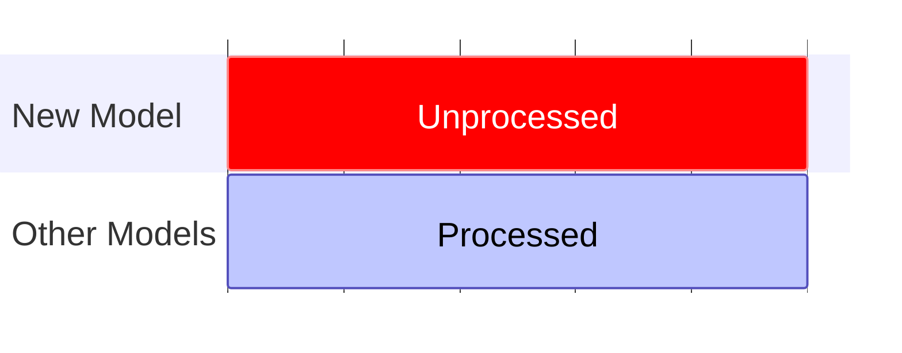
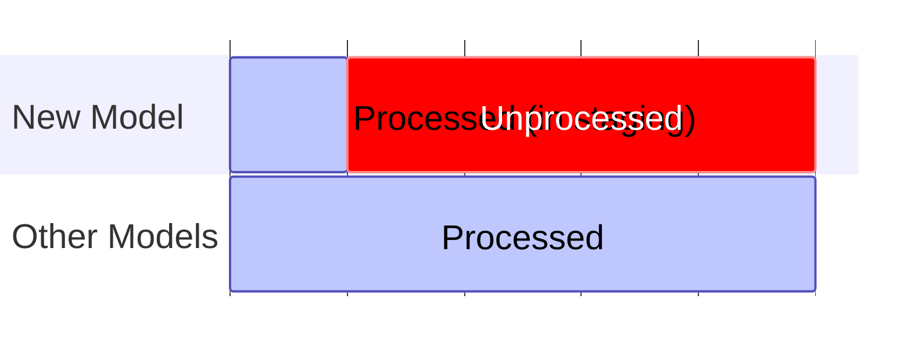
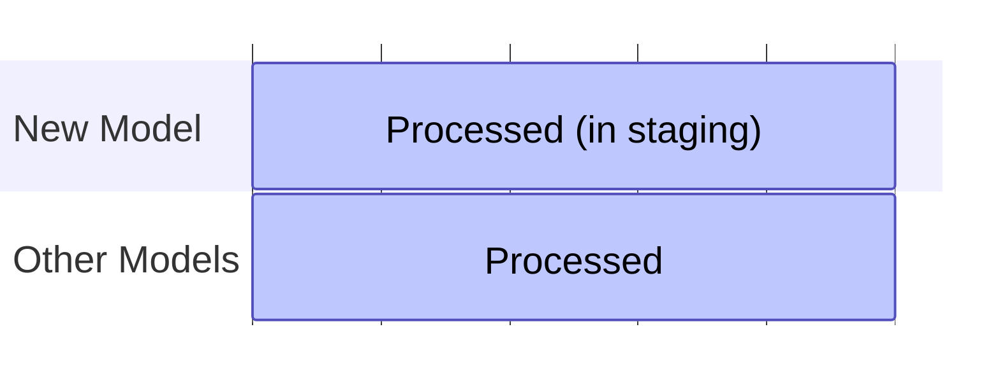

## Backfilling

When you first start using our packages, when you add [new custom models](/docs/modeling-your-data/modeling-your-data-with-dbt/dbt-custom-models/index.md), or following on from a [full refresh](/docs/modeling-your-data/modeling-your-data-with-dbt/dbt-operation/full-or-partial-refreshes/index.md), you may have a large period of data that needs to be processed before your models are *caught up* with your live data and the package does a [standard run](/docs/modeling-your-data/modeling-your-data-with-dbt/dbt-advanced-usage/dbt-incremental-logic/index.md#state-4-standard-run).

By default our packages are set up to avoid processing large periods of data in one go, this helps to reduce the workload on your cloud, as well as reducing the impact of any issues in the data causing a single run to fail. This behavior is controlled by the `snowplow__backfill_limit_days` in all our incremental packages.

When backfilling your data, either from a full refresh, it is recommended to increase the `snowplow__backfill_limit_days` variable to as high as you feel comfortable with to reduce the number of runs that need to complete to get your processed data up to date. In general increasing this to cover 3-6 months is a good balance between speed and number of runs. 

We also recommend doing this process manually, as until your data is up to date, no new data will be processed, so it may take many runs for your data to catch up with live tracking. Running locally you can do many runs back-to-back rather than wait for your scheduled runs to take place. You may also wish to warn any users of your data this is planned as it can lead to delays, and an initial full-refresh will remove any existing data from the derived tables.

:::tip

If you have added a new model it will be processed from the value in your `snowplow__start_date` variable, if you don't need the model to start from this far back then you should change this for the first run so the new model only runs from a more recent date instead.

:::

## Blue-Green style Deployment

As the process of backfilling data may take a long time depending on your data volumes, and during this time no new data will be processed, it may be preferable to backfill your model(s) in a staging environment and then deploy these derived tables into your production schema at a later date. 

:::caution

This process involves manually editing the manifest table, which is dangerous and should be done only with understanding of our [incremental sessionization logic](/docs/modeling-your-data/modeling-your-data-with-dbt/dbt-advanced-usage/dbt-incremental-logic/index.md)

:::


Let's assume you have one schema named `prod` that is used by a regularly scheduled run of a project that uses our package(s), and you want to introduce a new custom model backfilled with all your historic Snowplow data. We are going to first process this model in a `staging` schema before migrating it across.



### Step 1: Create and process new model only
In a local environment, assuming you are using version control for your project, create a new branch and create your model in this branch. Next ensure you are using a profile/target and/or configure the package models so that they will write to the `staging` schema (or be prefixed with `staging` depending on your setup) instead of `prod`. 

Now you will need to run the below script to run only what is needed for your new model (see [specific model selection](/docs/modeling-your-data/modeling-your-data-with-dbt/dbt-operation/model-selection/#specific-model-selection) for more details on why). We've also increased the backfill limit days so this needs to be run fewer times.


```bash
dbt run --select +my_new_model --vars "{'models_to_run': '$(dbt ls --m  +my_new_model --output name)', 'snowplow__backfill_limit_days': 90}"
```



Once you have run this enough times that the data is up-to-date, which you can identify either by looking at the print out in the logs or by querying the manifest table, it's time to move this data to your `prod` schema.



### Step 2: Migrate the new table
The exact SQL you need to run will vary by warehouse, and some warehouses may offer the ability to do this in their UI. It may be possible to move your table via an `ALTER TABLE` statement, however for simplicity you can recreate your new table in your `prod` schema via a `CREATE TABLE` statement e.g.

```sql
CREATE TABLE prod.my_new_model as (select * from staging.my_new_model);
```

Make sure to recreate any additional features as necessary e.g. partition keys.

### Step 3: Update the manifest record

:::danger

Ensure your project is not running while you perform this step as it could cause a conflict in the manifest table.

:::

If you were to now add this model to the project being run in `prod`, because the manifest table in `prod` (or more likely, `prod_snowplow_manifest`) has no record of this model, it will process it again from the start. To avoid this you need to add a record for this model into the manifest table. 

Again, some UIs may allow you to edit a table, but an `INSERT` statement is recommended e.g.

```sql
INSERT INTO PROD.SNOWPLOW_<package>_INCREMENTAL_MANIFEST (MODEL, LAST_SUCCESS) VALUES
('my_new_model', timestamp '2023-10-11 10:11:12');
```

Where you can find the exact timestamp you need to use in your `staging` manifest table.

### Step 4: Migrate the model
Finally, with the data in the `prod` schema, and the record of it in the manifest table, you can merge your branch into `main` (or whatever branch you run your `prod` from), ensuring that the schema setting for your model matches. On the next run the package will pick up this new model, see it in the manifest, and run it alongside the rest of the models without needing to start from scratch.
