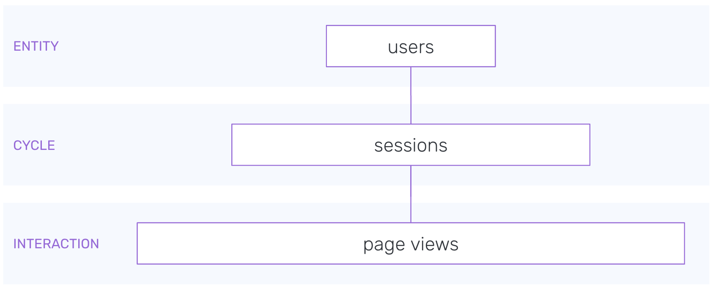

# Snowplow Web Package

The Snowplow web data model aggregates Snowplow's out of the box page view and page ping events to create a set of derived tables - page views, sessions and users - that contain many useful dimensions as well as calculated measures such as time engaged and scroll depth.

**The package can be found in the [snowplow/dbt-snowplow-web repo](https://github.com/snowplow/dbt-snowplow-web), with the full model doc site hosted [here](https://snowplow.github.io/dbt-snowplow-web/#!/overview/snowplow_web).** The package contains is a fully incremental model, that transforms raw web event data generated by the [Snowplow JavaScript tracker](https://docs.snowplowanalytics.com/docs/collecting-data/collecting-from-own-applications/javascript-trackers/) into a series of derived tables of varying levels of aggregation.

**Note this model site is linked to latest release of the package. If you are not using the latest release, [generate and serve](https://docs.getdbt.com/reference/commands/cmd-docs#dbt-docs-serve) the doc site locally for accurate documentation.**

## Overview

This model consists of a series of modules, each producing a table which serves as the input to the next module. The 'standard' modules are:

- Base: Performs the incremental logic, outputting the table `snowplow_web_base_events_this_run` which contains a de-duped data set of all events required for the current run of the model.
- Page Views: Aggregates event level data to a page view level, `page_view_id`, outputting the table `snowplow_web_page_views`.
- Sessions: Aggregates page view level data to a session level, `domain_sessionid`, outputting the table `snowplow_web_sessions`.
- Users: Aggregates session level data to a users level, `domain_userid`, outputting the table `snowplow_web_users`.
- User Mapping: Provides a mapping between user identifiers, `domain_userid` and `user_id`, outputting the table `snowplow_web_user_mapping`. This can be used for session stitching.

