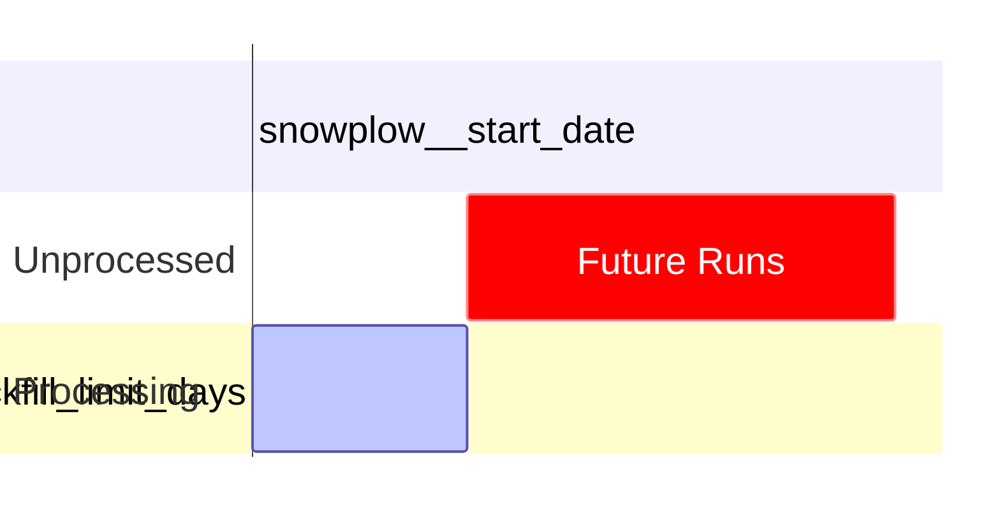
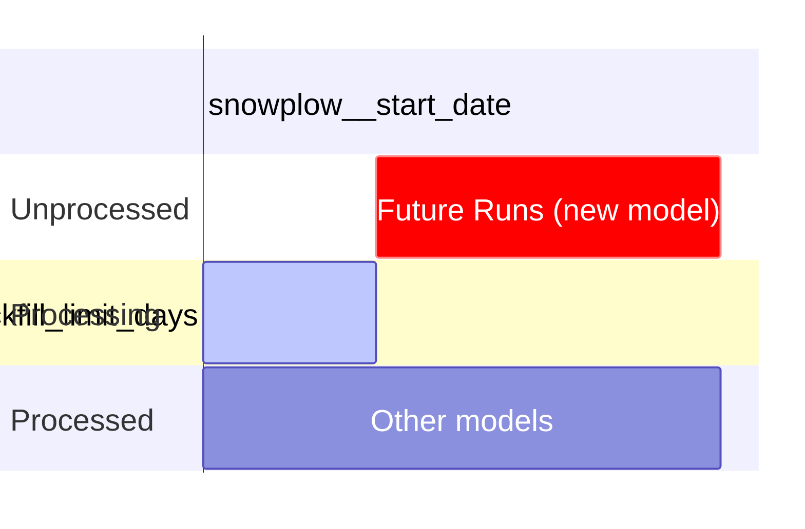
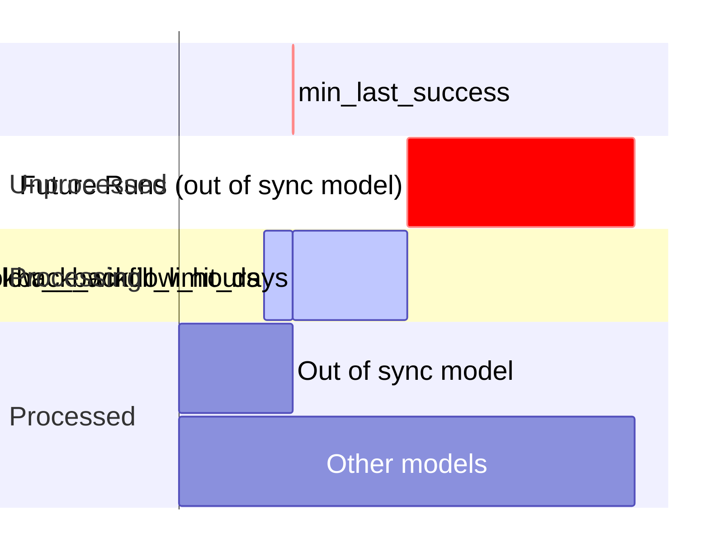
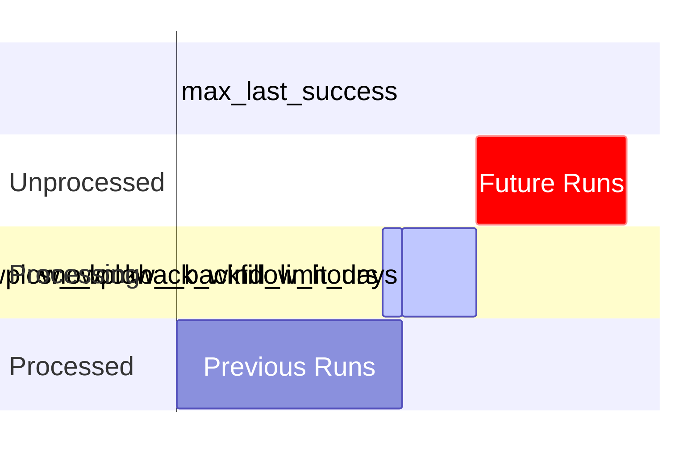

RHTODO
```mdx-code-block
import Tabs from '@theme/Tabs';
import TabItem from '@theme/TabItem';
```

:::tip
On this page, `<package>` can be one of: `unified`, `web`, `mobile`, `ecommerce`, `normalize`

:::

## Efficient Sessionization

The general principle behind an incremental model is to identify new events/rows since the previous run of the model, and only process these new events. This minimizes cost and reduces run times. This is great for basic event streams, however you begin to encounter issues for any aggregations you wish to do.

For mobile and web event data we typically consider a session to be a complete 'visit' and as such calculate metrics across the entire session. This means that when we have a new event for a previously processed session, we have to reprocess all historic events for that session as well as the new events - otherwise our metrics would be incorrect. The logic we have implemented to achieve this is:

1. Identify new events since the previous run of the package
2. Identify all `session_identifier`s associated with the new events
3. Look back over the events table to find all events associated with these `session_identifier`
4. Run all these events through the page/screen views, sessions and users modules

Given the large nature of event tables, Step 3 can be an expensive operation, we solve this issue in 2 ways:

| Problem | Solution |
|-|-|
| We have to scan the whole events table to find events for a subset of sessions | **Record when any given session started.** The `snowplow_<package>_base_sessions_lifecycle_manifest` model records the start and end timestamp of all sessions |
| Sessions generated by bots can persist for years which would mean scanning years of data every run of the package | **Limit the maximum allowed session length.** For our packages this is achieved by the `snowplow_<package>_base_quarantined_sessions` model, which stores the `session_identifier` of any sessions that have exceeded the max allowed session length (`snowplow__max_session_days`). For such sessions, all events are processed up until the max allowed length. Moving forward, no more data is processed for that session. _This is not required for mobile_ |
| We don't know how up-to-date each model is, so we have to scan each derived table | **Record the max processed timestamp for each model.** The `snowplow_<package>_incremental_manifest` model records the max processed timestamp of all derived tables | 

:::info

For more information about how to customize this `session_identifer` and how to use a custom sessionization approach in your own project check out the [utils quickstart](/docs/modeling-your-data/modeling-your-data-with-dbt/dbt-quickstart/utils/index.md).

:::

### The Incremental Manifest

Most of our packages use centralized manifest tables, `snowplow_<package>_incremental_manifest`, to record what events have already been processed and by which model/node. This allows for easy identification of what events to process in subsequent runs of the package. The manifest table is updated as part of an `on-run-end` hook, which calls the `snowplow_incremental_post_hook()` macro.


Example from the from the `snowplow_web_incremental_manifest`:

| model                            | last_success |
|----------------------------------|--------------|
| snowplow_web_page_views_this_run | '2021-06-03' |
| snowplow_web_page_views          | '2021-06-03' |
| snowplow_web_sessions            | '2021-06-02' |

## Package State

Your Snowplow dbt package can be considered to be in one of 4 states at any given time:

1. First run of the package
2. New model introduced
3. Models out of sync
4. Standard run

This state determines the range of events to start with to process in the next run of the package (note that events earlier than this range may be processed as part of a complete session, as detailed above). We use the `min_last_success` and `max_last_success` for models enabled in the current run, as well as the number of models in the manifest, as the base for our calculation.

<details>
<summary>Technical Details</summary>

The identification of which state the package is in is computed by the `get_run_limits` macro which is called in the `snowplow_<package>_base_new_event_limits` model. This macro uses the metadata recorded in `snowplow_<package>_incremental_manifest` to determine the `lower_limit` and `upper_limit` for the run of the package. This limit is based on the calculations shown below, and is based on the `collector_tstamp` column by default, but newer versions of our packages support choosing this column via the `snowplow__session_timestamp` variable. Check the config page for your package to see if it supports this variable.

To get the min and max last success, we run the following query:

```sql
select
    min(last_success) as min_last_success,
    max(last_success) as max_last_success,
    coalesce(count(*), 0) as models
from snowplow_<package>_incremental_manifest
where model in (array_of_snowplow_tagged_enabled_models)
```

</details>


Based on these the model is in one of the four states

:::tip

In all states the `upper_limit` is limited by the `snowplow__backfill_limit_days` variable. This protects against back-fills with many rows causing very long run times.

:::
### State 1: First run of the package

If there are no enabled models already in the manifest then we process from the start date up to the backfill limit or now, whichever is older:

**`lower_limit`**: `snowplow__start_date`  
**`upper_limit`**: `least(current_tstamp, snowplow__start_date + snowplow__backfill_limit_days)`



### State 2: New model introduced

If there are enabled models that aren't in the manifest table then a new model tagged with `snowplow_<package>_incremental` has been added since the last run; this can happen with a new custom model, or you have enabled some previously disabled custom modules. In this case the package will replay all previously processed events in order to back-fill the new model.

**`lower_limit`**: `snowplow__start_date`  
**`upper_limit`**: `least(max_last_success, snowplow__start_date + snowplow__backfill_limit_days)`



### State 3: Models out of sync

If the `min_last_success` is less than the `max_last_success` it means the tagged models are out of sync, for example due to a particular model failing to execute successfully during the previous run or as part of catching up on a new model. The package will attempt to sync all models as far as your backfill limit will allow.

**`lower_limit`**: `min_last_success - snowplow__lookback_window_hours`  
**`upper_limit`**: `least(max_last_success, min_last_success + snowplow__backfill_limit_days)`


### State 4: Standard run

If none of the above criteria are met, then we consider it a 'standard run' where all models are in sync and we carry on from the last processed event.

**`lower_limit`**: `max_last_success - snowplow__lookback_window_hours`  
**`upper_limit`**: `least(current_tstamp, max_last_success + snowplow__backfill_limit_days)`




:::note

Remember, this upper and lower limit is only used to identify which events are considered to get the session identifiers for the run, additional events outside this date range may be included to ensure that full sessions are processed.

:::

### How to identify the current state

If you want to check the current state of a model, run the `snowplow_<package>_base_new_event_limits` model. This will log the current state to the CLI while causing no disruption to the incremental processing of events. You will also see this in the logs of any incremental run.

```bash
dbt run --select snowplow_<package>_base_new_event_limits
...
00:26:29 + Snowplow: Standard incremental run
00:26:29 + Snowplow: Processing data between 2021-01-05 17:59:32 and 2021-01-07 23:59:32
```

- State 1: `Snowplow: No data in manifest. Processing data from start_date`
- State 2: `Snowplow: New Snowplow incremental model. Backfilling`
- State 3: `Snowplow: Snowplow incremental models out of sync. Syncing`
- State 4: `Snowplow: Standard incremental run`

:::caution

In all states, although much more likely in state 1, it is possible that a run finds no incremental data to process. In this case you will see a warning in the logs of the form `Snowplow Warning: No data in <table> for date range from variables, please modify your run variables to include data if this is not expected."`. In this case you should increase your start date if no runs have completed, or increase your backfill limit days if there is a gap in your data before the next records.

:::
