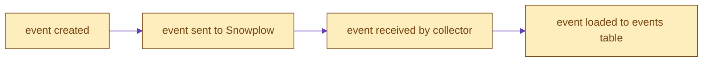
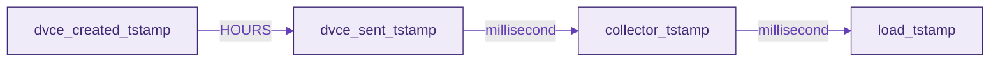
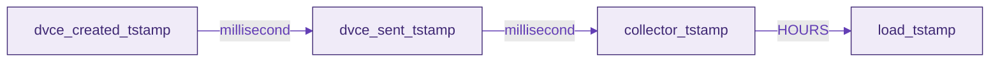

```mdx-code-block
import Tabs from '@theme/Tabs';
import TabItem from '@theme/TabItem';
```

:::tip
On this page, `<package>` can be one of: `unified`, `web`, `mobile`, `ecommerce`, `normalize`
:::

## Snowplow timestamps
- `collector_tstamp` - the time Snowplow receives the data by the collector
- `etl_tstamp` - the time the Snowplow pipeline processes the event
- `load_tstamp` - the time the event is added to the raw events table
- `dvce_created_tstamp` - the timestamp when the event was created
- `dvce_sent_tstamp` - the timestamp when the event was sent first
- `derived_tstamp` - the timestamp making allowance for inaccurate device clock, `derived_tstamp = collector_tstamp - (dvce_sent_tstamp - dvce_created_tstamp)`, this should be regarded as the most reliable timestamp to take into account to know when the event actually happened

For more details on timestamp check out this [Discourse forum](https://discourse.snowplow.io/t/which-timestamp-is-the-best-to-see-when-an-event-occurred/538).

## Timestamps used in our packages
By default we filter the events table on `collector_tstamp` because that is what was historically more likely to be partitioned on. Nowadays `load_tstamp` is increasingly common as well. (Which field being used for partitioning will depend on the warehouse, in Snowflake for instance it is dependent on the ingestion timestamp). To accommodate this and make use of more efficient filtering we advise you to verify which field it is and set `snowplow__session_timestamp` to that field.

For modeling reasons we try to use the `derived_tstamp` as this is the truest to the actual timestamp of the event itself.


### Normal data flow




## Balancing variables

Below we explain some use cases that are outside the normal flow, like late arriving data. Although some of these exceptions are quite rare, they have the ability to break the logic expected by our packages by creating duplicates records in certain tables. We try our best to prevent such rare events causing issues and interrupting the incremental flow in our packages but in case they may happen, our tests will likely detect them even if the model does not stop during execution. 

To help manage these cases, our packages are built to handle these edge cases, and you can configure a range of variables to finetune this to balance your needs between risk and cost:

- `snowplow__backfill_limit_days` (default= 30): to avoid processing too much data in one run
- `snowplow__lookback_window_hours` (default= 6): to limit how far to look back for late arriving data (not really necessary to be more than 1 when doing historic runs as data can’t arrive _late_ from months ago)
- `snowplow__start_date`: to not process data older than you actually need, there has to be data between this date and the back_fill_limit_days in the warehouse
- `snowplow__days_late_allowed`(default= 3): to configure how late is too late to be included. The maximum allowed number of days between the event creation and it being sent to the collector. If the `dvce_sent_tstamp - dvce_created_tstamp > days_late_allowed`, then the event is excluded.  
- `snowplow__upsert_lookback_days` (default= 730): Period of time (in days) to look back over the production table in order to find rows to delete when upserting data. Where performance is not a concern, should be set to as long a value as possible to avoid potential duplicates.
- `snowplow__max_session_days` (default= 3): Bots can keep alive a session for quite some time and with each incremental run, if there is a new event for that session the whole session will be reprocessed which can become a very costly operation on your events table over time, if kept "alive". This variable prevents those ongoing sessions to be reprocessed by tracking them in the `base_quarantined_sessions` table to exlude from processing further.

### Late arriving data

Late arriving data can mean a number of differnt things, depending on where the delay in the flow of data occurs. Here we cover the 2 most common.

#### Late Sent Events
The most common scenario is that the device the event is generated on goes offline, leading to a larger than usual gap between the `dvce_created_tstamp` and the `dvce_sent_tstamp`:



In our packages, processing this type of data is managed by the `snowplow__days_late_allowed` variable. Any event with a delay greater than this value between being created and being sent will not be processed. This will take effect in the `events_this_run` table:

```sql
...
and a.dvce_sent_tstamp <= {{ snowplow_utils.timestamp_add('day', days_late_allowed, 'a.dvce_created_tstamp') }}
...
```

#### Late Loaded Events
The other most common case is that of late loaded events, where the gap is between the collector and load timestamps. This may be due to batch loading, or issues with your pipeline.



This type of late arriving data is an issue when the `snowplow__session_timestamp` uses the `collector_tstamp`, if you are using the `load_tstamp` instead this is not an issue as the manifest table will track the load timestmap instead. To manage this we use the `snowplow__lookback_window_hours` variable to add a _buffer_ to the previous maximum processed timestamp to account for some events being delayed.

Note that this isn't an issue if _all_ events are delayed, because if all events are delayed the previous maximum processed timestamp would still be before any of these events. In the event of the model running part way through the loading of a set of out-of-order events (e.g. an event recovery), you can increase the `snowplow__lookback_window_hours` to forceably reprocess a larger window of data.

For more details on this they can check out the docs on the [incremental logic](https://docs.snowplow.io/docs/modeling-your-data/modeling-your-data-with-dbt/package-elements/incremental-processing/index.md#package-state).

#### Upserts
Finally, we have the `snowplow__upsert_lookback_days` variable, which applies a buffer to the limit we use to scan on the target table for any incremental models in our package. If you wish to disable the buffer, for a slightly more optimized but higher risk upsert, either set the `snowplow__upsert_lookback_days` to `0` or if your package has it, you can set `disable_upsert_lookback` to `true` in your model config. To remove the optimized upsert entirely and scan the full table to be sure of no duplicates, set `snowplow_optimize` to false in the specific `model` configuration (note this is not a variable).
