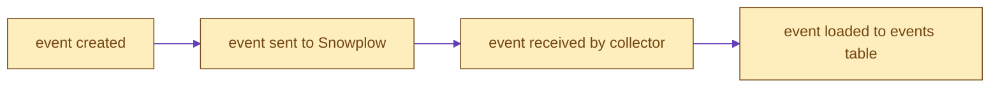
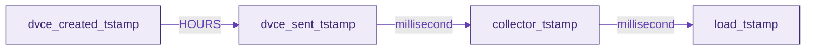
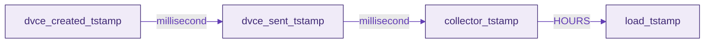

Normally, there is very little delay between each step of the dataflow, dependent on your pipeline setup and other environmental conditions.

However there can be times when data arrives "late", which can mean different things depending on where the delay in the flow of data occurs. Here we cover the 2 most common.

### Late Sent Events
The most common scenario is that the device the event is generated on goes offline, leading to a larger than usual gap between the `dvce_created_tstamp` and the `dvce_sent_tstamp`:

In our packages, processing this type of data is managed by the `snowplow__days_late_allowed` variable. Any event with a delay greater than this value between being created and being sent will not be processed. However, assuming the data lands within this limit the whole session will be reprocessed to include this event.

### Late Loaded Events
The other most common case is that of late loaded events, where the gap is between the collector and load timestamps. This may be due to batch loading, or issues with your pipeline.

Because by default our packages uses `collector_tstamp` to identify new data, this can mean that these events are not picked up (and therefore the sessions not reprocessed to include them). If you are using `load_tstamp` as your `snowplow__session_timestamp` then this is not an issue.

To manage this we use the `snowplow__lookback_window_hours` variable to add a _buffer_ to the previous maximum processed timestamp to account for some events being delayed. In the case of batch loading, you should ensure this window is at least a few hours greater than your batch period.

Note that this isn't an issue if _all_ events are delayed, because if all events are delayed the previous maximum processed timestamp would still be before any of these events. In the event of the model running part way through the loading of a set of out-of-order events (e.g. an event recovery), you can increase the `snowplow__lookback_window_hours` to forcibly reprocess a larger window of data.

For more details on how all these variables combine, please see the docs on the [incremental logic](/docs/modeling-your-data/modeling-your-data-with-dbt/package-mechanics/incremental-processing/index.md) of our packages.
