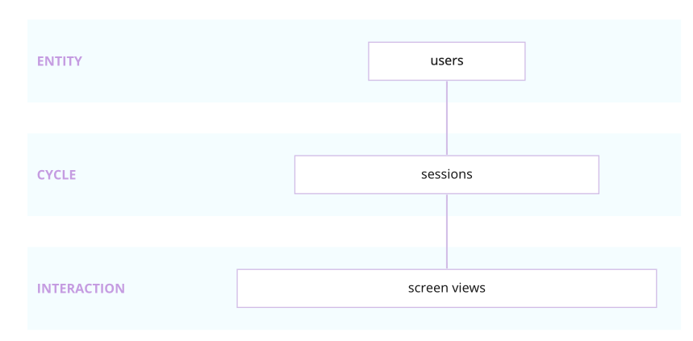
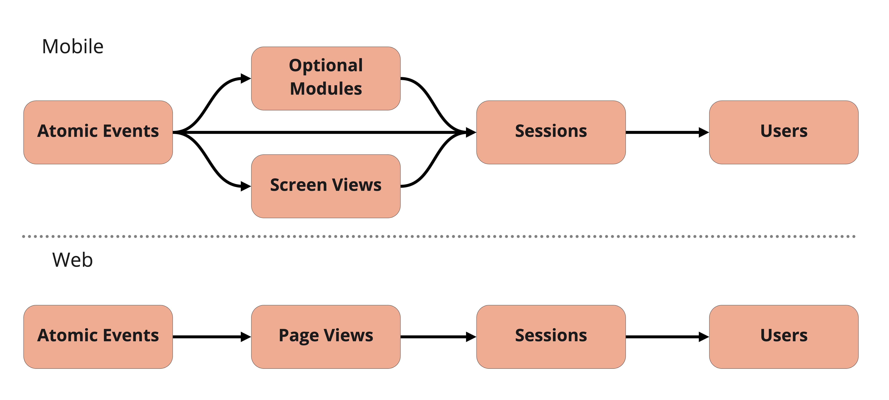
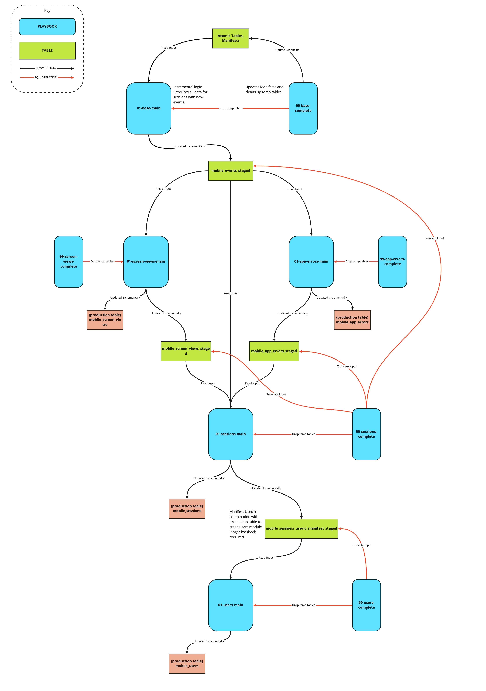
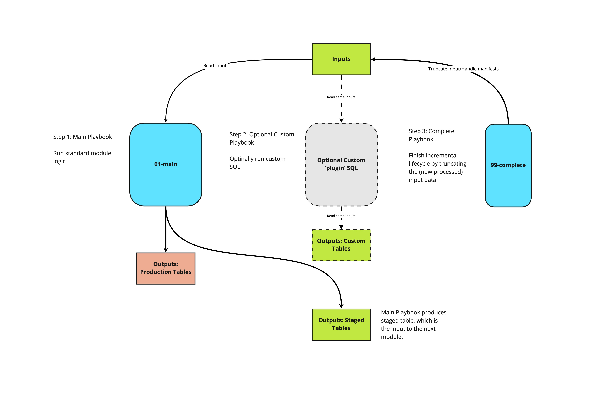

:::tip

For any new developments we highly recommend using our [mobile package for dbt](/docs/modeling-your-data/modeling-your-data-with-dbt/dbt-models/dbt-mobile-data-model/index.md) instead. SQL Runner is no longer under active development and will only receive bug fixes in the future.

:::

## Overview

The Snowplow mobile data model aggregates Snowplow's out-of-the-box mobile events to create a set of derived tables - screen views, sessions, and users. These contain many useful dimensions, as well as calculated measures such as screen views per session.



The Snowplow mobile data model processes and aggregates data collected by the Snowplow [iOS](/docs/collecting-data/collecting-from-own-applications/mobile-trackers/previous-versions/objective-c-tracker/index.md) and [Android](/docs/collecting-data/collecting-from-own-applications/mobile-trackers/previous-versions/android-tracker/index.md) mobile trackers into a set of derived tables - screen views, sessions and users - with each table generated by its respective module.

In addition to these 'standard' modules there are optional modules that can be enabled depending on your tracker implementation. Currently there is only one such optional module, Application Errors, which provides application crash reporting. These modules produce their own derived output table, as well as being aggregated and joined into 'standard' modules such as sessions for high level KPIs. As the tracker's functionality continues to expand, so will this library of optional modules.

Unlike the [web model](/docs/modeling-your-data/modeling-your-data-with-sql-runner/sql-runner-web-data-model/index.md) the level of aggregation is not linear, as shown in the diagram below. This allows the sessions module to consume events other than just screen views, such as app installs or crashes.



The model runs incrementally, only processing new events (and events that have previously been modeled but are part of screen views, sessions or users for which/whom there is new information) with every run. The incremental logic is separate from the logic that calculates the tables so as to make customization of the model easier. More information on the model structure and customization options can be found below.

**The latest Snowplow mobile data model can be found in the [snowplow/data-models GitHub repository](https://github.com/snowplow/data-models/tree/master).**

#### Supported Warehouses

- Redshift
- BigQuery
- Snowflake

#### Requirements

- Snowplow [Android](/docs/collecting-data/collecting-from-own-applications/mobile-trackers/previous-versions/android-tracker/index.md) or [iOS](/docs/collecting-data/collecting-from-own-applications/mobile-trackers/previous-versions/objective-c-tracker/index.md) mobile tracker version 1.1.0 or later implemented.
- Mobile session context enabled.
- Screen view events enabled.

## Quick start

#### Prerequisites

- [SQL-runner](https://github.com/snowplow/sql-runner) is installed.
- Snowplow [Android](/docs/collecting-data/collecting-from-own-applications/mobile-trackers/previous-versions/android-tracker/index.md) or [iOS](/docs/collecting-data/collecting-from-own-applications/mobile-trackers/previous-versions/objective-c-tracker/index.md) mobile tracker implemented with mobile events dataset present in a database.

#### Playbook Configuration

##### Setting Schemas

For all playbooks within `mobile/v1/{warehouse}/sql-runner/playbooks/standard`, configure the following:

- `input_schema` - Set to the schema containing your Snowplow events data.
- `scratch_schema` - Set to the scratch/staging schema to contain the intermediate tables generated by this model. Create if required.
- `output_schema` - Set to a schema to contain the model's final output tables (`mobile_screen_views`, `mobile_sessions` etc.)

##### Base Module

Within the base module's main playbook, `01-base-main.yml.tmpl`:

1. Set the `start_date` as desired.
2. Enable the following contexts as desired by setting to `True`:
    - Mobile - Device type, OS etc.
    - Geolocation - Device latitude, longitude, bearing etc.
    - Application - App version and build.
    - Screen - Screen details associated with a mobile event.
3. Adjust filtering of events if required:
    - `platform_filters`: Default - `platform = 'mob'`. Override if required.
    - `app_id`: Default - No filter on `app_id`. Add if required.

```yaml
# 01-base-main.yml.tmpl
:variables:
   ...
   :start_date:         2020-01-01 #Set as required
   ...
   #Enable contexts if desired
   :mobile_context: false 
   :geolocation_context: false
   :application_context: false
   :screen_context: false
   :platform_filters: [] #Override default if required e.g. ['mob','tv']
   :app_id_filters: [] #Add app_id filter if required e.g ['my_app']
```

The remaining variables are set to the recommended defaults. For more information please see the base module's README within the playbooks directory.

##### Optional Modules

Optional modules are disabled by default. Please enable where appropriate by setting `enabled: true` in the main playbook of each module.

#### Running the model

[Locally](#tablocally)[In orchestration](#tabin-orchestration)

##### Authentication

1. Set database password as an environmental variable.
    - Redshift: Set environmental variable, `REDSHIFT_PASSWORD`, to your database password.
    - BigQuery: Set environmental variable, `GOOGLE_APPLICATION_CREDENTIALS`, to the path of your GBQ json credential file
    - Snowflake: Set environmental variable, `SNOWFLAKE_PASSWORD`, to your database password.
2. Fill in the relevant template in `.scripts/templates` with your database details.
    - Redshift & Snowflake: Leave `PASSWORD_PLACEHOLDER` as is. This placeholder will be replaced at run time with the credentials from env var `{WAREHOUSE}_PASSWORD`, set in step 1.

##### Execution

For a full run of the model:

```bash
bash .scripts/run_config.sh -b ~/pathTo/sql-runner -c mobile/v1/{warehouse}/sql-runner/configs/datamodeling.json -t .scripts/templates/{warehouse}.yml.tmpl;
```

For more details please see the README within the `.scripts` directory.

##### Authentication

For each playbook within `mobile/v1/{warehouse}/sql-runner/playbooks/standard` fill in your database connection details. For more details please refer to the [SQL Runner Docs](/docs/modeling-your-data/modeling-your-data-with-sql-runner/index.md#target-configuration).

##### Execution

There are many tools available to schedule and run SQL jobs such as the mobile model. While these tools differ in operation the basic principles to running the mobile model should be similar.

A series of tasks will need to be set to execute SQL Runner against each individual playbook of the model in turn. For example, to run the main playbook of the base module:

```bash
bash {sql-runner-path} -playbook sql-runner/playbooks/standard/01-base/01-base-main.yml.tmpl -sqlroot sql-runner/sql
```

The correct order of playbook execution and the dependancies between them can be determined from the datamodeling config file within the repo.

#### Backfilling

By default when first running the model, events will be processed in 7 day increments beginning at the `start_date` set in the base module's playbook, `01-base-main.yml.tmpl`, as described above. To backfill data faster, set the `update_cadence_days` in the `01-base-main.yml.tmpl` to required number of days. Once backfilled, it is recommended to set `update_cadence_days` back to 7 days for performance.

#### Testing

The mobile model comes with a suite of data validation checks to ensure the model is running as intended. These checks are performed by [Great Expectations](https://greatexpectations.io/). The tests were used during the model's development and are not required to run the mobile model. If desired, they can however be used during the deployment of the mobile model on your own Snowplow dataset to validate the output. For further details please refer to the README in the `.scripts` directory.

#### Advanced Configurations

This quick start guide covers the implementation process for the majority of use cases. Further configurations can be made such as:

- Running specific modules more frequently than others.
- Running specific modules only.
- Adjusting table scan limits.

For further details please refer to the READMEs within each module's playbook directory.

## Technical architecture

#### The entire model

This model consists of a series of modules, each is idempotent and can be run on independent schedules, and each produces a table which serves as the input to the next module.



#### The individual modules

The ‘standard’ modules can be thought of as source code for the core logic of the model, which Snowplow maintains. These modules carry out the incremental logic in such a way as custom modules can be written to plug into the model’s structure, without needing to write a parallel incremental logic. We recommend that all customisations are written in this way, which allows us to safely maintain and roll out updates to the model, without impact on dependent custom SQL. For more information on this, jump to the section on customizing the model below.

Each module produces a table which acts as the input to the subsequent module (the `_staged` tables), and updates a production table – with the exception of the base module, which takes atomic data as its input, and does not update a production table.

Each module comes with a `99-{module}-complete playbook`, which marks that module complete by updating any relevant manifests, and truncating the input, and cleaning up temporary tables. The complete steps may be run at the end of each module, or at the end of the run.

More detail on each module can be found in the relevant READMEs in the [GitHub repository](https://github.com/snowplow/data-models/tree/master).



Architecture of an individual mobile module

## Customizing the model

Custom modules can fit into the incremental structure by consuming the same inputs, and running before the `99-{module}-complete` playbook runs. Custom modules may also consume and intermediary tables of the standard module, which will not be dropped until the `99-{module}-complete` playbook runs.

Any custom SQL that depends on a `_staged` table as its input should run before the complete step of the module which handles that same input. For example, custom logic which takes mobile_events_staged as an input should run before the `99-sessions-complete` playbook which truncates mobile_events_staged.

An example custom module has been included in `mobile/v1/redshift/sql-runner/sql/custom`. In this module we:

1. Read screen views from `scratch.mobile_screen_views_staged`.
2. Aggregate screen views to one row per `session_id`.
3. Delete and insert into the output table `derived.session_goals`. This table can then be joined onto `derived.mobile_sessions` on `session_id`.

The playbooks should then be run in the following order:

```text
standard/01-base/01-base-main
standard/01-base/99-base-complete
standard/02-screen-views/01-screen-views-main
standard/02-screen-views/99-screen-views-complete
standard/03-optional-modules/01-app-errors/01-app-errors-main
standard/03-optional-modules/01-app-errors/99-app-errors-complete
standard/04-sessions/01-sessions-main
custom/04-session-goals/01-session-goals-main
custom/04-session-goals/01-session-goals-complete
standard/04-sessions/01-sessions-complete
```

An example of this can be seen in the `datamodeling_custom_module.json` file within the config directory.

Custom modules can also be created with their own independent manifesting logic, in which case they are more complex, but don’t rely on the standard modules.

More information on customizing the Snowplow mobile data model can be found in the custom module [README](https://github.com/snowplow/data-models/blob/master/mobile/v1/redshift/sql-runner/sql/custom/README.md).

## Metadata

Metadata is logged in the `{{.output_schema}}.datamodel_metadata{{.entropy}}` table, per-module and per-run. A persistent ID is created, so that separate modules within the same run may be identified.
