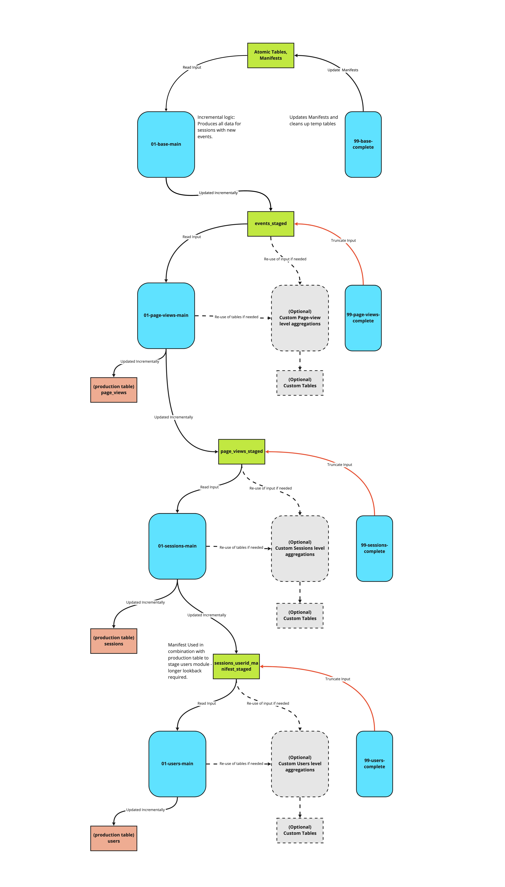
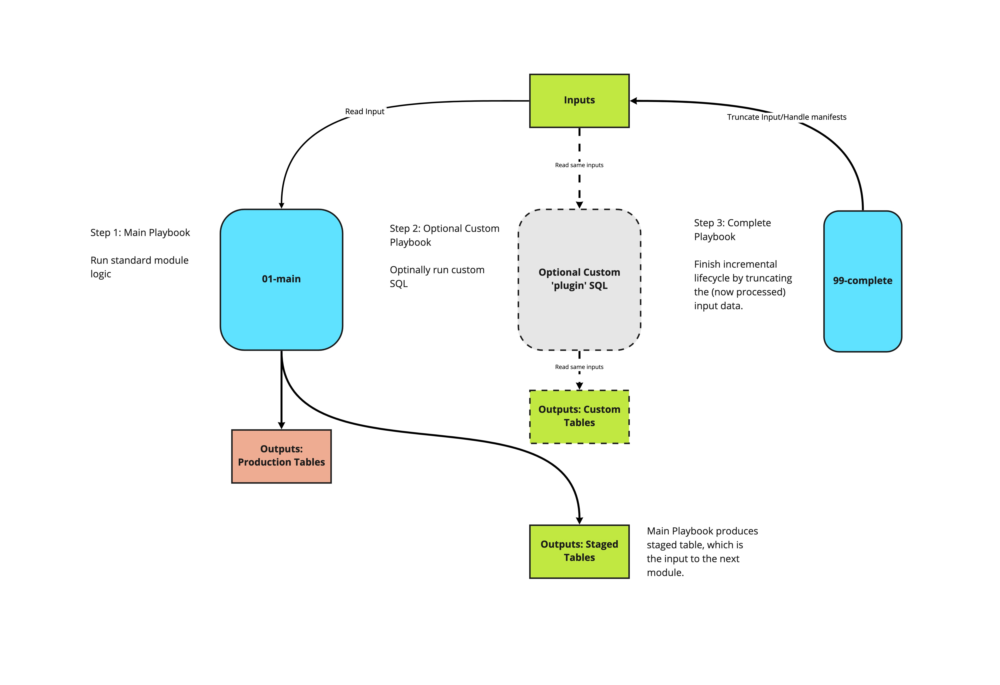

:::tip

For any new developments we highly recommend using our [web package for dbt](/docs/modeling-your-data/modeling-your-data-with-dbt/dbt-models/dbt-web-data-model/index.md) instead. SQL Runner is no longer under active development and will only receive bug fixes in the future.

:::

The Snowplow web data model aggregates Snowplow's out of the box page view and page ping events to create a set of derived tables - page views, sessions and users - that contain many useful dimensions as well as calculated measures such as time engaged and scroll depth.

**The latest Snowplow web data model can be found in the [snowplow/data-models GitHub repository](https://github.com/snowplow/data-models/tree/master).**

## Quickstart

#### Requirements

- [Snowplow Javascript tracker](/docs/collecting-data/collecting-from-own-applications/javascript-trackers/index.md) version 2 or later implemented.
- Web Page context [enabled](/docs/collecting-data/collecting-from-own-applications/javascript-trackers/web-tracker/tracker-setup/initialization-options/index.md#webpage-context) (enabled by default in [v3+](/docs/collecting-data/collecting-from-own-applications/javascript-trackers/web-tracker/tracker-setup/initialization-options/index.md#webpage-context)).
- [Page view events](/docs/collecting-data/collecting-from-own-applications/javascript-trackers/web-tracker/tracking-events/index.md#page-views) implemented.

#### Prerequisites

- [SQL-runner](https://github.com/snowplow/sql-runner) must be installed ([Setup guide](/docs/modeling-your-data/modeling-your-data-with-sql-runner/index.md)).
- A dataset of web events from the [Snowplow Javascript tracker](/docs/collecting-data/collecting-from-own-applications/javascript-trackers/index.md) must be available in the database.

#### Configuring and running the model

First, fill in the connection details for the target database in the relevant template in `.scripts/templates/redshift.yml.tmpl`.

Password can be left as a `PASSWORD_PLACEHOLDER`, and set as an environment variable or passed as an argument to the run_playbooks script. See the README in `.scripts` for more detail.

Variables in each module's playbook can also optionally be configured also. See each playbook directory's README for more detail on configuration of each module.

You can then run the model, either by running playbooks individually by running SQL-runner locally, or via your Snowplow BDP GitHub repository. Of course, as a Snowplow BDP customer you can also reach out to Support to get the model deployed for you.

## Technical architecture

#### The entire model

This model consists of a series of modules, each is idempotent and can be run on independent schedules, and each produces a table which serves as the input to the next module.

#### The individual modules

The 'standard' modules can be thought of as source code for the core logic of the model, which Snowplow maintains. These modules carry out the incremental logic in such a way as custom modules can be written to plug into the model's structure, without needing to write a parallel incremental logic. We recommend that all customisations are written in this way, which allows us to safely maintain and roll out updates to the model, without impact on dependent custom SQL. For more information on this, jump to the section on customizing the model below.

Each module produces a table which acts as the input to the subsequent module (the `_staged` tables), and updates a production table - with the exception of the base module, which takes atomic data as its input, and does not update a production table.

Each module comes with a `99-{module}-complete playbook`, which marks that module complete by updating any relevant manifests, and truncating the input, and cleaning up temporary tables. The complete steps may be run at the end of each module, or at the end of the run.

More detail on each module can be found in the relevant READMEs in the [GitHub repository](https://github.com/snowplow/data-models/tree/master).

## Customizing the model

Custom modules can fit into the incremental structure by consuming the same inputs, and running before the `99-{module}-complete` playbook runs. Custom modules may also consume and intermediary tables of the standard module, which will not be dropped until the `99-{module}-complete` playbook runs.

Any custom SQL that depends on a `_staged` table as its input should run before the complete step of the module which handles that same input. For example, custom logic which takes events_staged as an input should run before the `99-page-views-complete` playbook.

As an introductory example, if there is a requirement to include data from custom events and entities for page views, for example, we would write a custom module which:

- Reads events (i.e. event_ids) from the `scratch.events_staged` table
- Aggregates to one row per `page_view_id`
- Deletes and inserts this to a custom table which can join to the `derived.page_views table` on `page_view_id`

If the playbook for this custom module is called `AA-my-custom-page-views-level-module.yml.tmpl`, then we would run the playbooks as follows:

- `standard/01-base/01-base-main.yml.tmpl`
- `standard/01-base/99-base-complete.yml.tmpl`
- `standard/02-page-views/01-page-views-main.yml.tmpl`
- `custom/AA-my-custom-page-views-level-module.yml.tmpl`
- `standard/02-page-views/99-page-views-complete.yml.tmpl`

Custom modules can also be created with their own independent manifesting logic, in which case they are more complex, but don't rely on the standard modules.

More information on customizing the Snowplow web data model can be found in the [`web/v1/redshift/sql-runner/sql/custom` folder on GitHub](https://github.com/snowplow/data-models/).

## Metadata

Metadata is logged in the `{{.output_schema}}.datamodel_metadata{{.entropy}}` table, per-module and per-run. A persistent ID is created, so that separate modules within the same run may be identified. This ID is automatically handled, as long as the `99-{module}-complete` step of the last module to run has the `:ends_run:` variable set to `false`.

Rather than setting this variable, this can be maintained manually be running the `00-setup/00-setup-metadata.yml.tmpl` before all other steps, and the `00-setup/99-complete-metadata.yml.tmpl` playbook after all other steps.
