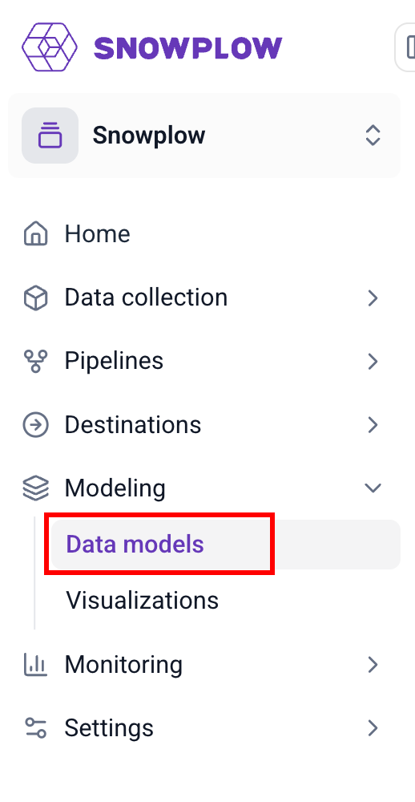
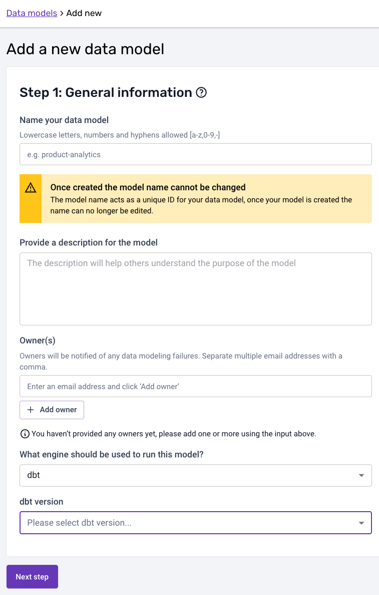
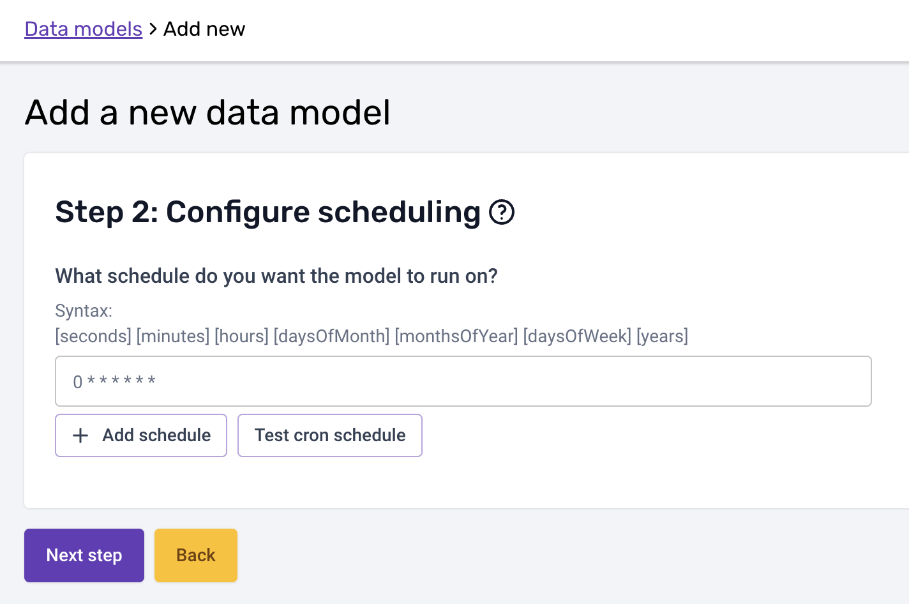
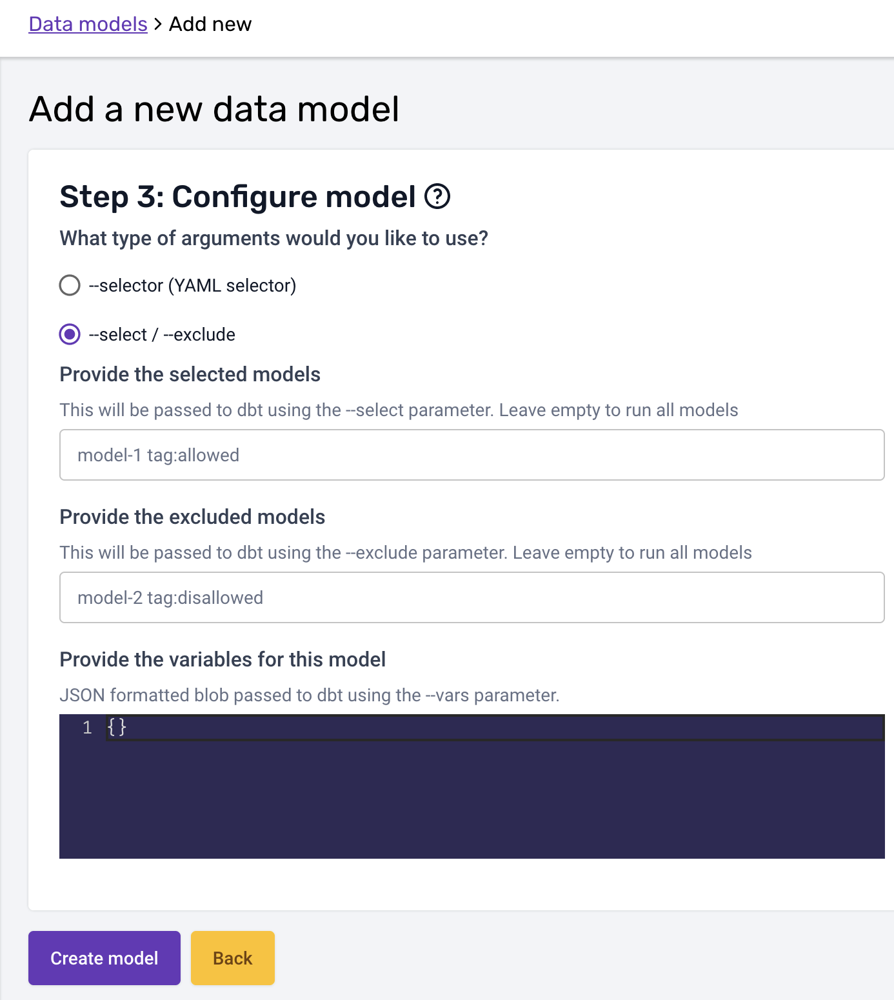
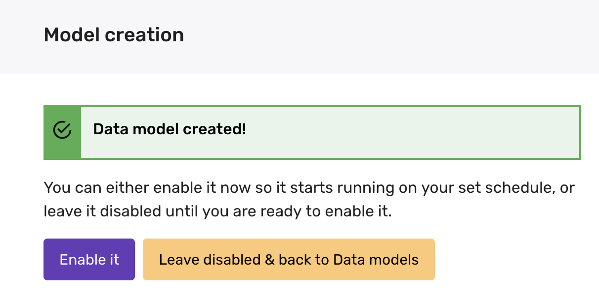

```mdx-code-block
import Tabs from '@theme/Tabs';
import TabItem from '@theme/TabItem';
```

### Overview

If you are a Snowplow BDP customer, you can get started with configuring and deploying dbt projects as outlined in the steps below. For more information about setting up your dbt project you can look at the [Snowplow dbt docs](/docs/modeling-your-data/modeling-your-data-with-dbt/index.md).

As an initial overview, in your snowplow-pipeline repository, your data models reside in the dbt directory. To start with, your GitHub repository will look like this (you may have additional folders based on your project e.g. `dbt_packages` or `docs`):

```text
.
├── datamodeling
|   ├── datamodel-name
|       └── dbt
|           ├── analyses
|           ├── logs
|           ├── macros
|           └── models
|               └── my_custom_datamodel
|                   ├── model_name_1.sql
|                   └── model_name_2.sql
|           ├── seeds
|           ├── snapshots
|           ├── tests
|           ├── README.md
|           ├── dbt_project.yml
|           └── profiles.yml
```

Inside the `datamodeling` directory you can create the data models as subdirectories, giving them an appropriate name. The allowable characters for naming are `a-z,0-9,-`. Under this you must create a subdirectory named `dbt`

Each `dbt` subdirectory contains your dbt project folders, with the `dbt_project.yml` file at the top level of this folder. For further information about the structure of a dbt project see the [dbt docs](https://docs.getdbt.com/docs/build/projects).


:::info

When the schedule kicks off, the data model configuration is loaded and validated. A corresponding data modeling DAG is autogenerated accordingly. This DAG will only contain 2 steps, a `git clone cache` and a `dbt run` command, dbt manages all model dependencies within the `run` command.

:::

Read below for more details on the steps to configure and run your dbt data models with Snowplow BDP.

### 1. Setup your dbt profile

You need to provide your prod connection profile for the warehouse you are connecting to in the `profiles.yml` file for **each datamodel**. Ensure that your profile and target are set to `prod`. See [the dbt adapters docs](https://docs.getdbt.com/docs/supported-data-platforms#verified-adapters) for more specific configuration information for each database.

<Tabs groupId="warehouse" queryString>
<TabItem value="redshift" label="Redshift" default>

See [dbt connection setup](https://docs.getdbt.com/reference/warehouse-setups/redshift-setup) for more information.

```yaml
profile_name:
  outputs:
    prod:
      type: redshift
      threads: [1 or more]
      host: [hostname.region.redshift.amazonaws.com]
      port: 5439
      user: datamodeling
      pass: "{{ env_var('REDSHIFT_DATAMODELING_PASSWORD') }}"
      dbname: [database name]
      schema: [schema name]
  target: prod
```

</TabItem>
<TabItem value="snowflake" label="Snowflake">

See [dbt connection setup](https://docs.getdbt.com/reference/warehouse-setups/snowflake-setup) for more information.
[Finding your snowflake account name](https://docs.snowflake.com/en/user-guide/admin-account-identifier.html#non-vps-account-locator-formats-by-cloud-platform-and-region)

```yaml
profile_name:
  outputs:
    prod:
      type: snowflake
      account:
      user: ANALYTICS_PROD_USER
      password: "{{ env_var('SNOWFLAKE_DATAMODELING_PASSWORD') }}"
      role: ANALYTICS_PROD_ROLE
      database: ANALYTICS_PROD_DB
      warehouse: ANALYTICS_PROD_WH
      schema: DBT_PROD
      threads: [1 or more]
      client_session_keep_alive: true
  target: prod
```

Alternatively, if you prefer to leverage RSA public/private key-based authentication, your profile should look like the following:

```yaml
profile_name:
  outputs:
    prod:
      type: snowflake
      account:
      user: ANALYTICS_PROD_USER
      private_key_path: "{{ env_var('SNOWFLAKE_RSA_PRIVATE_KEY_PATH') }}"
      # passphrase is optional -> if this is not set only include 'private_key_path'
      private_key_passphrase: "{{ env_var('SNOWFLAKE_RSA_PRIVATE_KEY_PASSPHRASE') }}"
      role: ANALYTICS_PROD_ROLE
      database: ANALYTICS_PROD_DB
      warehouse: ANALYTICS_PROD_WH
      schema: DBT_PROD
      threads: [1 or more]
      client_session_keep_alive: true
  target: prod
```

</TabItem>
<TabItem value="bigquery" label="BigQuery">

See [dbt connection setup](https://docs.getdbt.com/reference/warehouse-setups/bigquery-setup) for more information.


```yaml
profile_name:
  outputs:
    prod:
      type: bigquery
      method: service-account
      project: [GCP project id]
      dataset: [the name of your dbt dataset] # You can also use "schema" here
      threads: [1 or more]
      keyfile: "{{ env_var('GOOGLE_APPLICATION_CREDENTIALS') }}"
  target: prod
```

</TabItem>
<TabItem value="databricks" label="Databricks">

See [dbt connection setup](https://docs.getdbt.com/reference/warehouse-setups/databricks-setup) for more information.

```yaml
profile_name:
  outputs:
    prod:
      type: databricks
      catalog: [optional catalog name, if you are using Unity Catalog, is only available in dbt-databricks>=1.1.1]
      schema: [schema name]
      host: [yourorg.databrickshost.com]
      http_path: [/sql/your/http/path]
      token: "{{ env_var('DATABRICKS_DATAMODELING_PASSWORD') }}"
      threads: [1 or more]  # optional, default 1
  target: prod
```

</TabItem>
</Tabs>

:::info

The warehouse password should be sent by [secure form from Snowplow Console](https://console.snowplowanalytics.com/secure-messaging/freeform) in order to set the environment variables.

:::

#### Required Privileges

```mdx-code-block
import DbtPrivs from "@site/docs/reusable/dbt-privs/_index.md"

<DbtPrivs/>
```

### 2. The data modeling configuration

Data models can be configured via the [Data Models](https://console.snowplowanalytics.com/data-models) page in Snowplow Console:



In the first step, you can provide the data model name, a description, and the owner(s) of the data model that will be alerted in case of failure. Finally select the engine and version that should run your datamodel (dbt in this case):



When selecting a `dbt-core` version, below you'll find a table which contains the exact `dbt-adapter` versions that are bundled with each specific version of `dbt-core`:

|  dbt-core  | BigQuery | Databricks | Postgres | Redshift | Snowflake |
| :--------: | :------: | :--------: | :------: | :------: | :-------: |
| **1.0.0**  |  1.0.0   |     -      |  1.0.0   |  1.0.0   |   1.0.0   |
| **1.0.8**  |  1.0.0   |   1.0.3    |  1.0.8   |  1.0.1   |   1.0.1   |
| **1.1.2**  |  1.1.1   |   1.1.6    |  1.1.2   |  1.1.0   |   1.1.0   |
| **1.2.2**  |  1.2.0   |   1.2.4    |  1.2.2   |  1.2.1   |   1.2.0   |
| **1.3.0**  |  1.3.0   |   1.3.1    |  1.3.0   |  1.3.0   |   1.3.0   |
| **1.4.5**  |  1.4.2   |   1.4.2    |  1.4.5   |  1.4.0   |   1.4.1   |
| **1.5.1**  |  1.5.1   |   1.5.4    |  1.5.1   |  1.5.9   |   1.5.1   |
| **1.6.9**  |  1.6.9   |   1.6.7    |  1.6.9   |  1.6.4   |   1.6.5   |
| **1.7.11** |  1.7.7   |   1.7.11   |  1.7.11  |  1.7.5   |   1.7.3   |

Please also note that the model name needs to match to the corresponding datamodeling subfolder name in GitHub. The dbt project for the model in the above example would therefore live under:

`your snowplow-pipeline repo > datamodeling > data model name > dbt ...`

In the second step, you can then add the schedule:



Please note that the cron schedule is in UTC.

:::caution

You should write your dbt models in such a way that if they fail part way through they can be re-run without issue. All Snowplow models are written in this way and if you write your models following the [custom modules](/docs/modeling-your-data/modeling-your-data-with-dbt/dbt-custom-models/index.md) documentation you can take advantage of this.

:::

In the third and last step you can configure the arguments and variables your `dbt run` call is excecuted with. The arguments (`--selector` or `--select` / `--exclude`) follow the syntax described on [dbt docs](https://docs.getdbt.com/reference/node-selection/syntax), and so do variables ([`--vars` flag](https://docs.getdbt.com/docs/build/project-variables#defining-variables-on-the-command-line)):

<Tabs groupId="dbt-step3" queryString>
<TabItem value="selector" label="Selector" default>


</TabItem>
<TabItem value="select_exclude" label="Select/Exclude">



</TabItem>
</Tabs>

Once you are happy with the configuration, you can create the model. The model will be disabled until you enable it:



Please make sure all your dbt project files are merged to the default branch in GitHub before enabling the model. Any changes merged to the default branch are available immediately.

### 3. Model execution

Once everything is set up, Console will run the following commands in this order:
1. `dbt deps` (if a `packages.yml` file is present)
2. `dbt seed`
3. `dbt snapshot`
4. `dbt run`
5. `dbt test`

This ensures that the correct package dependencies are installed, that seeds are uploaded and refreshed, that snapshots are taken, that the dbt models are created, and that all specified tests are run.

### 4. Monitor your model in Console

After everything has been set up and has executed, you can now monitor your data models running against your data warehouse from Console, in the Jobs UI. There you can see the data modeling DAG generated, and monitor the status, duration and run times of the data model. You can also browse through the logs that dbt generates during it's runs. If all seeds, snapshots, models, and tests pass you will see the `Result: SUCCEEDED` status in the Jobs UI. If any of the steps fail (including tests that result in a warning), you will see the `Result: FAILED` status.
