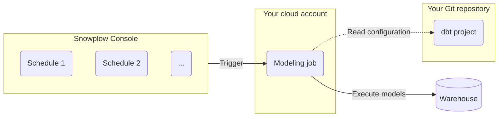
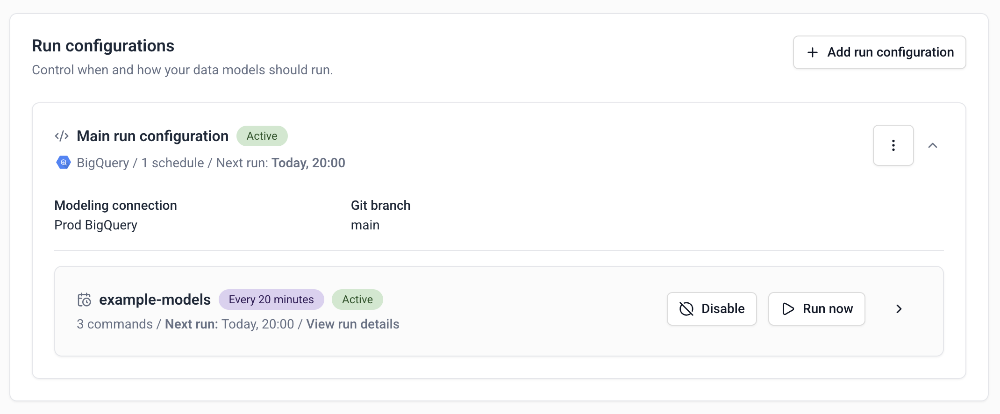

You can use Snowplow Console to schedule and run [dbt](https://www.getdbt.com/) data models, including our [out-of-the-box models](/docs/modeling-your-data/modeling-your-data-with-dbt/dbt-models/index.md), [automatically generated models](docs/modeling-your-data/automatically-generated-data-models/index.md) and any custom or third party models.

## Overview

To use this feature, you will need to store your data models in a **Git repository** organized into one or more [**dbt projects**](https://docs.getdbt.com/docs/build/projects). This provides you full control over the model logic and helps with versioning and collaboration.

In Console, you can define multiple **run configurations** and **schedules** to control what dbt commands get executed and when. For example, you could set the Unified Digital data model to run every day at midnight.

Based on what you defined, Console will trigger data modeling **jobs** in your cloud account associated with Snowplow (managed by you, in the case of Private Managed Cloud, or by Snowplow otherwise). The jobs will execute actual dbt commands against your data warehouse.

:::tip

This architecture allows you to take advantage of a secure connection to the warehouse (e.g., VPC Peering or AWS Private Link) that you might have already set up with Snowplow.

:::

## Prerequisites

To get started, you will need a Git repository (and sufficient permissions to grant read access to Snowplow).

We also highly recommend installing dbt locally so that you can quickly test your model configuration. Follow the [dbt documentation](https://docs.getdbt.com/docs/core/installation-overview) to install dbt Core as well as the relevant adapter for your destination (e.g., `dbt-snowflake`).

## Initial setup

First, create a Git connection to your repository:
* In Console, go to **Destinations > Connections > Set up connection > Git connection**
* The setup flow will guide you to create and test the connection

Next, create the model project:
* Navigate to **Modeling > Model projects > Create model project**
* You will need to provide the Git connection you created in the previous step, as well as some metadata for your project
* Console will show you the dbt commands to initialize your project if you haven't done so (you can also bring a pre-existing project)

Once the project is created, you can start adding data models.

## Adding data models

:::tip

If you already have an existing dbt project with a set of data models, you can skip this section. Console will work with your current dbt configuration in `dbt_project.yml` and `packages.yml`.

:::

Because the dbt configuration is stored in your Git repository, rather than in Console, you will add and configure models by making commits to this repository.

For example, to install our Unified Digital data model, you can follow the [tutorial](/tutorials/unified-digital/intro/) and add `snowplow/snowplow_unified` to your `packages.yml`.

Likewise, to configure variables for the models, edit the `dbt_project.yml` file.

:::note

When running the models, Console will override any warehouse connection settings with the ones you will configure in the next section.

:::

Once you are happy with the dbt project setup, run dbt commands locally to verify it.

## Connecting to the warehouse

In this step you will create a warehouse connection for the models to use. Note that you can define more than one connection, for example if you would like to have separate model run configurations for production and QA data.

:::tip

You might have already set up a warehouse connection for loading the data. Data modeling, however, requires a new connection, as you will often want data models to run under a different user/role and with different permissions.

:::

Navigate to **Destinations > Connections > Set up connection > Data modeling connection**. Select your warehouse and follow the steps in Console to create and test your connection.

## Adding run configurations

For Console to run your data models, you will need to create run configurations.

Each run configuration controls what dbt commands will be executed and when. More concretely:
* You can add one or more run configurations to a project
* Each run configuration can contain one or more schedules
* For each schedule, you can define specific dbt commands

:::tip Examples

If you want to run all your models every day at midnight, you would create:
* One run configuration
* One schedule (daily, 00:00 AM)
* Add standard dbt commands, e.g. `dbt deps` and `dbt run`

If you want to run different models within the project at different times, you can use dbt’s [selector features](https://docs.getdbt.com/reference/commands/run#running-specific-models). In this case, create:
* One run configuration
* Two schedules, e.g. daily at 00:00 AM and every Monday at 03:00 AM
* Pick different commands for each schedule, e.g. `dbt run --select <...>`

:::

To create a run configuration:
* Navigate to your model project in Console
* Click **Add run configuration**
* Pick the warehouse connection created earlier
* Click **Add schedule**
* Select the desired time and dbt commands
* Repeat as necessary

## Running the models

Once you’ve defined the run configurations and schedules, Console will automatically run your data models. You can see when the next run is scheduled by looking at at each run configuration.

You can also use the **Run now** button to trigger a one-off model run for a specific schedule. The resulting job will use the same commands and settings.

## Troubleshooting

See [Resolving data model failures](/docs/modeling-your-data/running-data-models-via-console/resolving-data-model-failures/index.md).