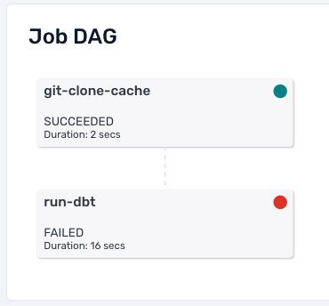
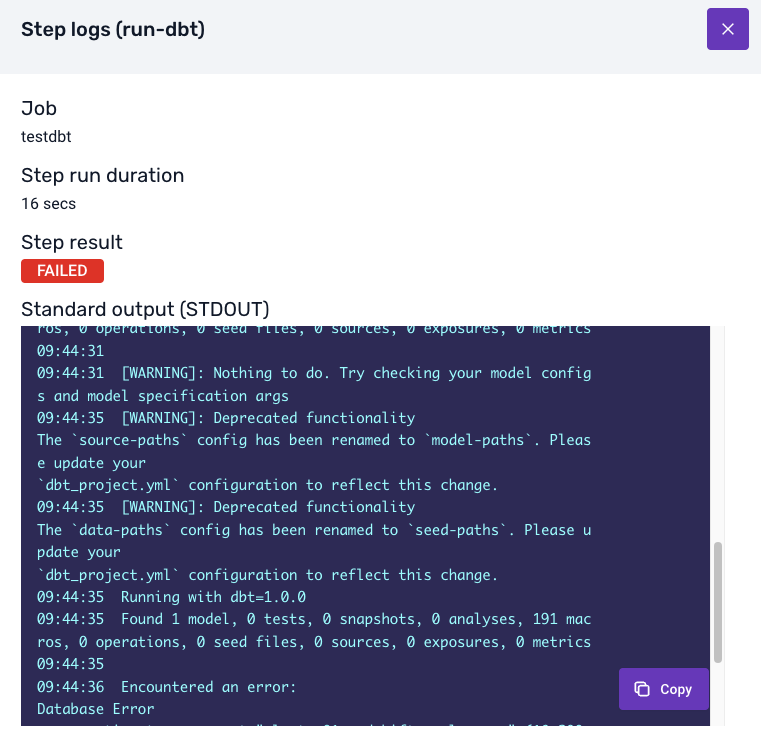

## Receive alerts

When you create a model project in Console, you have to specify one or more owner email addresses. (You can edit the project later to add or remove owners.)

Console uses these email addresses to send notifications when a data modeling job fails for any reason. The email will contain a link to the **Jobs** section in Console with the relevant failure.

## Diagnose failures

You will be able to see the details of your data model failure in the jobs interface in Console. Under **Job DAG** (Directed Acyclic Graph) for the failed job, click on the failed step to see details of what went wrong.

The **Error Output** will show you the error logs from the dbt commands that were executed. These logs will contain the failure information that dbt and the warehouse relayed back to Console.

## Understand and resolve issues

An error message such as 'connection refused' or `EOF` (end of file) is typically caused by a network problem. These errors often do not need any interaction to be resolved.

If the logs show a dbt call with a model error, you will need to identify the issue in your model files and push the changes to your Git repository. For help debugging dbt errors, please see the [dbt docs](https://docs.getdbt.com/guides/debug-errors) and ensure your models run correctly locally before pushing changes.

:::note

Even if a job fails, it will run again next time as per the schedule (e.g. next midnight). If you identified an issue, you can temporarily disable the schedule to prevent spurious failures while you work on a fix.

:::
