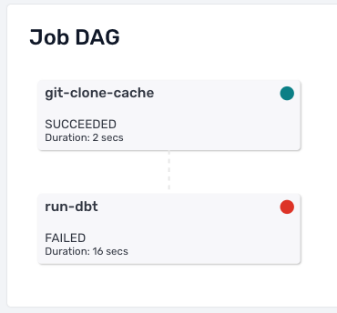
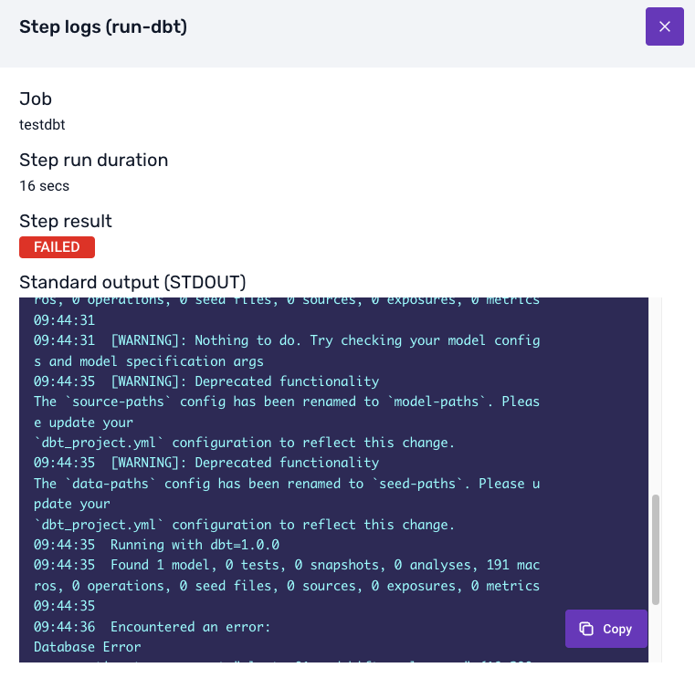

:::note

This documentation assumes you are running your data models via the data modeling UI in Snowplow Console, as described in [the documentation for running data models](/docs/modeling-your-data/running-data-models-via-snowplow-bdp/dbt/index.md#2-the-data-modeling-configuration).

:::

### Receiving alerts

If a run of a data model fails for any reason, all owners are notified automatically. A link to the jobs UI in console is provided in the alert, which you can review to diagnose the failure.

### Diagnosing failures

You will be able to see the details of your data model failure in the jobs interface in console. Under 'Job Dag' for the failed job, click on the failed step to see details of what went wrong. Due to the nature of the `dbt run` call, your DAG will only have 2 blocks.

The 'Error Output' will show you the error logs from the `dbt run` call. These logs will contain the information that dbt and the database relayed back to Console from the failure, and will match the dbt logs you get if you run it locally.

### Understanding and resolving issues

An error output message such as a 'connection refused' related message, or for example an `EOF` error is typically down to some external database process, or a network connection error. These errors often do not need any interaction to be resolved.

If the error output shows a dbt call with a model ERROR, you will need to identify the issue in your model files and push the changes to the default branch in Github. For help debugging dbt errors please see the [dbt docs](https://docs.getdbt.com/guides/legacy/debugging-errors) and ensure your models run correctly locally before pushing changes.

:::note

Models are automatically retried on your schedule regardless of the last run outcome; if an issue is identified it is recommended to disable your model in the UI while you work on a fix.

:::
