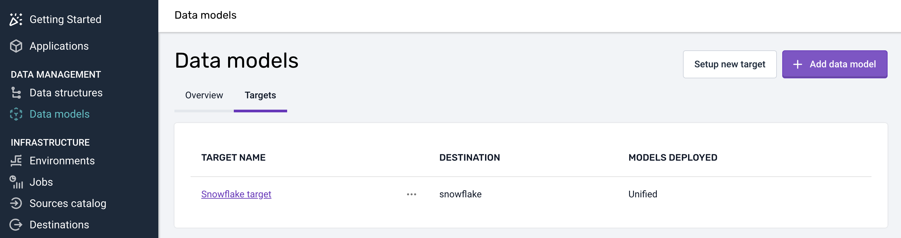
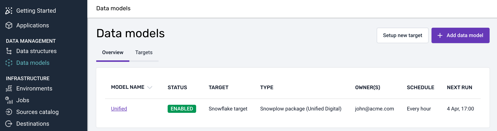

```mdx-code-block
import Tabs from '@theme/Tabs';
import TabItem from '@theme/TabItem';
```

### Overview
[Standard data models](/docs/modeling-your-data/modeling-your-data-with-dbt/dbt-models/) are authored and maintained by Snowplow. Follow the steps below to create and run one.

## Create a warehouse connection
Begin by creating a new warehouse connection. It will be used by a data model to connect to your warehouse. Click on the "Set up new connection" button on the [Data Models page](https://console.snowplowanalytics.com/data-models) and fill in all the necessary details.



:::tip

You might have already set up a warehouse connection for loading the data. Data modeling, however, requires a new connection, as you will often want data models to run under a different user/role and with different permissions.

:::

Supported destinations are Snowflake, Databricks, Redshift and BigQuery.

## Create a data model
To create a new data model, click the "Add data model" button. Then, select the data model you're interested in, such as [Unified Digital](/docs/modeling-your-data/modeling-your-data-with-dbt/dbt-models/dbt-unified-data-model/index.md), and the warehouse connection it should use. You can also specify the owners of the data model who will be alerted in case of failure.



## Monitor data model runs
After you've set everything up, Snowplow BDP Console will run the model according to the provided schedule. You can monitor your data model runs on the [Jobs page](https://console.snowplowanalytics.com/jobs).
