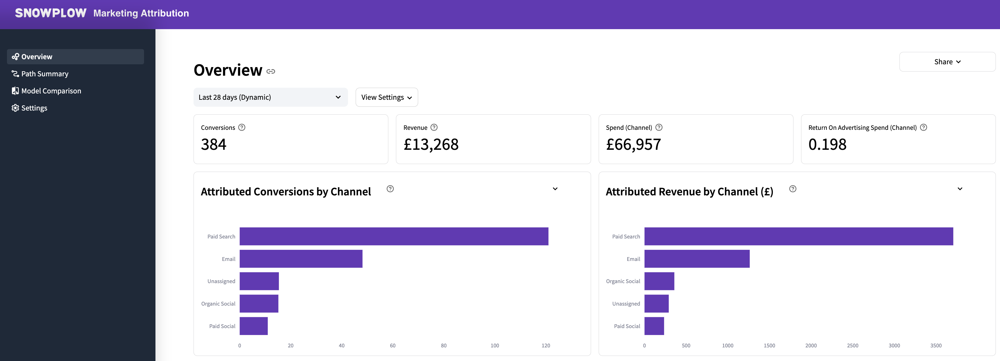
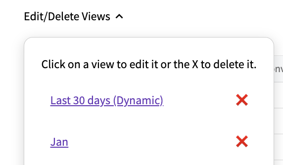

In today's increasingly complex digital world, users often take multi-channel journeys before converting. Assigning credit across multiple touchpoints is vital to getting an accurate picture of the efficacy of your marketing channels, yet requires merging disparate datasets and running complex calculations.

The Snowplow Marketing Attribution visualization (together with the [Snowplow Attribution dbt package](/docs/modeling-your-data/modeling-your-data-with-dbt/dbt-models/dbt-attribution-data-model/index.md)) lowers the barrier to entry for your marketing team through the following features:

- Incremental SQL model in your warehouse for cost-effective computation
- Choice of first-touch, last-touch, linear and positional methods, with additional filters and transforms available
- Reports for conversions, revenue, spend and Return On Advertising Spend (ROAS) per channel and campaign
- Option to specify your own touchpoint and advertising spend tables
- Intermediate tables that you can build your own attribution models on top of

## Requirements

- [Campaign Attribution enrichment](/docs/pipeline/enrichments/available-enrichments/campaign-attribution-enrichment/index.md) enabled
- [Referrer Parser enrichment](/docs/pipeline/enrichments/available-enrichments/referrer-parser-enrichment/index.md) enabled
- Running the [Snowplow Unified Digital dbt Package](/docs/modeling-your-data/modeling-your-data-with-dbt/dbt-models/dbt-unified-data-model/index.md) with `conversion event(s)` defined and the optional conversion module enabled
- Running the [Snowplow Attribution dbt Package](/docs/modeling-your-data/modeling-your-data-with-dbt/dbt-models/dbt-attribution-data-model/index.md)
- Access to the derived tables granted to the role used when setting up the visualization

## Configuration

Configuration is best performed by a Data Analyst or Engineer.

All these settings are global for all users, meaning if you change them they will be changed for everyone. The first user of the visualization will have to define at least one **view** which is the dataset needed to generate the charts. Creating views can be done on the **Settings** page.

### Update method

Use the toggle **Last N days View (Dynamic)** to choose whether to define a dynamic view that auto-updates or a static view:

- **Dynamic (Last N Days)**: the so-called dynamic views are for generating datasets that have a rolling conversion window of last nth day and will be refreshed automatically (e.g. last 30 days).

  The visualization will save the last-refreshed date with the view configurations. Any subsequent day a user logs back into the visualization, a query will run in the background to look for any newly processed conversion events in the conversion source. If there are any, the dynamic datasets are refreshed by running all the queries that are needed to generate data for the charts to populate.

  If you choose this option, set the **auto-update days**: the number of days since the last conversion event defined here will define the conversion window. The latest conversion window in use can be checked on the **Settings** page where a table with information on all the created views is displayed, including the conversion window that is currently in use.

- **Static (Custom Date Range)**: non-dynamic views need a name, and will typically be used to generate a fixed dataset (e.g. Jan, Q1, 2023) to avoid having to recalculate the analysis for subsequent users.

  Define a fixed conversion window by selecting the appropriate date range with the date picker tool. It is activated by clicking on the default date range.

### Set a currency symbol

The currency symbol defaults to "$".

### Connect to data sources

1. Select your schema that contains the derived unified and attribution tables. This will trigger an update which checks for any tables with the names closest to what the visualization expects.
2. After waiting for the update to take place, you can check if the auto-detected source tables are what you expect. Change them to any other appropriate existing tables if they are not correct.
3. For most users, the **Paths To Non-Conversion** table should be set to **Do not use paths_to_non_conversion table**.

    This drop and recompute table calculates the paths your customers have followed that have not led to a conversion, for use in the **Path Summary** page. This table is not recalculated by the visualization. Therefore it should only be used for a static view with the intention of consuming the same period as in the latest data model.

4. Overwrite the **Attribution Manifest** table. Most likely the schema name will have to be modified. Keep the `schema_name.table_name` notation here, and press enter once modified.
5. (Optional but recommended) Specify the **Spend Source** to get the ROAS calculation in your overview. This will most likely be a view you created on top of your table that holds your marketing spend data. The view will make sure you align the expected field names. It should have `campaign`, `channel`, `spend` and `spend_tstamp` for the analysis to work. Press enter once modified.

6. Once you are happy with all the inputs, press the **Create View** button. The visualization will first run a validation against the data sources making sure it has all the fields it needs. If all is well, it will save the view.
7. The dashboards are ready to be explored. The first time a dashboard page is visited, the relevant query will run once and the data will be cached to speed up subsequent dashboard explorations for other users.

## Using the Dashboard

Once at least one view is configured, all users can go ahead and use the dashboards directly.

### Filters

There are various filters at the top of each dashboard page that make the data exploration interactive. Because the queries are cached, users can make any of these interactive changes without involving the warehouse, avoiding expensive queries or laggy information retrieval.

To use a filter, first select which view to use, and then make changes with **View Settings**:

- select which **Attribution Type** to use (`First Touch`, `Last Touch`, `Linear` or `Position Based`)
- choose between using **Campaign** or **Channel** for paths

Some pages have additional filters, such as the **Number of items** filter for the **Path Summary** page, which reduces the number of items shown in specific charts.

## Editing and deleting views
Edit or delete existing views from the **Settings** page, using the **Edit/Delete Views** dropdown.

- **Delete**: click X next to the view.
- **Edit**: click on the name of the view. The visualization will take you to the view configuration page where you can make amendments. Saving will overwrite the existing view configurations.

