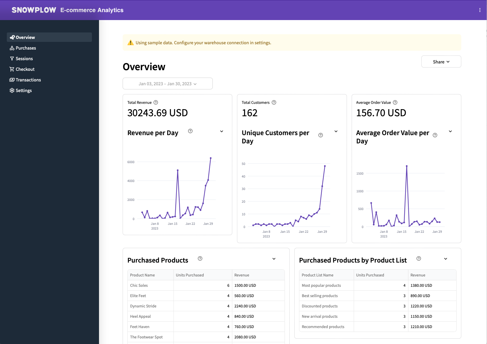
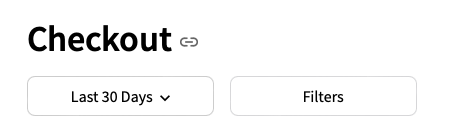
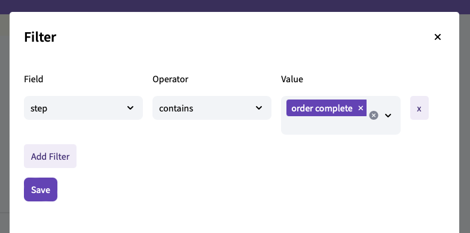

<!-- Ecommerce reports based on GA4's Monetization metrics, covering revenue, purchases, checkout journey and promotions -->

The Ecommerce Analytics visualization offers an in-depth breakdown of ecommerce activities across your websites and mobile apps, presenting an enhanced rendition of Google Analytics v4 reports. Use the dashboards to:

* Access real-time data directly within your data warehouse in a governed manner.
* Navigate through a series of interactive dashboards designed to surface monetization data, purchasing behaviors, checkout experiences, and transaction patterns.
* Customize your analytics workflow with filters for campaigns, channels, and products.

Leveraging Snowplow's Ecommerce event tracking packages and our Ecommerce dbt package, the visualization transforms raw event data into structured tables covering carts, checkouts, products, transactions, and user interactions, providing valuable insights for informed decision-making.

## Requirements

- Running the [Snowplow Ecommerce dbt Package](/docs/modeling-your-data/modeling-your-data-with-dbt/dbt-models/dbt-ecommerce-data-model/index.md)
- Access to the derived tables granted to the role used when setting up the visualization
- Ecommerce events tracked using the ecommerce APIs for the [JavaScript (Snowplow Ecommerce plugin)](/docs/sources/trackers/javascript-trackers/web-tracker/tracking-events/ecommerce/index.md) or [mobile trackers](/docs/sources/trackers/mobile-trackers/tracking-events/ecommerce-tracking/index.md)

## Usage

The following steps will guide you through using the visualization.

### Explore the dashboards using sample data (optional)

Before you configure your data, you are free to explore all the dashboards using the sample data included.
The use of sample data is enabled by default and can be enabled/disabled using the **Use Sample Data** toggle on the **Settings** page.

You can browse the following pages:

1. **Overview**: key metrics including the revenue, number of customers and the average order value. It also shows the revenue for top performing products and product lists.
2. **Purchases**: dive deeper into the purchased products and compare product views, add to carts, units purchased, and more.
3. **Sessions**: a funnel of how users navigated from product views all the way to transactions by their number of sessions, conversion rate and abandonments.
4. **Checkout**: individual checkout steps within the funnel, showing conversion rate and abandonment for each step.
5. **Transactions**: key metrics for the transactions including types of payments.

### Configure using the Ecommerce dbt package tables

The **Settings** page lets you choose the schema and tables in your data warehouse to use.
These refer to the output of the Ecommerce dbt package.

First, choose the warehouse schema where your dbt Ecommerce package produced the derived tables (e.g. `dbt_ecom_derived`).
The visualization will suggest the most likely tables below.
The following derived tables will need to be configured: `cart interactions`, `checkout interactions`, `product interactions`, `sessions`, and `transaction interactions`.

Verify that these match the desired tables and click **Save Settings**.
If the tables have the required columns, you can navigate to the dashboard pages in the sidebar and explore your data.

### Choose the date range and filters

At the top of each page, there is an option to choose the date range (including a secondary date range to compare the data against) and filters.
These options let you narrow down the data shown in the dashboard to what you are interested in.

When you click on the **Filters** button, you will see a modal with an option to add conditions on fields in the data.
For example, you can add conditions on the products or product lists that you are interested in.

