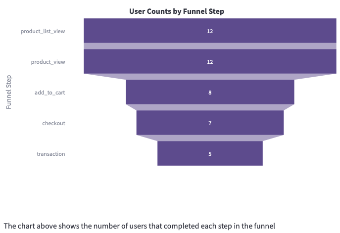
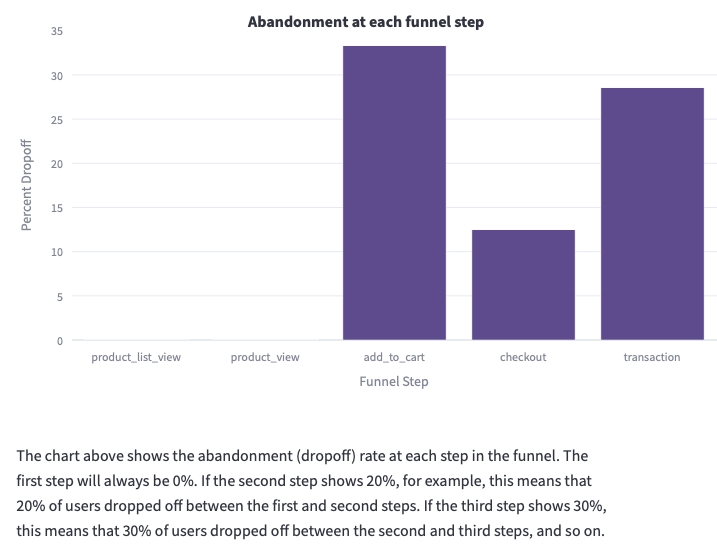
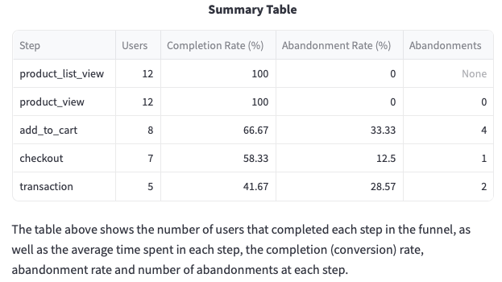

```mdx-code-block
import MainImage from './images/ecommerce-full-page.png';
import TableAndSchemaImage from './images/table-and-schema.png';
import FilterImage from './images/filter.png';
import StepImage from './images/step.png';
import SettingsImage from './images/settings.png';
```

Funnels are an essential tool for understanding user journeys on your app or website. They help to visualize how many users complete each event along a journey such as signing up or making a purchase, so you can understand which stages are leading to the most drop-off and make changes to improve conversion rates.

This visualization provides an intuitive UI for building a funnel analysis and visualizing the results. You can specify any number of conditions and steps, and will receive the following outputs when you run the analysis (see screenshots below):

- User Counts by Funnel Step Chart
- Conversion Rates Chart
- Abandonment Rates Chart
- Summary Statistics Table

It works on any table that Snowplow’s Data Modeling User has access to, including the atomic events table and derived tables. It comes with some pre-built funnels based on out-of-the-box Snowplow events such as page views and link clicks, and you can save your own custom funnels to share with teammates.


```mdx-code-block
import TrackedReactFilePlayer from '@site/src/components/TrackedReactFilePlayer'
import videoUrl from './images/funnel_builder_video.mp4'

<TrackedReactFilePlayer label="Funnel Builder" controls url={videoUrl} width='100%' height='100%' />
<br/>
```
## Requirements

- Access to the table(s) you wish to run the tool on, granted to the role used when setting up the visualization

## Building a funnel

The following steps will guide you through building a funnel.

### Start from template or create a new funnel

The main page shows a list of example funnels for common use cases (e.g., ecommerce) to get you started.

You can choose to start using one of the templates, or create a new funnel configuration from scratch.

### Choose your funnel name, database schema and table

A page with the funnel configuration will be shown.

First, you are asked to provide a name for the funnel, which will be used to identify it.

Next, you can select which warehouse schema and table you want to run the analysis on.
If you select the atomic events table, we have included some additional functionality allowing you to reference properties inside nested columns. Otherwise, you can only reference flat columns.


### Configure filter conditions

To minimize query costs, we **highly** recommend including a filter on the partition key of your table.
For the atomic events table, this is usually `collector_tstamp` or `derived_tstamp` for BigQuery, but may more recently be `load_tstamp`.

You can add filter conditions to select a subset of events to be used by the funnel using the partition or other columns of the table.


### Define funnel steps

Next, you are asked to define rules for the funnel steps.
Each step requires a name and one or more rules, which can be combined together using conditional logic.
You can define an unlimited number of steps.


:::note The **Update Steps** button
Whenever you make a change to the funnel steps or the filter rules, it is necessary to click the **Update Steps** button.
:::

### Check additional settings

There are a range of other options you can use to configure the funnel.
Use the **Settings** tab to update the following configuration if you prefer (or keep the defaults):

- **Order events by**: this must be a timestamp column. If you have added a date range pre-filter, make sure that it is the same field as this one.
- **Group funnels by**: choose a field to group the funnels by - we recommend user or session identifiers.
- **Additional columns to group by**: use this to visualize additional dimensions in your funnel analysis e.g. experiment groups.
- **Max days since funnel start**: maximum days since the funnel's start for an event to still be considered part of that funnel. Set to 0 for unlimited.
- **Intra step time (hours)**: maximum hours since an event for the next to be included in the same funnel. Set to 0 for unlimited.


### Build the funnel charts

Click the **Build Funnel Charts** button to generate interactive funnel charts and tables.
You can also download the generated SQL to edit or rerun in your own environment.

| User counts by funnel step                                                  | Funnel conversion rates                                                       |
| --------------------------------------------------------------------------- | ----------------------------------------------------------------------------- |
|  |  |

| Abandonment at each funnel step                                                  | Summary table                                                      |
| -------------------------------------------------------------------------------- | ------------------------------------------------------------------ |
|  |  |

### Save your funnel configuration

Once you are happy with the settings of your funnel you can save it for anyone to open and use using the **Save Funnel** button.
The funnel configuration will be saved under the name used in the **Funnel Name** input at the top of the page.

### (Optional) Output to a table

You can also save the results of a given run to a table in your warehouse in the **Settings** tab.
Use the **Output results to table** checkbox under the **Settings** tab and choose the configuration for the output table.

### Export visualizations to a BI tool

If you would like to visualize these funnels in a different tool, the **Export** page contains instructions on how to run the generated SQL and recreate the analysis in the following tools:

- Looker
- PowerBI
- Tableau
- Preset
- Streamlit

## Editing or deleting a funnel
Once your funnel is saved you will find it on the **Welcome** page. You are free to make any modifications to them as you need if you click on them. Deletion is also simple, just click on the ❌ symbol.

:::note
If your underlying data sources (views/tables) change (e.g. fields removed) the pre-saved funnels might break, and you may need to edit or recreate them to avoid SQL compilation issues.
:::
