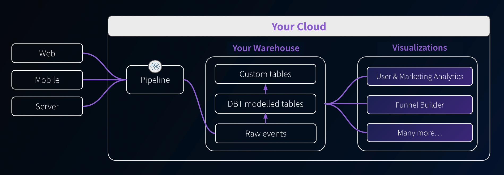
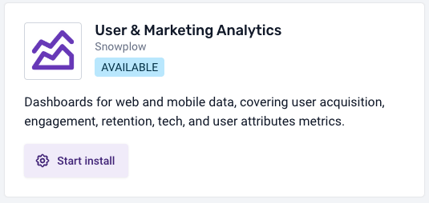
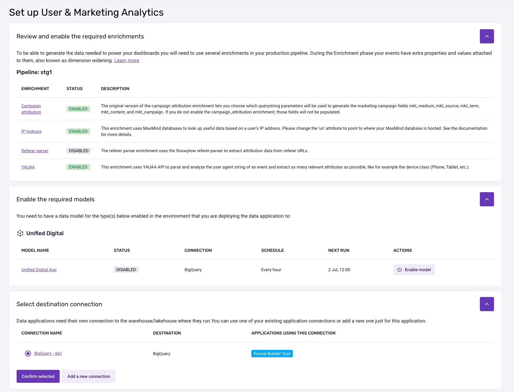
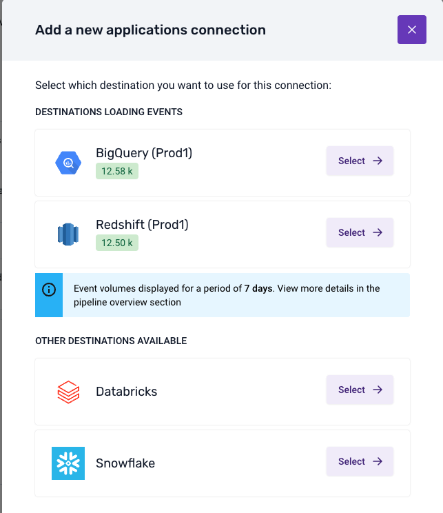

```mdx-code-block
import Tabs from '@theme/Tabs';
import TabItem from '@theme/TabItem';
```

Along with data models, Snowplow provides dashboards and visualizations to help you extract value from your data quickly. These self-service analytics tools give you templated use-cases for data collection, modeling, and activation.

They are deployed in your cloud and aim to reduce the technical barrier, making data analysis more accessible beyond just SQL users.



## Available visualizations

Purchase a Data Model Pack to get access to visualizations.

### Digital Analytics Data Model Pack

This includes the following dashboard visualizations, as well as the required dbt data models:

* **[User and Marketing Analytics](/docs/modeling-your-data/visualization/marketing-dashboards/index.md)**: understand your customer engagement with digital channels.
* **[Marketing Attribution](/docs/modeling-your-data/visualization/attribution-modeling/index.md)**: understand the impact of different marketing channels on conversions and traffic levels.
* **[Funnel Analytics](/docs/modeling-your-data/visualization/funnel-builder/index.md)**: understand the sequential steps users take toward a specific goal, identifying drop-off points and optimizing the user journey for higher conversions.
* **[Video and Media Analytics](/docs/modeling-your-data/visualization/video-media/index.md)**: understand engagement with video, audio, and streaming content, including clicks through to conversions and advertisements.

### Ecommerce Data Model Pack

This includes the following dashboard visualizations, as well as the required dbt data models:

* **All the visualizations** from the Digital Analytics Data Model Pack.
* **[Ecommerce Analytics](/docs/modeling-your-data/visualization/ecommerce-analytics/index.md)**: understand your customer engagement with digital channels.

## Access

You can find the visualizations in the **Visualizations** section in the left sidebar of your Snowplow Console. A visualization can be in one of three states:
* **By request**: if you have not yet purchased a Data Model Pack that includes the visualization, click on **Learn more** and register your interest. A Snowplow Customer Success Manager will then get in contact with you to discuss getting access.
* **Available**: the visualization is ready to be set up. See the installation instructions below.
* **Live**: the visualization is ready to use.

Once the visualization is installed, clicking on the tile will launch it in a separate browser tab. By default, anyone in your Console organization will be able to access the visualizations.

If you wish to invite others to use the visualizations but without giving them access to the rest of the Console, you can [create a new user](/docs/account-management/managing-users/index.md) with the `visualizations user` role. That user will then only see the **Visualizations** tab within the Console. The permissions can be managed in the [usual way](/docs/account-management/managing-permissions/index.md).

## Installation

After purchase, click the tile in the Console **Visualizations** section to begin installing it and follow the steps.

An example tile:



During installation, you will need to [provide a connection](#warehouse-connections) to the warehouse you would like the visualization to use. It will also highlight any required pipeline and data model dependencies.

The installation workflow will look something like this:



### Data model dependencies

Generally, visualizations will depend on data models. If there are dependencies, the installation flow will highlight which models are required and what models you currently have [running via BDP](/docs/modeling-your-data/running-data-models-via-snowplow-bdp/index.md). It will also highlight any properties that you need to enable or configure for these data models.

:::note Manual configuration for Open Source
If you are running the necessary data models yourself outside of BDP, then you will need to manually check that your setup satisfies the requirements for each visualization. These requirements are listed within the documentation pages for each visualization.
:::

## Warehouse connection

To install a visualization, you will need to create a connection to where your data model output or atomic table resides. You can do this as part of the installation process. The visualization will need secure credentials to fetch the required data.

You might have already set up a warehouse connection for loading and/or modeling the data. Visualizations, however, require a different connection, as you will often want them to run under a different user/role and with different permissions.

The connection process will look something like this:



Once you have selected a destination, provided the credentials, and run the suggested SQL script, the Console will test the connection. Upon a successful test, the visualization will be available to use.

## Using the visualization
### Is it running?
When the visualization is doing some calculations, querying the database, or otherwise still loading, you'll see the following gif in the top right:

<div style={{"background-color": '#F2F4F7'}}>

</div>

You may particularly notice this on visualizations with multiple tabs per page, as the tabs will load in order so the last tab may seem empty until this processing is completed.

### Configuration
Where the visualization has some configuration requirements it will also have a **Settings** page that will validate what is available to the visualization, and provide information for steps to take for any unfulfilled requirements.

### Chart sources
Many of the visualizations support the exporting of the SQL used to generate the charts. In some cases, there may be a specific download button, but otherwise look for the  icon. Click it to download the SQL used to make that chart.

Note that some data is processed further after the query to get it into the format required for plotting, which may include actions such as filtering, pivoting, etc.

### Help
The visualizations provide help text throughout: keep an eye out for the help icon (<Icon icon="fa-regular fa-circle-question"/>) to get more context or help in using some functionality.

### Log out
If you wish to log out of the visualization, you can do this from the sidebar. Note that this also logs you out of the Console.
