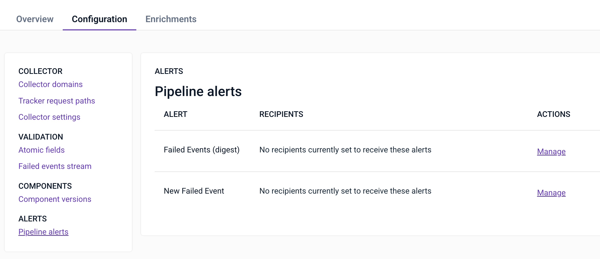
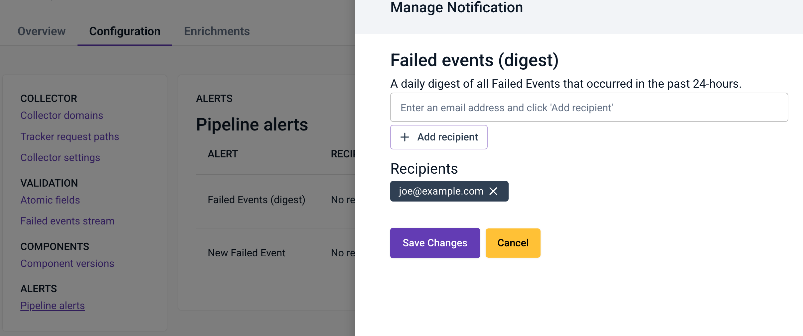

Snowplow can send two types of pipeline alerts to help you monitor failed events:

- **New failed event:** receive an alert within 10 minutes of a new type of event failure being detected on your pipeline.
- **Failed event digest**: receive a daily digest of all failed event activity in the previous 48-hour period.

To receive alerts you must have the failed events [monitoring](/docs/monitoring/index.md) feature switched on in Snowplow Console.

## Subscribing to alerts

- Login to Snowplow Console
- Locate the pipeline you wish to set up alerts for in the left-hand navigation
- Click on the `Configuration` tab, then the `Pipeline alerts` section

- Click `Manage` for the alert you wish to subscribe to
- Add one or more email addresses by typing them into the input and clicking `Add recipient`
- Once you have added all recipients, click `Save Changes`

