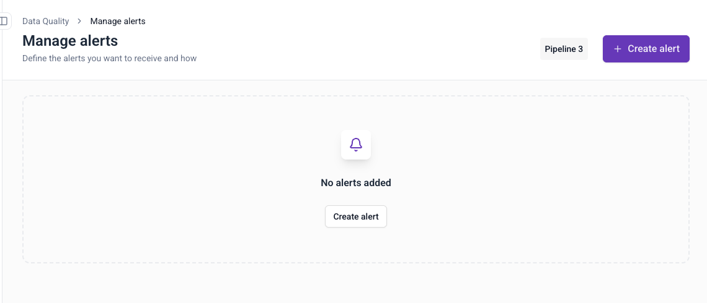
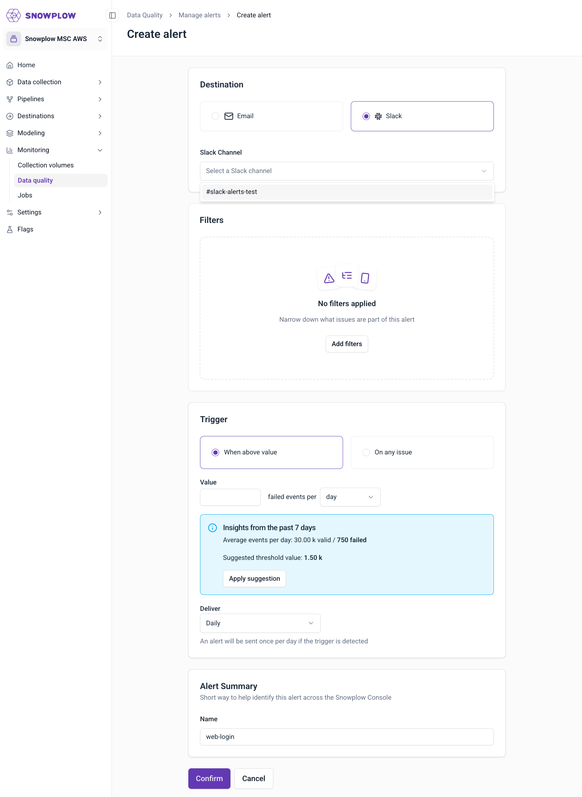
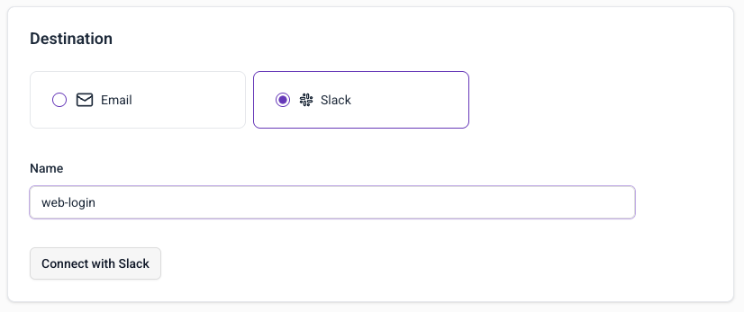
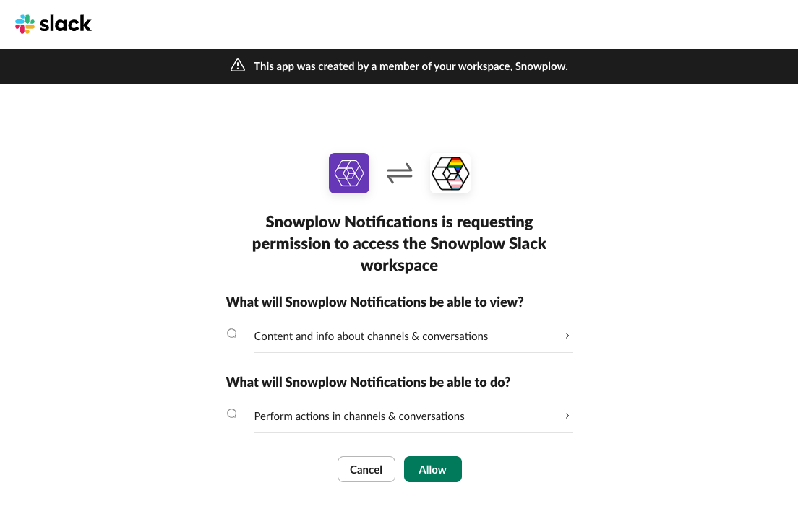
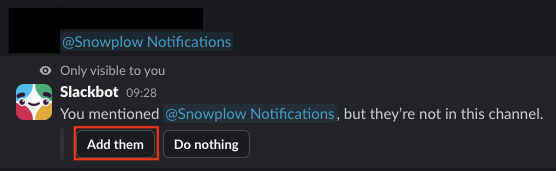
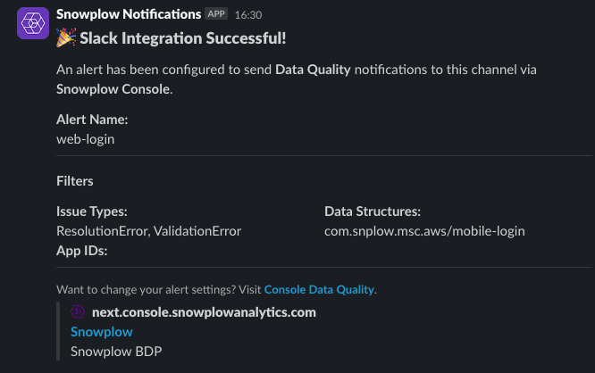
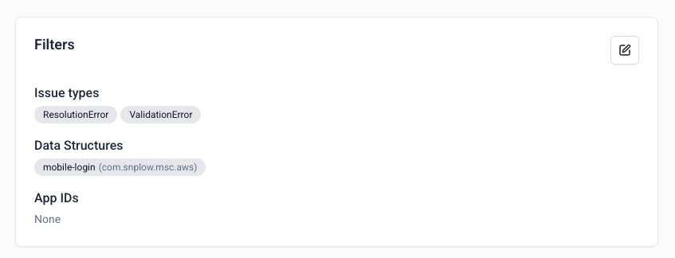
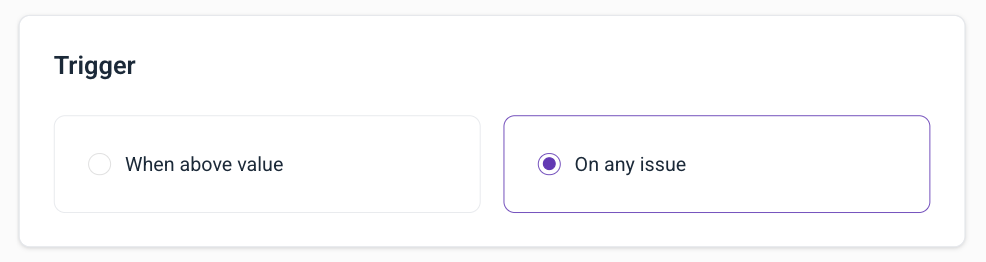
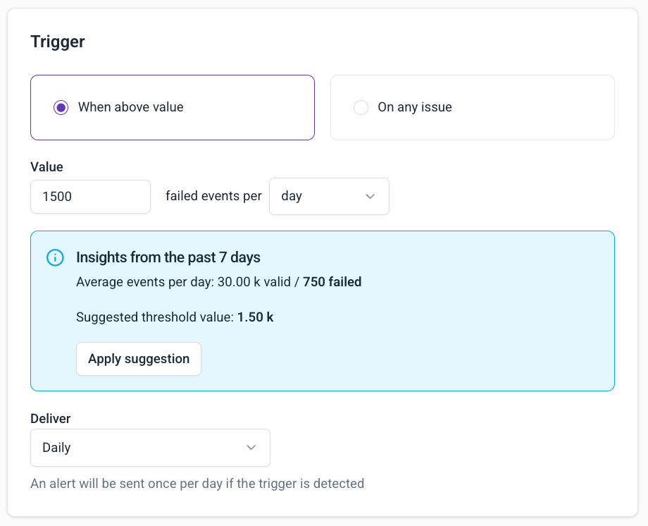

Set up failed event alerts to receive notifications when failed events occur in your data pipeline.

You'll need access to the [data quality dashboard](/docs/monitoring/index.md#data-quality-dashboard).

To create an alert, go to Snowplow Console:
1. Navigate to **Data Quality** in the left sidebar
2. Click **Manage alerts** in the top-right corner
3. Click **Create alert**

## Configure destination

Choose how you want to receive notifications:

### Email notifications

1. Select **Email** as destination
2. Add recipient email addresses
3. Click **Add filters** to configure filters
4. Configure triggers as needed
5. Enter alert name (e.g., "mobile-app")

### Slack notifications

1. Select **Slack** as destination
2. Select Slack channel from dropdown
3. Click **Add filters** to configure filters
4. Configure triggers as needed
5. Enter alert name (e.g., "web-app")

When no active Slack integration is found, a `Connect with Slack` button will appear instead of the list of channels.

A Slack consent screen will appear.

To select channels in the UI, first add the app to those channels. In Slack:

1. Open the channel where you want notifications
2. Type `@Snowplow Notifications` and send
3. Click "Add them" when prompted

Once a Slack alert is configured you will see a confirmation notification in the selected Slack channel.

## Set up filters

Configure when alerts should trigger:

1. **Issue types**: select `ValidationError`, `ResolutionError`, or both
2. **Data structures**: choose specific data structures (all versions will apply)
3. **App IDs**: filter by application identifiers

## Configure triggers

Set up when alerts should be triggered based on failed event conditions:

### Trigger types

Choose from the available trigger options:

- **When above value**: Set an absolute threshold for failed events (e.g., 1,500 failed events per hour)
- **On any issue**: Alert when any failed events are detected

### Threshold configuration

When using "When above value" trigger:

1. **Value**: Enter the threshold number of failed events
2. **Time period**: Select the time window (10 minutes, hour, or day)
3. **Deliver**: Choose notification frequency (daily, weekly, or monthly)

#### Insights from recent data

When configuring a threshold alert, the Insights panel displays data from the last 7 days to help you choose an appropriate threshold:

- **Average events volume** - Shows the average counts of valid and failed events (per relevant time unit)
- **Suggested threshold** - Provides a recommended threshold value based on recent patterns
- **Apply suggestion** - Click to automatically populate the threshold value field with the suggested value

Use these insights to set realistic thresholds that reflect your actual event patterns.

**Alert delivery:** If the trigger condition is met, the alert is sent once per delivery interval you selected.

## Complete setup

1. Review your configuration
2. Click **Confirm** to create the alert
3. Your alert will appear in the alerts list

## Alert frequency

Alerts are checked every 10 minutes. You'll receive notifications when new failed events match your filter criteria.
