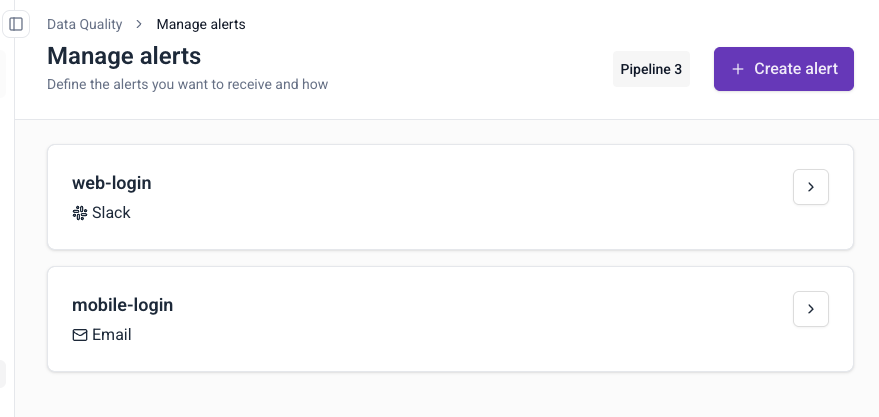

This page explains how to edit, delete, or review existing failed event alerts.

## View alerts

1. Navigate to **Data Quality** in the left sidebar
2. Click **Manage alerts** in the top-right corner
3. View all configured alerts with their destinations

## Edit an alert

1. Click the arrow next to the alert name
2. Modify destination, filters, triggers, or recipients:
   - **Destination**: change email addresses or Slack channels
   - **Filters**: update issue types, data structures, or App IDs
   - **Triggers**: switch between **When above value** and **On any new issue**. Threshold values and delivery frequency apply only to **When above value**.
3. Click **Save** to update

## Delete an alert

1. Click the arrow next to the alert name
2. Click on the three dots button
3. Click **Delete**
4. Confirm deletion

## Alert behavior

### Trigger frequency

All alerts are checked every 10 minutes. What happens next depends on the trigger type:

- **When above value**: the alert counts the failed events that match your filters in the chosen time window (10 minutes, hour, or day). If the count is above your threshold, you get a notification. The alert then waits for the delivery frequency period before it can notify you again.
- **On any new issue**: the alert notifies you when a new type of failure appears. A failure is new if the same error on the same schema hasn't occurred in the last 7 days. You get one notification per new failure type, and the same failure type doesn't notify you again until it has been absent for 7 days. This trigger has no delivery frequency setting. Use **When above value** if you want notifications about failures that keep happening.

### Multiple notifications

You may receive more than one notification for the same failed events in the following scenarios:
- **Repeated threshold breaches**: a **When above value** alert notifies you again after each delivery frequency period, as long as the total number of matching failed events is still above the threshold. **On any new issue** alerts don't repeat for the same failure type.
- **Overlapping alert configurations**: multiple alerts may capture the same failed events when their filter criteria overlap. This results in duplicate notifications, especially when alerts are configured to send to the same destination (same Slack channel or email address).
