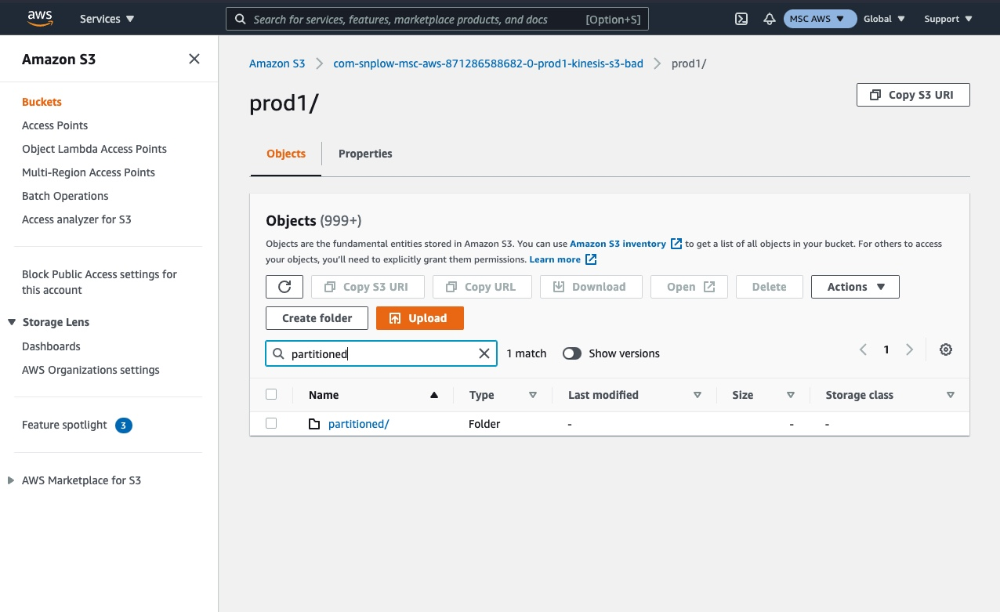
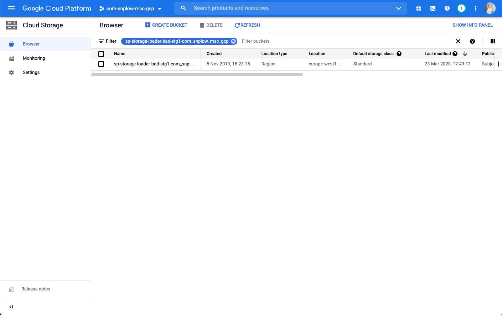
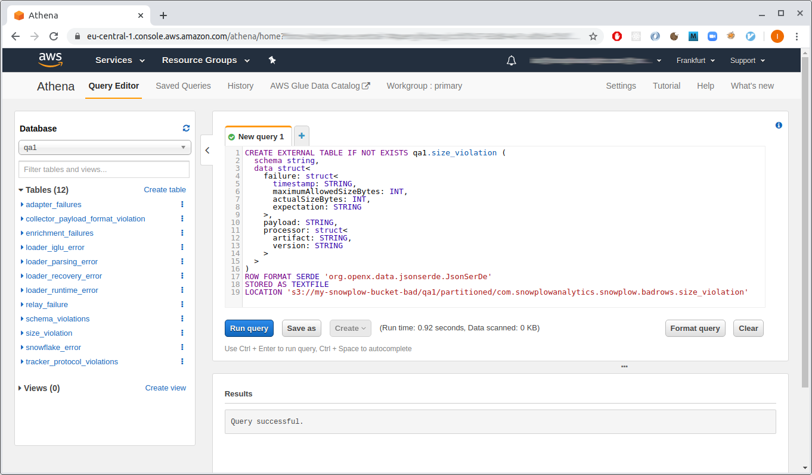

```mdx-code-block
import Tabs from '@theme/Tabs';
import TabItem from '@theme/TabItem';
```

On AWS and GCP, when failed events are generated on your pipeline, the raw event payload along with details about the failure are saved into file storage (S3 on AWS, GCS on Google Cloud).

:::info Snowplow Self-Hosted quick start guide on GCP

If you followed the [Snowplow Self-Hosted quick start guide](/docs/get-started/self-hosted/quick-start/index.md) on GCP, you will need to manually deploy the [GCS Loader](/docs/api-reference/loaders-storage-targets/google-cloud-storage-loader/index.md) to save failed events into GCS, as it’s currently not included in the Terraform scripts.

:::

## Retrieving raw data

You can directly access and download examples of events that are failing from file storage. This is useful for further investigation, and also required to design a recovery operation.

<Tabs groupId="cloud" queryString>
  <TabItem value="aws" label="AWS" default>

Login to your AWS Console account and navigate to the sub-account that contains your Snowplow pipeline. Then navigate to your S3 storage buckets.

You should find a bucket with a name ending in `-kinesis-s3-bad` and within that a folder with your pipeline name e.g. `prod1`.


Navigate into this folder and you should see `partitioned` (search if it isn't visible).



Within this folder, there will be a subfolder for each type of failed event. Select the relevant type for the failed events you wish to find.


You can now browse the folder using date and time to find a batch of failed events that occurred on that date / time period.


  </TabItem>
  <TabItem value="gcp" label="GCP">

Login to your Google Cloud Platform account and navigate to the project that contains your Snowplow pipeline. Then navigate to your Google Cloud Storage buckets.

You should find a bucket named with a prefix of `sp-storage-loader-bad`.



Navigate into this folder and you should see `partitioned` (search if it isn't visible).


Within this folder, there will be a subfolder for each type of failed event. Select the relevant type for the failed events you wish to find.


You can now browse the folder using date and time to find a batch of failed events that occurred on that date / time period.


  </TabItem>
</Tabs>

## Using Athena or BigQuery

[Athena](https://aws.amazon.com/athena/) on AWS and [BigQuery](https://cloud.google.com/bigquery) on GCP are tools that let you query your failed events, using the cloud storage files as a back-end data source.

```sql
SELECT data.failure.messages FROM adapter_failures
WHERE from_iso8601_timestamp(data.failure.timestamp) > timestamp '2020-04-01'
```

This approach is handy for debugging your pipeline without the need to load your failed events into a separate database.

Before you can query this data, you need to create corresponding tables in Athena or BigQuery as we explain below. Each different failed event type (e.g. schema violations, adapter failures) has a different schema, so you will need one table per event type.

## Creating the tables

<Tabs groupId="cloud" queryString>
  <TabItem value="aws" label="AWS" default>

Go to [the Athena dashboard](https://eu-central-1.console.aws.amazon.com/athena/home) and use the query editor. Start by creating a database (replace `{{ DATABASE }}` with the name of your pipeline, e.g. `prod1` or `qa1`):

```sql
CREATE DATABASE IF NOT EXISTS {{ DATABASE }}
```

Then run each SQL statement provided in the [badrows-tables repository](https://github.com/snowplow-incubator/snowplow-badrows-tables/tree/master/athena) by copying them into the Athena query editor. We recommend creating all tables, although you can skip the ones you are not interested in.

:::info Placeholders

Note that the SQL statements contain a few placeholders which you will need to edit before you can create the tables:

* `{{ DATABASE }}` — as above, change this to the name of your pipeline, e.g. `prod1` or `qa1`.
* `s3://{{ BUCKET }}/{{ PIPELINE }}` — this should point to the directory in S3 where your bad rows files are stored.

:::



  </TabItem>
  <TabItem value="gcp" label="GCP">

:::info Snowplow Self-Hosted quick start guide on GCP

If you followed the [Snowplow Self-Hosted Quick Start guide](/docs/get-started/self-hosted/quick-start/index.md), you will need to manually deploy the [GCS Loader](/docs/api-reference/loaders-storage-targets/google-cloud-storage-loader/index.md) to save failed events into GCS, as it’s currently not included in the Terraform scripts.

:::

:::note

These instructions make use of the [`bq` command-line tool](https://cloud.google.com/bigquery/docs/bq-command-line-tool) which is packaged with the [Google cloud SDK](https://cloud.google.com/sdk/docs). Follow the SDK instructions for how to [initialize and authenticate the SDK](https://cloud.google.com/sdk/docs/initializing). Also take a look at the [BigQuery dashboard](https://console.cloud.google.com/bigquery) as you run these commands, so you can see your tables as you create them.

:::

Create a dataset to contain your failed event tables:

```bash
bq mk --data_location=EU bad_rows_prod1
# Dataset 'my-snowplow-project:bad_rows_prod1' successfully created.
```

The `--data-location` should match the location of your bad rows bucket. Also replace `prod1` with the name of your pipeline.

Next, download the table definitions provided in the [badrows-tables repository](https://github.com/snowplow-incubator/snowplow-badrows-tables/tree/master/bigquery) in JSON format.

:::info Placeholders

Each table definition contains a `{{ BUCKET }}` placeholder which needs to be changed to the GCS bucket where your bad rows files are stored (e.g. `sp-storage-loader-bad-prod1-com_acme`).

:::

Now run `bq mk` for each table definition in turn. Use the `--external_table_definition` parameter so that BigQuery uses the bucket as the back-end data source. Here is how to run the command for the first three tables (note that you should change the dataset name `bad_rows_prod1` to match the dataset you just created):

```bash
bq mk \
  --display_name="Adapter failures" \
  --external_table_definition=./adapter_failures.json \
  bad_rows_prod1.adapter_failures

# Table 'my-snowplow-project:bad_rows_prod1.adapter_failures' successfully created.

bq mk \
  --display_name "Schema violations" \
  --external_table_definition=./schema_violations.json \
  bad_rows_prod1.schema_violations

# Table 'my-snowplow-project:bad_rows_prod1.schema_violations' successfully created.

bq mk \
  --display_name "Tracker protocol violations" \
  --external_table_definition=./tracker_protocol_violations.json \
  bad_rows_prod1.tracker_protocol_violations

# Table 'my-snowplow-project:bad_rows_prod1.tracker_protocol_violations' successfully created.
```

Run the corresponding commands for the remaining table definitions. We recommend creating all tables, although you can skip the ones you are not interested in.

:::tip Why not just auto-detect the schemas?

BigQuery has an “Auto-detect” feature to automatically generate the table definition for you by inspecting the file contents. So you might wonder why it is necessary to provide explicit schema definitions for your tables.

There are two potential pitfalls when using the autogenerated schema with the Snowplow bad rows files:

- _Optional fields_. BigQuery might not “notice” that a field exists, depending on the sample of data used to detect the schema.
- _Polymorphic fields_, e.g. `error` that can be either a string or an object. BigQuery will throw an exception if it sees an unexpected value for a field. Our table definitions use the `JSON` data type for these fields.

:::

  </TabItem>
</Tabs>

## Querying the data

<Tabs groupId="cloud" queryString>
  <TabItem value="aws" label="AWS" default>

As example of using your Athena tables, you might start by getting counts of each failed event type from the last week. Repeat this query for each table you have created:

```sql
SELECT COUNT(*) FROM schema_violations
WHERE from_iso8601_timestamp(data.failure.timestamp) > DATE_ADD('day', -7, now())
```


If you have schema violations, you might want to find which tracker sent the event:

```sql
SELECT data.payload.enriched.app_id, COUNT(*) FROM schema_violations
WHERE from_iso8601_timestamp(data.failure.timestamp) > DATE_ADD('day', -7, now())
GROUP BY data.payload.enriched.app_id
```

You can do a deeper dive into the error messages to get a explanation of the last 10 failures:

```sql
SELECT message.field AS field,
       message.value AS value,
       message.error AS error,
       message.json AS json,
       message.schemaKey AS schemaKey,
       message.schemaCriterion AS schemaCriterion
FROM schema_violations
CROSS JOIN UNNEST(data.failure.messages) AS t(message)
ORDER BY data.failure.timestamp DESC
LIMIT 10
```

  </TabItem>
  <TabItem value="gcp" label="GCP">

You can query your tables from the query editor in the [BigQuery console](https://console.cloud.google.com/bigquery). You might want to start by getting counts of each failed event type from the last week. This query will work, but it is relatively expensive because it will scan all files in the `schema_violations` directory:

```sql
SELECT COUNT(*) FROM bad_rows_prod1.schema_violations
WHERE data.failure.timestamp > TIMESTAMP_SUB(CURRENT_TIMESTAMP(), INTERVAL 7 DAY);
```

You can construct a more economical query by using the `_FILE_NAME` pseudo column to restrict the scan to files from the last week:

```sql
SELECT COUNT(*) FROM bad_rows_prod1.schema_violations
WHERE DATE(PARSE_TIMESTAMP('%Y-%m-%dT%H:%M:%S', LTRIM(REGEXP_EXTRACT(_FILE_NAME, 'output-[0-9]+-[0-9]+-[0-9]+T[0-9]+:[0-9]+:[0-9]+'), 'output-'))) >= DATE_SUB(CURRENT_DATE, INTERVAL 7 DAY);
```

You can repeat that query for each table you created in your bad rows dataset.


If you have schema violations, you might want to find which tracker sent the event:

```sql
SELECT data.payload.enriched.app_id, COUNT(*) FROM bad_rows_prod1.schema_violations
WHERE DATE(PARSE_TIMESTAMP('%Y-%m-%dT%H:%M:%S', LTRIM(REGEXP_EXTRACT(_FILE_NAME, 'output-[0-9]+-[0-9]+-[0-9]+T[0-9]+:[0-9]+:[0-9]+'), 'output-'))) >= DATE_SUB(CURRENT_DATE, INTERVAL 7 DAY)
GROUP BY data.payload.enriched.app_id;
```

If you have tracker protocol failures, you can do a deeper dive into the error messages to get a explanation of the last 10 failures:

```sql
SELECT message.field AS field,
       message.value AS value,
       message.error AS error,
       message.expectation AS expectation,
       message.schemaKey AS schemaKey,
       message.schemaCriterion AS schemaCriterion
FROM bad_rows_prod1.tracker_protocol_violations,
UNNEST(data.failure.messages) AS message
WHERE DATE(PARSE_TIMESTAMP('%Y-%m-%dT%H:%M:%S', LTRIM(REGEXP_EXTRACT(_FILE_NAME, 'output-[0-9]+-[0-9]+-[0-9]+T[0-9]+:[0-9]+:[0-9]+'), 'output-'))) >= DATE_SUB(CURRENT_DATE, INTERVAL 7 DAY)
ORDER BY data.failure.timestamp DESC
LIMIT 10;
```

<details>
  <summary>Digging deeper</summary>

You might notice that the `error` field in the result of the query above has the `JSON` type.
This is because depending on the variety of the failed event, the `error` might be a simple string or a complex object with additional detail.

For example, the “invalid JSON” message might have this `error`:

```json
"invalid json: expected false got 'foo' (line 1, column 1)"
```

In contrast, in case of a failure to resolve Iglu server, the value in the `error` field would look like this, with “sub-errors” inside:

```json
{
  "error": "ResolutionError",
  "lookupHistory": [
    {
      "attempts": 1,
      "errors": [
        {
          "error": "RepoFailure",
          "message": "Unexpected exception fetching: org.http4s.client.UnexpectedStatus: unexpected HTTP status: 404 Not Found"
        }
      ],
      "lastAttempt": "2021-10-16T17:20:52.626Z",
      "repository": "Iglu Central"
    },
    ...
  ]
}
```

You can figure out what to expect from such a field by looking at the JSON schema for the respective type of failed events, in this case the [tracker protocol violations schema](https://github.com/snowplow/iglu-central/blob/master/schemas/com.snowplowanalytics.snowplow.badrows/tracker_protocol_violations/jsonschema/1-0-0). The mapping between the various failed event tables and the corresponding JSON schemas is [here](https://github.com/snowplow-incubator/snowplow-badrows-tables/tree/master/bigquery).

BigQuery has a variety of JSON functions that allow you to extract data from within complex objects. For instance, if you are interested in Iglu repositories that failed to resolve, you can use something like this:

```sql
SELECT DISTINCT(JSON_VALUE(message.error.lookupHistory[0].repository))
FROM ...
WHERE ...
AND message.error.lookupHistory IS NOT NULL
```

It’s also possible, although unwieldy, to reduce all `error`s to a single string:

```sql
-- Unnest individual messages for each failed event
WITH unnested_messages AS (
  SELECT message, CASE
    -- resolution errors
    WHEN message.error.lookupHistory IS NOT NULL THEN JSON_QUERY_ARRAY(message.error.lookupHistory[0].errors)
    -- event validation errors
    WHEN message.error.dataReports IS NOT NULL THEN JSON_QUERY_ARRAY(message.error.dataReports)
    -- schema validation errors
    WHEN message.error.schemaIssues IS NOT NULL THEN JSON_QUERY_ARRAY(message.error.schemaIssues)
    -- other errors
    ELSE [TO_JSON(STRUCT(message.error as message))]
  END AS errors
FROM bad_rows_prod1.tracker_protocol_violations,
UNNEST(data.failure.messages) AS message
WHERE ...)

SELECT JSON_VALUE(error.message) AS error
FROM unnested_messages,
UNNEST(errors) AS error
```

In the future, we plan to simplify the schemas of failed events so that they are more uniform and straightforward to query.

</details>

  </TabItem>
</Tabs>
