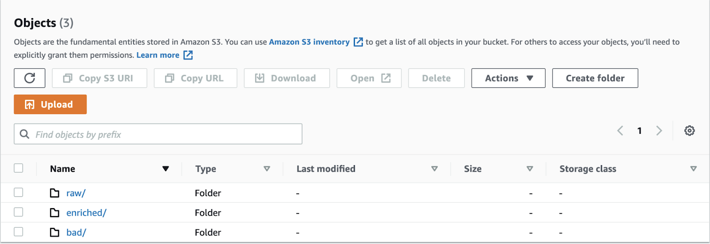

If you were using the `default` or `secure` example scripts unedited in the last section, you will have created a number of S3 buckets where all of your data is stored.

S3 provides an important backup of your data and can also serve as your data lake.

- Navigate to the AWS management console, search for S3 and select
- If you have multiple buckets on S3 already, you can navigate to the correct one by searching for the s3 bucket name that you entered when spinning up your pipeline

When you created your pipeline you also created three directories in your S3 bucket:

The `enriched/` and `bad/` directory holds your enriched data, and the data that has failed to be validated by your pipeline. We took a look at this data in Postgres in the last step.

The `raw/` directory holds the events that come straight out of your collector and have not yet been validated (i.e. quality checked) or enriched by the Enrich application. They are thrift records and are therefore a little tricky to decode -  there are not many reasons to use this data, but backing this data up gives you the flexibility to replay this data should something go wrong further downstream in the pipeline.

Athena

_You can learn more about querying your data at scale on S3 using Athena_ [_here_](https://snowplowanalytics.com/blog/2019/04/04/use-glue-and-athena-with-snowplow-data/)_._
