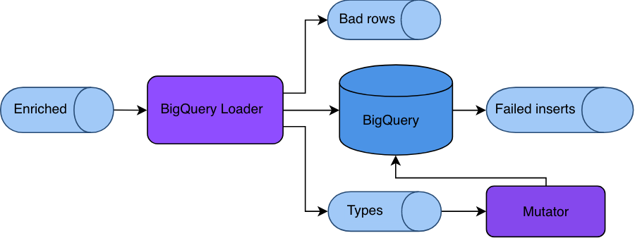

## Technical Architecture

The available tools are:

1. **Snowplow BigQuery Loader**, an [Apache Beam](https://beam.apache.org/) job that reads Snowplow enriched data from Google Pub/Sub, transforms it into BigQuery-friendly format and loads it. It also writes information about encountered data types into an auxiliary `typesTopic` Pub/Sub topic.
2. **Snowplow BigQuery Mutator**, a Scala app that reads the `typesTopic` (via `typesSubscription`) and performs table mutations to add new columns as required.
3. **Snowplow BigQuery Repeater**, a Scala app that reads `failedInserts` (caused by _mutation lag_) and tries to re-insert them into BigQuery after some delay, sinking failures into a dead-end bucket.
4. **Snowplow BigQuery Forwarder**, an alternative to Repeater implemented as an Apache Beam job. In most cases, we recommend using Repeater.



In addition it also includes a fourth microservice, the "forwarder". This has been replaced by the "repeater" - we recommend users setup the repeater rather than the forwarder.

### Snowplow BigQuery Loader

#### Overview

An Apache Beam job intended to run on [Google Dataflow](https://cloud.google.com/dataflow/) and load enriched data from `enriched` Pub/Sub topic to Google BigQuery.

#### Algorithm

- Reads Snowplow enriched events from `input` Pub/Sub subscription.
- Uses the JSON transformer from the [Snowplow Scala Analytics SDK](https://github.com/snowplow/snowplow-scala-analytics-sdk) to convert those enriched events into JSONs.
- Uses [Iglu Client](https://github.com/snowplow/iglu-scala-client/) to fetch JSON schemas for self-describing events and entities.
- Uses [Iglu Schema DDL](https://github.com/snowplow/iglu/tree/master/0-common/schema-ddl) to transform self-describing events and entities into BigQuery format.
- Writes transformed data into BigQuery.
- Writes all encountered Iglu types into a `typesTopic`.
- Writes all data failed to be processed into a `badRows` topic.
- Writes data that succeeded to be transformed, but failed to be loaded into a `failedInserts` topic.

### Snowplow BigQuery Mutator

#### Overview

This is a Scala app that reads data from the `typesTopic` via a `typesSubscription` and performs table mutations.

#### Algorithm

- Reads messages from `typesSubscription`.
- Finds out if a message contains a type that has not been encountered yet (by checking internal cache).
- If a message contains a new type, double-checks it with the connected BigQuery table.
- If the type is not in the table, fetches its JSON schema from Iglu Registry.
- Transforms JSON schema into BigQuery column definition.
- Adds the column to the connected BigQuery table.

### Snowplow BigQuery Repeater

A JVM application that reads a `failedInserts` subscription and tries to re-insert them into BigQuery to overcome mutation lag.

#### Overview

Repeater has several important behavior aspects:

- If a pulled record is not a valid Snowplow event, it will result into a `loader_recovery_error` bad row.
- If a pulled record is a valid event, Repeater will wait some time (5 minutes by default) after the `etl_tstamp` before attempting to re-insert it, in order to let Mutator do its job.
- If the database responds with an error, the row will get transformed into a `loader_recovery_error` bad row.
- All entities in the dead-end bucket are valid Snowplow bad rows.

#### Mutation lag

Loader inserts data into BigQuery in near real-time. At the same time, it sinks `shredded_type` payloads into the `typesTopic` approximately every 5 seconds. It also can take up to 10-15 seconds for Mutator to fetch, parse the message and execute an `ALTER TABLE` statement against the table.

If a new type arrives from `input` subscription in this period of time and Mutator fails to handle it, BigQuery will reject the row containing it and it will be sent to the `failedInserts` topic. This topic contains JSON objects _ready to be loaded into BigQuery_ (ie not canonical Snowplow Enriched event format).

In order to load this data again from `failedInserts` to BigQuery you can use Repeater or Forwarder (see below). Both read a subscription from `failedInserts` and perform `INSERT` statements.

### Snowplow BigQuery Forwarder

Used for exactly the same purpose as Repeater, but uses Dataflow under the hood, which makes it suitable for very big amounts of data. At the same time, it has several important drawbacks compared with Repeater:

- User needs to re-launch it manually when failed inserts appear.
- Otherwise, it could be extremely expensive to run a Dataflow job that idles 99.9% of the time (it cannot terminate as it is a streaming/infinite job1).
- There's no way to tell Forwarder that it should take a pause before inserting rows back. Without the pause there's a chance that Mutator doesn't get a chance to alter the table.
- Forwarder keeps retrying all inserts (default behavior for streaming Dataflow jobs), while Repeater has a dead-end GCS bucket.
- In order to debug a problem with Forwarder, operator needs to inspect Stackdriver logs.

1Forwarder is a very generic and primitive Dataflow job. It could be launched using the standard Dataflow templates. But a standard template job cannot accept a subscription as a source, only a topic. That means the job must be running all the time and most of the time it will be idle.

### Topics and message formats

Snowplow BigQuery Loader uses Google Pub/Sub topics and subscriptions to store intermediate data and communicate between applications.

- `input` subscription -- data enriched by Beam Enrich, in canonical `TSV+JSON format`;
- `typesTopic` -- all shredded types in `iglu:com.snowplowanalytics.snowplow/shredded_type/jsonschema/1-0-0` self-describing payload encountered by Loader are sinked here with ~5 seconds interval;
- `typesSubscription` -- a subscription to `typesTopic` used by Mutator with `iglu:com.snowplowanalytics.snowplow/shredded_type/jsonschema/1-0-0` self-describing payloads;
- `badRows` topic -- data that could not be processed by Loader due to Iglu Registry unavailability, formatted as `bad rows`;
- `failedInserts` topic -- data that has been successfully transformed by Loader, but failed loading to BigQuery usually due to mutation lag, formatted as `BigQuery JSON`.

## Setup guide

### Configuration file

Loader, Mutator, Repeater and Forwarder accept the same configuration file with [iglu:com.snowplowanalytics.snowplow.storage/bigquery_config/jsonschema/](https://github.com/snowplow/iglu-central/tree/master/schemas/com.snowplowanalytics.snowplow.storage/bigquery_config/jsonschema) schema, which looks like this:

```json
{
    "schema": "iglu:com.snowplowanalytics.snowplow.storage/bigquery_config/jsonschema/1-0-0",
    "data": {
        "name": "Alpha BigQuery test",
        "id": "31b1559d-d319-4023-aaae-97698238d808",

        "projectId": "com-acme",
        "datasetId": "snowplow",
        "tableId": "events",

        "input": "enriched-good-sub",
        "typesTopic": "bq-test-types",
        "typesSubscription": "bq-test-types-sub",
        "badRows": "bq-test-bad-rows",
        "failedInserts": "bq-test-bad-inserts",

        "load": {
            "mode": "STREAMING_INSERTS",
            "retry": false
        },

        "purpose": "ENRICHED_EVENTS"
    }
}
```

- All topics and subscriptions (`input`, `typesTopic`, `typesSubscription`, `badRows` and `failedInserts`) are explained in the [topics and message formats](#topics-and-message-formats) section.
- `projectId` is used to group all resources (topics, subscriptions and BigQuery table).
- `datasetId` and `tableId` (along with `projectId`) specify the target BigQuery table.
- `name` is an arbitrary human-readable description of the storage target.
- `id` is a unique identificator in UUID format.
- `load` specifies the loading mode and is explained in the dedicated section below.
- `purpose` is a standard storage configuration. Its only valid value currently is `ENRICHED_EVENTS`.

#### Loading mode

BigQuery supports two loading APIs:

- [Streaming inserts API](https://cloud.google.com/bigquery/streaming-data-into-bigquery)
- [Load jobs API](https://cloud.google.com/bigquery/docs/reference/rest/v2/jobs)

You can use the `load` property to configure Loader to use one of them.

For example, the configuration for using **streaming inserts** can look like this:

```json
{
    "load": {
        "mode": "STREAMING_INSERTS",
        "retry": false
    }
}
```

`retry` specifies if failed inserts (eg due to mutation lag) should be retried infinitely or sent straight to the `failedInserts` topic. If a row cannot be inserted, it will be re-tried indefinitely, which can throttle the whole job. In that case a restart might be required.

The configuration for using **load jobs** can look like this:

```json
{
    "load": {
        "mode": "FILE_LOADS",
        "frequency": 60000
    }
}
```

`frequency` specifies how often the load job should be performed, in seconds. Unlike the near-real-time **streaming inserts** API, load jobs are more batch-oriented.

Load jobs do not support `retry` (and streaming inserts do not support `frequency`).

It is generally recommended to stick with the **streaming jobs** API without retries and use [Repeater](#snowplow-bigquery-repeater) to recover data from `failedInserts`. However, the **load jobs** API is cheaper and generates fewer duplicates.

### Command line options

All four apps accept a path to a config file as specified above, and to an Iglu resolver config.

#### Loader

Loader accepts two required arguments, one optional argument, and [any other](https://cloud.google.com/dataflow/pipelines/specifying-exec-params#setting-other-cloud-pipeline-options) supported by Google Cloud Dataflow.

```bash
$ ./snowplow-bigquery-loader \
    --config=$CONFIG \
    --resolver=$RESOLVER
    --labels={"key1":"val1","key2":"val2"} # optional
```

The optional `labels` argument accepts a JSON with key-value pairs that will be used as [labels](https://cloud.google.com/compute/docs/labeling-resources) to the Cloud Dataflow job. This will be helpful if you are launching Loader as a Kubernetes job: because labels assigned to the job will not be replicated in the resulting Dataflow job.

This can be launched from any machine authenticated to submit Dataflow jobs.

#### Mutator

Mutator has three subcommands: `listen`, `create` and `add-column`.

##### `listen`

`listen` is the primary command and is used to automate table migrations.

```bash
$ ./snowplow-bigquery-mutator \
    listen
    --config $CONFIG \
    --resolver $RESOLVER \
    --verbose               # Optional, for debugging only
```

##### `add-column`

`add-column` can be used once to add a column manually. This should eliminate the risk of mutation lag and the necessity to run a Repeater or Forwarder job.

```bash
$ ./snowplow-bigquery-mutator \
    add-column \
    --config $CONFIG \
    --resolver $RESOLVER \
    --shred-property CONTEXTS \ --schema iglu:com.acme/app_context/jsonschema/1-0-0
```

The specified schema must be present in one of the Iglu registries in the resolver configuration.

##### `create`

`create` creates an empty table with `atomic` structure.

```bash
$ ./snowplow-bigquery-mutator \
    create \
    --config $CONFIG \
    --resolver $RESOLVER
```

#### Repeater

We recommend constantly running Repeater on a small / cheap node or Docker container.

```bash
$ ./snowplow-bigquery-repeater \
    create \
    --config $CONFIG \
    --resolver $RESOLVER \
    --failedInsertsSub $FAILED_INSERTS_SUB \
    --deadEndBucket $DEAD_END_GCS \   # Must start with gcs:\\ prefix
    --desperatesBufferSize 20 \       # Size of the batch to send to the dead-end bucket
    --desperatesWindow 20 \           # Window duration after which bad rows will be sunk into the dead-end bucket
    --backoffPeriod 900               # Seconds to wait before attempting a re-insert (calculated against etl_tstamp)
```

`desperatesBufferSize`, `desperatesWindow` and `backoffPeriod` are optional parameters.

#### Forwarder

Like Loader, Forwarder can be submitted from any machine authenticated to submit Dataflow jobs.

```bash
$ ./snowplow-bigquery-forwarder \
    --config=$CONFIG \
    --resolver=$RESOLVER
    --labels={"key1":"val1","key2":"val2"} # optional
    --failedInsertsSub=$FAILED_INSERTS_SUB
```

Its only unique option is `failedInsertsSub`, which is a subscription (that must be created _upfront_) to the `failedInserts` topic.

The `labels` argument works the same as with Loader.

By convention both Dataflow jobs (Forwarder and Loader) accept CLI options with `=` symbol and camelCase, while Mutator and Repeater accept them in UNIX style (without `=`).

### Docker support

All four applications are available as Docker images.

- `snowplow/snowplow-bigquery-loader:0.4.2`
- `snowplow/snowplow-bigquery-mutator:0.4.2`
- `snowplow/snowplow-bigquery-repeater:0.4.2`
- `snowplow/snowplow-bigquery-forwarder:0.4.2`

### Partitioning

During initial setup it is strongly recommended to [setup partitioning](https://cloud.google.com/bigquery/docs/creating-column-partitions) on the `derived_tstamp` property. Mutator's `create` command does not automatically add partitioning yet.
