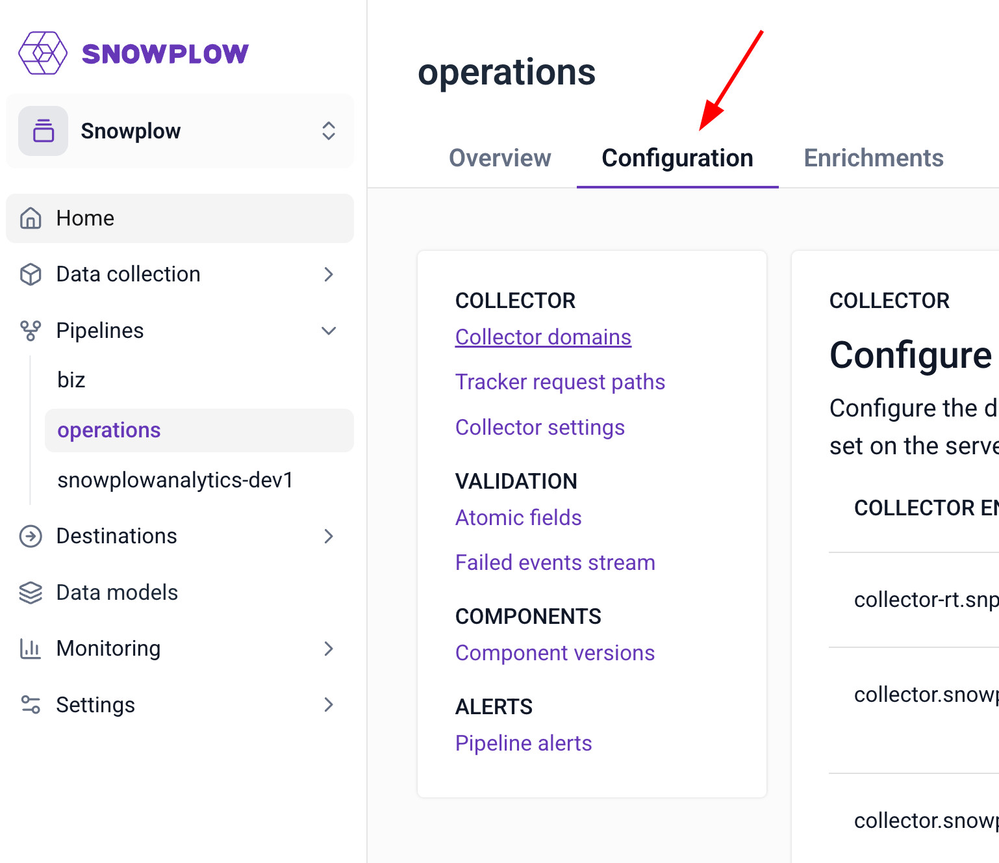
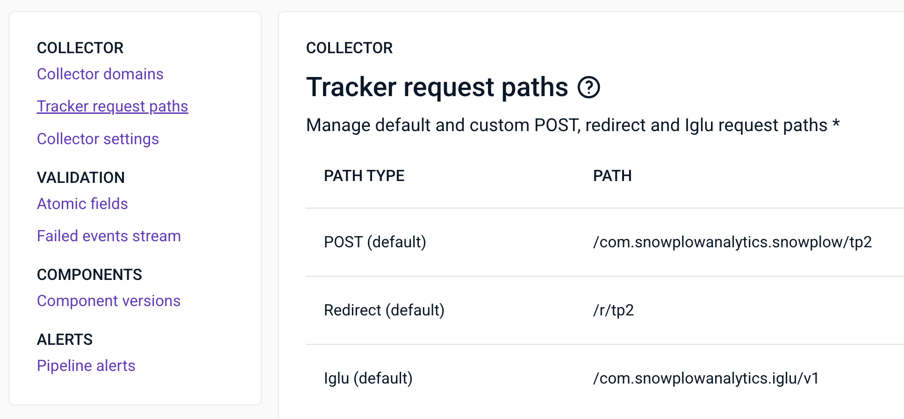
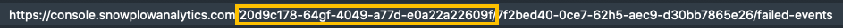
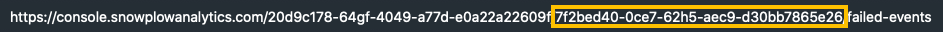

Once your [event collector](/docs/fundamentals/index.md) is set up, along with [trackers](/docs/sources/trackers/index.md) to submit events to them, you may want to verify your collector configuration. This can take two forms, depending on your needs.

Read more about the technical aspects of the collector [here](/docs/api-reference/stream-collector/index.md).

## Viewing collector configuration in Snowplow Console

The easiest way to access collector configuration is to view it within the Snowplow Console. To do that, after you log in click on _Pipeline Configuration_ under the respective pipeline's navigation menu:



Selecting the pipeline configuration tab

You can then view your configuration, with the default values displayed for empty fields:



Example collector configuration

This view is consuming the respective API that you can also access, as discussed in the next section.

## Consuming the collector configuration API

As a Snowplow customer you already benefit from 24x7 monitoring of pipeline collector health. If you wish to add collector monitoring to your internal monitoring systems nevertheless, the maintainable way to do this is to retrieve collector endpoints and other configuration values via the available API, then invoke your health checks on them.

### Authorization

To start using the API you’ll need authorization credentials.

First, you’ll need to:

- [Create a new user account for your API authorization in console](https://console.snowplowanalytics.com/users)
- Request the `clientid` and `clientsecret` for the API service from the [admin section in console](https://console.snowplowanalytics.com/credentials).

Once you have these you can exchange credentials for a token.

Here is an example CURL to use to fetch the token:

```bash
curl --request POST \
  --url 'https://id.snowplowanalytics.com/oauth/token' \
  --header 'content-type: application/x-www-form-urlencoded' \
  --data grant_type=password \
  --data username=USER@DOMAIN.COM \
  --data password='PASSWORD' \
  --data audience=https://snowplowanalytics.com/api/ \
  --data client_id='YOUR_CLIENT_ID' \
  --data client_secret='YOUR_CLIENT_SECRET'
```

This token will be needed in any request to the API in the form of `Authorization: Bearer {{token}}`

### Getting started

You can have a look at and interact with the collector configuration endpoint in the normative [API specification](https://console.snowplowanalytics.com/api/msc/v1/docs/index.html?url=/api/msc/v1/docs/docs.yaml#/configuration/getOrganizationsOrganizationidResourcesV1PipelinesPipelineidConfigurationCollector).

### Authorizing in the API documentation

To be able to post sample requests in the documentation you need to click the `Authorize` button at the top of the document and authorize with your token. The value for the token field in each individual requests is overwritten by this authorization.

The endpoint for the API is:

`https://console.snowplowanalytics.com/api/msc/v1/organizations/{organizationId}/resources/v1/pipelines/{pipelineId}/configuration/collector`

and the only supported HTTP verb is `GET`.

Your organization ID is a UUID and can be found in the location bar of your browser when you are using the Console:



Organization ID is the UUID in-between the two forward slashes.

Similarly, the pipeline ID can be found in the location bar as the second UUID there:



The Pipeline ID is the second UUID in the location bar.

### Invoking the API

Invoking this API will return an object of the following form:

```json
{
    "cookieDomains":
    {
        "fallback": "mydomain.com",
        "domains": []
    },
    "paths": {
        "post": {
            "paths": []
        },
        "webhook": {
            "paths": []
        },
        "redirect": {
            "paths": [],
            "enabled": true
        }
    },
    "cookieAttributes": {
        "secure": true,
        "sameSite": "None",
        "httpOnly": false
    },
    "blockUnencrypted": false
}
```

#### Response details

The `cookieDomains` object is always expected to be available and holds two properties:

- `domains` is a non-optional list of domains for which collector cookies are being set. The value may be an empty list.
- `fallback` represents the default fallback cookie domain. The property is optional and if unavailable it defaults to `none`.

The `paths` object is always expected to be available and holds the following three non-optional properties:

- `post` contains a non-optional list of paths that accept Tracker Protocol 2 compatible POST requests
- `redirect` contains
    - a non-optional flag weather redirect-based tracking is enabled, and
    - a non-optional list of paths that support this kind of tracking
- `webhook` contains a non-optional list of paths for tracking events sent via a `GET` or `POST` request containing an [Iglu](https://github.com/snowplow/iglu)\-compatible event payload.

The `cookieAttributes` object is always expected to be available and contains three non-optional properties:

- `secure` is a boolean value indicating whether secure connections should be enforced;
- `httpOnly` is a boolean value set to true if the cookie must be inaccessible to non-HTTP requests; and
- `sameSite` is a string that can take one of the following values:
    - `lax`
    - `none`
    - `strict`

Finally, `blockUnencrypted` is an optional boolean property indicating whether un-encrypted traffic should be allowed or not. If not available, the default is `false` (i.e. "do not block").

## Configuring the collector for Community Edition users

After you have installed the [Collector](/docs/api-reference/stream-collector/index.md) (either following the [Quick Start guide](/docs/get-started/snowplow-community-edition/what-is-quick-start/index.md) or [manually](/docs/api-reference/stream-collector/setup/index.md)), you can follow the [reference page](/docs/api-reference/stream-collector/configure/index.md) to configure it.
